## Cards

| Name | Image | Upgraded image | Rarity | Type | Cost | Description |
| ---- | ----- | -------------- | ------ | ---- | ---- | ----------- |
| Batch | 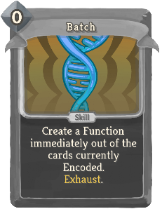 | 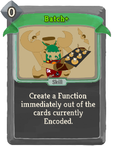 | Special | Skill | 0 | Create a Function immediately out of the cards in the Sequence. Exhaust. (not Exhaust.) |
| Branch: Attack | 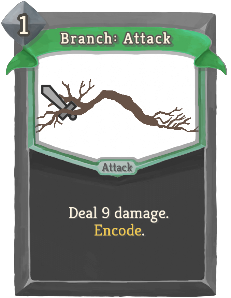 | 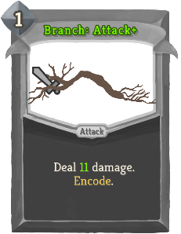 | Special | Attack | 1 | Deal 9 (11) damage. bronze:Encode. |
| Branch: Block | 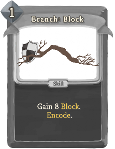 | 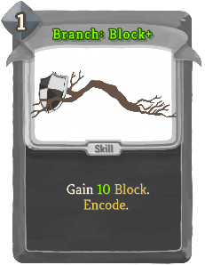 | Special | Skill | 1 | Gain 8 (10) Block. bronze:Encode. |
| Byte Shift | 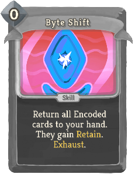 |  | Special | Skill | 0 | (Retain.)  Return all Encoded cards to your hand. They gain Retain. Exhaust. |
| Council's Justice | 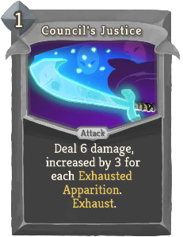 | 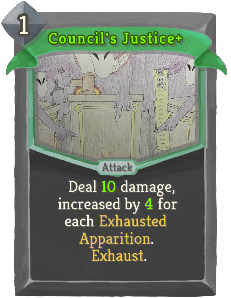 | Special | Attack | 1 | Deal 6 (10) damage, increased by 3 (4) for each Exhausted Apparition. Exhaust. |
| Crystal Shiv | 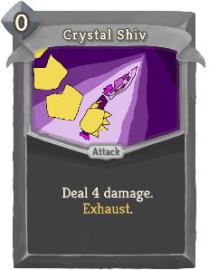 | 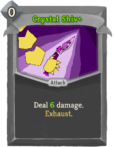 | Special | Attack | 0 | Deal 4 (6) damage. Exhaust. |
| Crystal Ward | 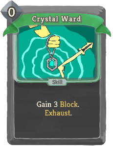 | 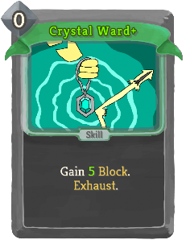 | Special | Skill | 0 | Gain 3 (5) Block. Exhaust. |
| Darkling Duo | 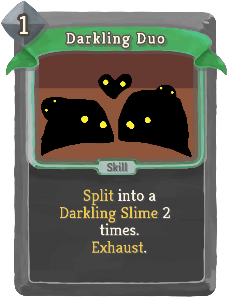 | 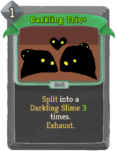 | Special | Skill | 1 | slimeboundmod:Split into a slimeboundmod:Darkling_Slime 2 (3) times. Exhaust. |
| Dazing Pulse |  | 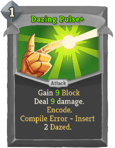 | Special | Attack | 1 | Deal 7 (9) damage. Gain 7 (9) Block bronze:Encode. bronze:Compile Error - bronze:Insert 2 Dazed. |
| Debug | 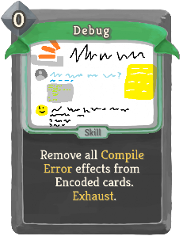 | 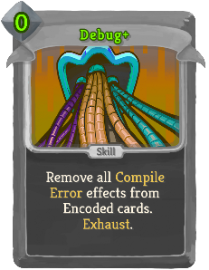 | Special | Skill | 0 | Remove all bronze:Compile Error effects from Encoded cards. Exhaust. |
| Decompile | 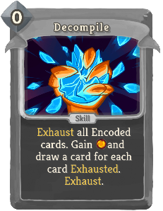 | 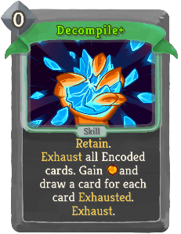 | Special | Skill | 0 | (Retain.)  Exhaust all Encoded cards. Gain [E] and draw a card for each card Exhausted. Exhaust. |
| Explode |  | 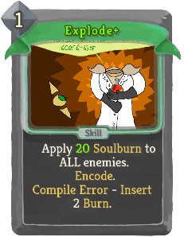 | Special | Skill | 1 | Apply 15 (20) hexamod:Soulburn to ALL enemies. bronze:Encode. bronze:Compile Error - bronze:Insert 2 Burn. |
| Finishing Strike | 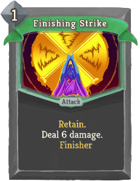 | 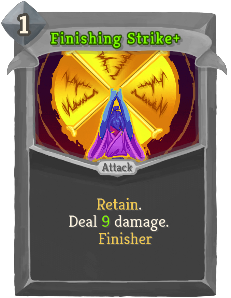 | Special | Attack | 1 | Retain. Deal 6 (9) damage. [fist_icon]   champ:Finisher |
| Knowing Skull | 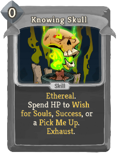 |  | Special | Skill | 0 | Ethereal. Spend HP to Wish for Souls, Success, or a Pick Me Up. Exhaust. |
| Lick | 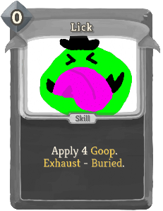 | 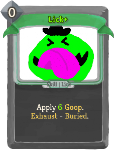 | Special | Skill | 0 | Apply 4 (6) slimeboundmod:Goop. Exhaust - slimeboundmod:Buried. |
| Minor Beam | 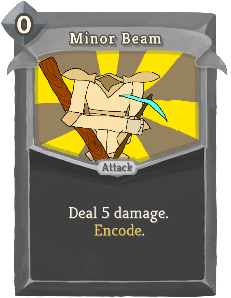 | 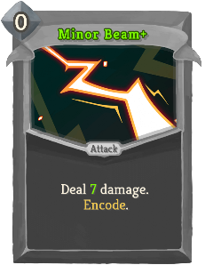 | Special | Attack | 0 | Deal 5 (7) damage. bronze:Encode. |
| Orb Slam | 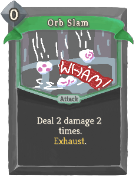 | 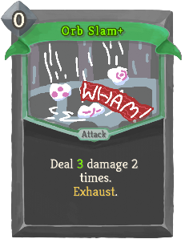 | Special | Attack | 0 | Deal 2 (3) damage 2 times. Exhaust. |
| Package: Ancients | 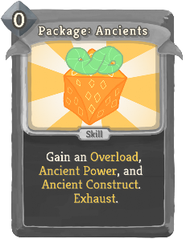 | 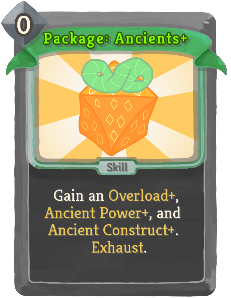 | Special | Skill | 0 | Gain an Overload (*Overload+), Ancient Power (*Power+), and Ancient Construct (*Construct+). Exhaust. |
| Package: Bronze | 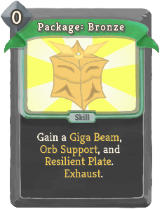 | 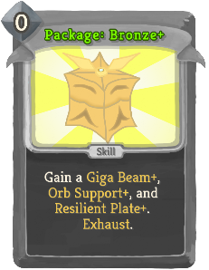 | Special | Skill | 0 | Gain a Giga Beam (*Beam+), Orb Support (*Support+), and Resilient Plate (*Plate+). Exhaust. |
| Package: Defect | 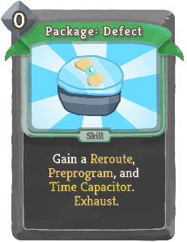 | 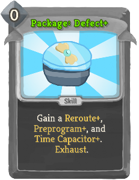 | Special | Skill | 0 | Gain a Reroute (*Reroute+), Preprogram (*Preprogram+), and Time Capacitor (*Capacitor+). Exhaust. |
| Package: Orbwalker | 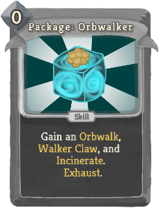 | 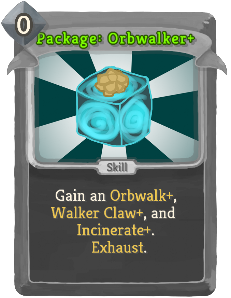 | Special | Skill | 0 | Gain an Orbwalk (*Orbwalk+), Walker Claw (*Claw+), and Incinerate (*Incinerate+). Exhaust. |
| Package: Sentry | 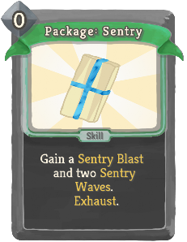 | 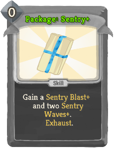 | Special | Skill | 0 | Gain a Sentry Blast (*Blast+) and two Sentry Waves (*Waves+). Exhaust. |
| Package: Shapes | 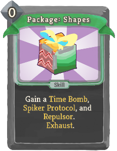 | 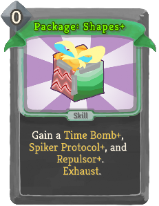 | Special | Skill | 0 | Gain a Time Bomb (*Bomb+), Spiker Protocol (*Protocol+), and Repulsor (*Repulsor+). Exhaust. |
| Package: Spheric | 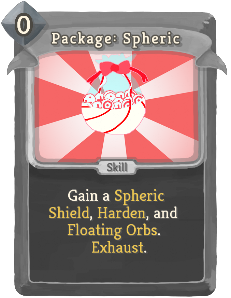 | 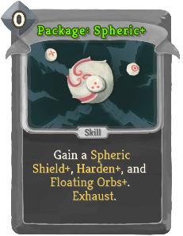 | Special | Skill | 0 | Gain a Spheric Shield (*Shield+), Harden (*Harden+), and Floating Orbs (*Orbs+). Exhaust. |
| Proto-Beam | 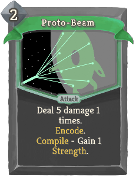 | 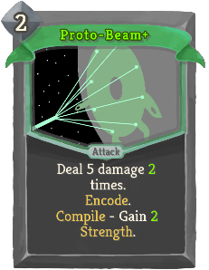 | Special | Attack | 2 | Deal 5 damage 1 (2) times. bronze:Encode. bronze:Compile - Gain 1 (2) Strength. |
| Proto-Shield | 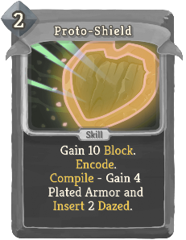 | 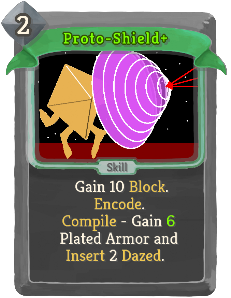 | Special | Skill | 2 | Gain 10 Block. bronze:Encode. bronze:Compile - Gain 4 (6) Plated Armor and bronze:Insert 2 Dazed. |
| SLIME CRUSH!!! | 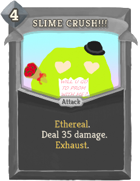 |  | Special | Attack | 4 | Ethereal. Deal 35 (40) damage (to ALL enemies). Exhaust. |
| Sentry Wave | 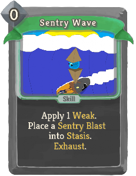 |  | Special | Skill | 0 | Apply 1 Weak. (guardianmod:Brace 2.)  Place a Sentry Blast (*Blast+) into guardianmod:Stasis. Exhaust. |
| Shadow Guise |  |  | Special | Skill | 2 | Ethereal. Gain 7 (9) Block twice. expansioncontent:Reclaim Nightmare Guise. Exhaust. |
| Shadow Strike |  |  | Special | Attack | 2 | Ethereal. Deal 8 (10) damage twice. expansioncontent:Reclaim Nightmare Strike. Exhaust. |
| Spike |  |  | Special | Attack | 0 | Deal 4 (6) damage. bronze:Encode. bronze:Compile - Gain 4 (6) Thorns. |
| Ward |  |  | Special | Skill | 0 | Gain 3 (5) Block. Exhaust. |
| Impending Doom |  |  | Special | Curse |  | Unplayable. hermit:Dead_On: At the end of your turn, deal 13 damage to EVERYONE. |
| Memento |  |  | Special | Curse | 0 | Retain. Apply 1 Vulnerable to EVERYONE. |
| Aged |  |  | Curse | Curse |  | Unplayable. Ethereal. At the end of your turn, add a Void to the top of your draw pile. |
| Bewildered |  |  | Curse | Curse | 2 | When you play another card, sneckomod:Muddle your hand, then discard this. Exhaust. |
| Flawed |  |  | Curse | Curse | 1 | Ethereal. At the end of your turn, transform all cards in hand into random Status cards. Exhaust. |
| Haunted |  |  | Curse | Curse |  | Ethereal. Unplayable. When drawn, add Ethereal to all cards in your hand. |
| Icky |  |  | Curse | Curse | 1 | Gain a Slimed. Exhaust. |
| Scatterbrained |  |  | Curse | Curse |  | Unplayable. When drawn, if it is your turn, fill your hand with gremlin:Echoes of this card. |
| Automa-Beam |  |  | Uncommon | Attack | 2 | Deal 26 (34) damage to ALL enemies. At the start of your next turn, lose [E]. Exhaust. |
| Awaken |  |  | Uncommon | Power | 2 | When you would die, or at the end of combat, heal 8 (12) HP instead and lose this buff. |
| Chrono-Boost |  |  | Uncommon | Power | 2 | Gain 1 Strength (. Gain 1 Strength) for every 12th card you play. |
| Guardian Whirl |  |  | Uncommon | Attack | 2 | Requires 10 Block. Deal 4 (6) damage to ALL enemies 4 times. Exhaust. |
| Hexaburn |  |  | Uncommon | Power | 2 | In 3 (2) turns, deal 6 damage to a random enemy 6 times. Scales with Strength. |
| Invincible |  |  | Uncommon | Power | 2 (1) | Gain 10 expansioncontent:Invincible. If you already had expansioncontent:Invincible, it lasts another turn instead. |
| Last Stand |  |  | Uncommon | Power | 2 | Remove all Debuffs. Gain 1 Strength. If you are below half HP, Gain (Heal 10 and gain) 2 Strength. |
| Prepare Crush |  |  | Uncommon | Skill | 2 | Gain 10 (15) Block. Next turn, gain [E] [E] [E] and SLIME CRUSH (*CRUSH+). Exhaust. |
| Shaper's Blessing |  |  | Uncommon | Power | 2 | Choose - Gain 2 (3) Strength or 5 (8) Plated Armor. |
| YOU ARE MINE! |  |  | Uncommon | Skill | 2 | Remove Block from, and apply 3 (5) Weak and Vulnerable to, ALL enemies. Exhaust. |
| Quick Study |  |  | Rare | Skill | 1 | Choose 1 of 3 (Upgraded) Boss cards to gain. It costs 0 until played. Exhaust. |
| Study the Spire |  |  | Rare | Power | 3 | Gain a random (Upgraded) Boss card (not card)at the start of your next 3 turns. They cost 0. |
| The Evil Within |  |  | Rare | Attack | 1 | Deal 10 (12) damage. Gain a random (Upgraded) Boss card. It costs 0 until played. Exhaust. |
| Defend |  |  | Basic | Skill | 1 | Gain 5 (8) Block. |
| Float |  |  | Basic | Skill | 0 | Draw a card. (You may choose to hexamod:Retract or) hexamod:Advance. |
| Kindle |  |  | Basic | Skill | 1 | If (hexamod:Ignite) the current Ghostflame is not Ignited, hexamod:Ignite it (not is not Ignited, hexamod:Ignite it). |
| Sear |  |  | Basic | Skill | 1 | Ethereal. hexamod:Afterlife. Apply 10 (14) hexamod:Soulburn. |
| Strike |  |  | Basic | Attack | 1 | Deal 6 (9) damage. |
| Advancing Guard |  |  | Common | Skill | 1 | Gain 8 (11) Block. hexamod:Advance. |
| Again! |  |  | Common | Skill | 1 (0) | hexamod:Ignite the current Ghostflame, then hexamod:Extinguish it. |
| Backtrack Smack |  |  | Common | Attack | 1 | Deal 12 (15) damage. hexamod:Retract. |
| Burning Touch |  |  | Common | Skill | 1 | Apply 7 (11) hexamod:Soulburn, twice if the enemy has hexamod:Soulburn. |
| Firestarter |  |  | Common | Attack | 1 | Deal 6 (8) damage and apply 6 (8) hexamod:Soulburn to ALL enemies. |
| Ghost Lash |  |  | Common | Attack | 1 | Ethereal. hexamod:Afterlife. Deal 9 (12) damage. When Exhausted, gain 6 (8) Vigor. |
| Ghost Shield |  |  | Common | Skill | 1 | Ethereal. hexamod:Afterlife. Gain 7 (10) Block. When Exhausted, gain 1 bronze:Blur. |
| Haunting Echo |  |  | Common | Attack | 1 | Deal 8 (11) damage. If the current Ghostflame is Ignited, hexamod:Ignite it again. |
| Heat Metal |  |  | Common | Attack | 1 | Deal 9 (12) damage. After hexamod:Soulburn detonates on this enemy, apply 12 (16) hexamod:Soulburn. |
| Hexaguard |  |  | Common | Skill | 1 | Ethereal. hexamod:Afterlife. Gain 7 (10) Block. Draw 1 card. |
| Nightmare Guise |  |  | Common | Skill | 1 | Ethereal. Gain 9 (12) Block. When Exhausted, gain a Shadow Guise (*Guise+). |
| Nightmare Strike |  |  | Common | Attack | 1 | Ethereal. Deal 10 (13) damage. When Exhausted, gain a Shadow Strike (*Strike+). |
| Phantom Fireball |  |  | Common | Attack | 0 | Deal 4 (7) damage. If the enemy has Soulburn, detonate it. |
| Shield of Night |  |  | Common | Skill | 2 | If the current Ghostflame is not Ignited, gain [E] . Gain 12 (16) Block. |
| Specter's Wail |  |  | Common | Attack | 1 | Ethereal. hexamod:Afterlife. Deal 8 (11) damage to ALL enemies. |
| Stoke the Fire |  |  | Common | Skill | 1 | Gain 7 (10) Block. For each Ignited Ghostflame, Upgrade a random card in your hand. |
| Strike From Beyond |  |  | Common | Attack | 1 | Deal 4 (6) damage twice. expansioncontent:Reclaim a random Afterlife card. |
| Sword of Night |  |  | Common | Attack | 2 | If the current Ghostflame is not Ignited, gain [E] . Deal 14 (18) damage. |
| Thermal Transfer |  |  | Common | Attack | 1 | Deal 7 (10) damage. If the enemy has Soulburn, gain 6 (8) Block. |
| Bright Ritual |  |  | Uncommon | Skill | 1 (0) | Gain [E] and draw 1 card for each Ignited Ghostflame, then hexamod:Extinguish them. Exhaust. |
| Catch Up |  |  | Uncommon | Skill | 1 | hexamod:Ignite the previous Ghostflame 2 (3) times. |
| Charged Barrage |  |  | Uncommon | Skill | 1 | Apply 5 (7) hexamod:Soulburn. Repeat for each Ignited Ghostflame. |
| Devil's Dance |  |  | Uncommon | Power | 2 (1) | The first time you Retract each turn, gain [E] and draw 1 card. hexamod:Retract. |
| Divider |  |  | Uncommon | Attack | 1 | Deal 3 (5) damage. Repeat for each Ignited Ghostflame. |
| Eerie Expedition |  |  | Uncommon | Skill | 1 (0) | Ethereal. Gain a random Ethereal card. It costs 0 this turn. Exhaust. |
| Empowered Flame |  |  | Uncommon | Power | 1 | Gain 2 (3) hexamod:Intensity. |
| Extra Crispy |  |  | Uncommon | Power | 1 | (Innate.)  Cards and Ghostflames apply 2 more hexamod:Soulburn. |
| Fast Forward |  |  | Uncommon | Skill | 1 | Ethereal. (not Ethereal.) hexamod:Ignite the current Ghostflame. hexamod:Advance. |
| First Seal |  |  | Uncommon | Power | 1 | Ethereal (not Ethereal)hexamod:Seal. At the end of combat, heal 7 HP. |
| Flames from Beyond |  |  | Uncommon | Skill | 2 | Ethereal. hexamod:Afterlife. Apply 18 (24) hexamod:Soulburn to ALL enemies. |
| Floatwork |  |  | Uncommon | Power | 1 | Ethereal. hexamod:Afterlife. Gain 3 (4) Plated Armor. |
| Fourth Seal |  |  | Uncommon | Power | 1 | Ethereal (not Ethereal)hexamod:Seal. At the end of combat, gain an additional Potion reward. |
| Ghostflame Wall |  |  | Uncommon | Skill | 2 | Gain 12 (16) Block. Whenever you are attacked this turn, apply 6 (9) hexamod:Soulburn to the attacker. |
| Haunted Hand |  |  | Uncommon | Skill | 1 | Ethereal. hexamod:Afterlife. Draw 2 (3) cards. All cards in your hand become Ethereal. |
| Heat Crush |  |  | Uncommon | Attack | 3 | Deal 20 (30) damage. Damage is increased by enemy's Soulburn. |
| Heat Shield |  |  | Uncommon | Skill | 1 (0) | Gain Block equal to Soulburn on ALL enemies, then remove Soulburn. |
| Incineration |  |  | Uncommon | Attack | 2 | Deal 4 damage and apply 4 hexamod:Soulburn 3 (4) times. |
| Incorporeal |  |  | Uncommon | Skill | 0 | hexamod:Retract. Lose 5 (3) HP. Gain 1 Intangible. Exhaust. |
| Living Bomb |  |  | Uncommon | Skill | 0 | Apply 4 (8) hexamod:Soulburn. When it detonates, it affects ALL enemies. |
| Nightmare Vision |  |  | Uncommon | Skill | 0 | expansioncontent:Exhume an (2) Ethereal card(s). Exhaust. |
| Power from Beyond |  |  | Uncommon | Skill | 1 | Ethereal. hexamod:Afterlife. Gain [E] and draw 1 (2) card(s) next turn. |
| Premonition |  |  | Uncommon | Skill | 1 (0) | Choose a card in your hand. Play the chosen card and Exhaust it. Exhaust. |
| Radiant Flame |  |  | Uncommon | Power | 1 | Whenever you Ignite a Ghostflame, gain 3 (4) Block. |
| Rain of Embers |  |  | Uncommon | Attack | X | Deal 6 damage and (,) apply 6 hexamod:Soulburn (, and apply 1 Weak) X times. |
| Rewind |  |  | Uncommon | Skill | 0 | hexamod:Retract. Gain [E] (and draw 1 card). |
| Second Seal |  |  | Uncommon | Power | 1 | Ethereal (not Ethereal)hexamod:Seal. At the end of combat, gain 10 additional Gold. |
| Spectral Spark |  |  | Uncommon | Skill | 0 | If possible, hexamod:Extinguish the current Ghostflame to gain 1 (2) hexamod:Intensity. |
| Speedrunning |  |  | Uncommon | Power | 1 | (Innate.)  Whenever you Advance, gain 2 temporary Strength. |
| Step Through |  |  | Uncommon | Attack | 1 | Deal 8 (11) damage. Draw 1 card for each Ignited Ghostflame. |
| Third Seal |  |  | Uncommon | Power | 1 | Ethereal (not Ethereal)hexamod:Seal. At the end of combat, gain an additional card reward. |
| Worthy Sacrifice |  |  | Uncommon | Skill | 0 | Exhaust a card. If it was Attack or Skill, gain a random card of the opposite type. (It costs 1 less.) |
| Bad Omen |  |  | Rare | Skill | 1 | Ethereal (Retain). Choose a Ghostflame type to change the current one into. Exhaust. |
| Burning Question |  |  | Rare | Skill | 2 | Ethereal. Gain 3 (4) Strength. When Exhausted, gain 2 Dexterity. |
| Doomsday |  |  | Rare | Power | 0 | The next time all (at least) 6 (5) Ghostflames are Ignited, take an extra turn. |
| Fifth Seal |  |  | Rare | Power | 2 | Ethereal (not Ethereal)hexamod:Seal. At the end of combat, Upgrade a random card in your deck. |
| Forked Flame |  |  | Rare | Attack | 1 | Deal 5 (10) damage. hexamod:Ignite the previous, then the next Ghostflames. |
| Gifts From Beyond |  |  | Rare | Power | 2 (1) | At the start of your turn, expansioncontent:Reclaim a random Afterlife card. |
| Here and Now |  |  | Rare | Power | 1 (0) | You no longer Advance at the end of turn. At the start of your turn, gain [E] . |
| Infernal Form |  |  | Rare | Power | 3 | At the start of your turn, gain 2 (3) hexamod:Intensity. |
| Instant Inferno |  |  | Rare | Skill | 1 | Retain. hexamod:Ignite the (current, then the) Inferno Ghostflame(s). Exhaust. |
| Poltergeist |  |  | Rare | Power | 2 | Whenever you play an Afterlife card, deal 6 (9) damage to a random enemy. |
| Searing Wound |  |  | Rare | Skill | 1 | ALL enemies lose HP equal to their Soulburn. Exhaust. (not Exhaust.) |
| Sixth Seal |  |  | Rare | Power | 3 | Ethereal (not Ethereal)hexamod:Seal. At the end of combat, gain an additional non-Sixth Seal card reward. |
| Time Warp |  |  | Rare | Attack | 0 | Deal 4 (6) damage. Whenever you Advance or Retract, return this from the discard pile. |
| Time of Need |  |  | Rare | Skill | 1 (0) | Retain. Gain a random Power card. It costs 0 until played. Exhaust. |
| Toasty! |  |  | Rare | Attack | 2 | Deal 14 (18) damage. Apply hexamod:Soulburn equal to unblocked damage dealt. |
| Turn It Up |  |  | Rare | Skill | X | Gain 6 hexamod:Intensity. Lose it in X+1 turns. (Gain [E].)  Exhaust. |
| Unleash Spirits |  |  | Rare | Attack | 2 | Deal 6 (8) damage to a random enemy. Repeat for each Exhausted Ethereal card. Exhaust. |
| Unlimited Power |  |  | Rare | Skill | 5 (4) | hexamod:Ignite all Ghostflames in order. Exhaust. |
| Volcano Visage |  |  | Rare | Power | 1 | Whenever you Ignite a Ghostflame, apply 4 (6) hexamod:Soulburn to ALL enemies. |
| Defend |  |  | Basic | Skill | 1 | Gain 5 (8) Block. |
| Goto |  |  | Basic | Skill | 1 | Draw 1 (2) card(s). bronze:Encode. bronze:Compile - Next turn, draw 1 (2) card(s). |
| Replicate |  |  | Basic | Attack | 0 | Deal 5 (7) damage. bronze:Encode. π When bronze:Encoded, add a copy to your discard pile. |
| Strike |  |  | Basic | Attack | 1 | Deal 6 (9) damage. |
| function() | .png) |  | Special | Skill | 1 |  |
| Bit Shift |  |  | Common | Skill | 0 | (Retain.)  Choose an Encoded card to return to your hand. It gains Retain. Exhaust. |
| Branch |  |  | Common | Attack | 1 | Deal 7 (9) damage or gain 6 (8) Block. The option not chosen is bronze:Encoded. Exhaust. |
| Bug Barrage |  |  | Common | Attack | 1 | Gain 1 (2) Wound(s). bronze:Cycle each Status, dealing 7 damage for each. |
| Buggy Mess |  |  | Common | Skill | 1 (0) | bronze:Insert a Dazed. Gain 1 [E] . bronze:Encode. |
| Cleanse |  |  | Common | Attack | 1 | Deal 9 (12) damage. Exhaust a random Status card in your draw pile. |
| Cut Through |  |  | Common | Attack | 1 | Deal 5 (7) damage. Scry 2 (3). bronze:Encode. bronze:Compile - Draw 1 card. |
| Delayed Guard |  |  | Common | Skill | 0 | Next turn, gain 7 (10) Block. bronze:Encode. |
| Deprecate |  |  | Common | Skill | 0 | Apply 1 (2) Weak. bronze:Encode. |
| Fine Tuning |  |  | Common | Skill | 0 | (Retain.)  Increase all numbers on Encoded cards by 1 except cost. Exhaust. |
| Frontload |  |  | Common | Skill | 2 | Gain 8 (11) Block. bronze:Encode. bronze:Compile - Function gains Retain. |
| Invalidate |  |  | Common | Skill | 0 | Apply 1 (2) Vulnerable. bronze:Encode. |
| Oil Spill |  |  | Common | Attack | 1 | Deal 4 (5) damage and apply 4 (5) Poison. bronze:Encode. bronze:Compile Error - bronze:Insert a Slimed. |
| Overheat |  |  | Common | Attack | 2 | Deal 18 (24) damage. Remove the next bronze:Compile Error you would bronze:Encode. |
| Piercing Shot |  |  | Common | Attack | 1 | Deal 6 (8) damage to ALL enemies. bronze:Encode. |
| Robo-Chop |  |  | Common | Attack | 1 | Deal 9 (10) damage. Next turn, draw 1 (2) additional card(s). |
| Safeguard |  |  | Common | Skill | 1 | Gain 7 (9) Block. bronze:Encode. |
| Sticky Shield |  |  | Common | Skill | 1 | Gain 11 (14) Block. bronze:Insert 1 Slimed. |
| Turbo |  |  | Common | Skill | 0 | Gain [E] [E] ([E]). Add a Void into your discard pile. |
| Wild Strike |  |  | Common | Attack | 1 | Deal 12 (17) damage. π bronze:Insert a Wound. |
| Allocate |  |  | Uncommon | Skill | 1 (0) | Gain [E] for each Status in your draw pile. |
| Backtrace |  |  | Uncommon | Attack | 0 | Innate.   Deal 8 (12) damage. bronze:Encode. bronze:Compile Error - Function Exhausts. |
| Blockchain |  |  | Uncommon | Skill | 1 | Gain 1 bronze:Blur. bronze:Encode.  (bronze:Compile - Gain 1 bronze:Blur.) |
| Boost |  |  | Uncommon | Skill | 2 | Gain 6 Block. bronze:Encode. bronze:Compile - Gain 2 (3) Strength. |
| Bronze Armor |  |  | Uncommon | Skill | 0 | Gain 1 Artifact. bronze:Encode. bronze:Compile Error - ALL enemies gain 12 (8) Block. |
| Bronze Orb |  |  | Uncommon | Attack | 1 | Innate. Deal 8 (12) damage. bronze:Encode a random card with bronze:Encode in your draw pile. Exhaust. |
| Class Default |  |  | Uncommon | Power | 1 | (Retain.)  Add a copy of the first card in the current Sequence to the next 2 Sequences. |
| Constructor |  |  | Uncommon | Skill | 1 | Gain 5 (7) Block. π When bronze:Encoded as the first card, increase its Block by 5 (7). bronze:Encode. |
| Copy Paste |  |  | Uncommon | Skill | 1 | Play a copy of each Encoded card. They do not Encode. Exhaust. (not Exhaust.) |
| Cultist Strike |  |  | Uncommon | Attack | 1 | Deal 6 (9) damage. bronze:Encode. bronze:Compile - Increase this card's damage by 1 permanently. |
| Flail |  |  | Uncommon | Attack | 2 | Deal 7 (8) damage to ALL enemies 2 times. Gain 1 (2) Artifact. Exhaust. |
| Follow Through |  |  | Uncommon | Attack | 1 | Deal 7 (9) damage. Gain 4 (6) Block. If the last played card was a Function, play this again. |
| For Loop |  |  | Uncommon | Skill | X | The next card you bronze:Encode causes X (X+1) additional copies to also be bronze:Encoded. Exhaust. |
| Force Shield |  |  | Uncommon | Skill | 3 | Costs 1 less [E] for each Function created this combat. Gain 12 (16) Block. |
| Fortify |  |  | Uncommon | Attack | 2 | Deal 8 damage. bronze:Encode. bronze:Compile - Gain 2 (3) Dexterity. |
| Fragment |  |  | Uncommon | Attack | 1 | Deal 4 (6) damage. Gain 4 (6) Block. bronze:Encode. |
| Get Latest |  |  | Uncommon | Skill | 1 (0) | Gain a random card with bronze:Encode. It costs 0. Exhaust. |
| Infinite Beams |  |  | Uncommon | Power | 1 | At the start of each turn, gain a Minor Beam (*Beam+). |
| It's a Feature |  |  | Uncommon | Power | 1 | (Innate.)  Whenever you draw a Curse or Status card, gain 1 Temporary Strength and Dexterity. |
| Iterate |  |  | Uncommon | Attack | 1 | Deal 2 damage 3 (4) times. bronze:Encode. |
| Max Output |  |  | Uncommon | Power | 1 (0) | Draw 3 cards. At the start of each turn, draw 1 additional card and bronze:Insert 1 Dazed. |
| Merge Conflict |  |  | Uncommon | Attack | 2 | Deal 14 damage. The next time you bronze:Encode a card, bronze:Encode a copy of it. Exhaust. (not Exhaust.) |
| Null Pointer |  |  | Uncommon | Attack | 1 | Gain 12 (15) Block. Deal 12 (15) damage. bronze:Encode. bronze:Compile Error - Function is Unplayable. |
| Optimize |  |  | Uncommon | Power | 0 | Upgrade the next 3 (5) cards you bronze:Encode that can be upgraded. |
| Philosophize |  |  | Uncommon | Skill | 1 | Gain 1 Strength. bronze:Encode. bronze:Compile Error - ALL enemies gain 2 (1) Strength. |
| Recursive Strike |  |  | Uncommon | Attack | 2 | Deal 6 (9) damage 2 times. bronze:Encode 2 copies of Strike (*Strike+). |
| Refactor |  |  | Uncommon | Skill | 1 | Scry 4. Exhaust all cards discarded. Gain 4 (6) Block for each Status card exhausted. |
| Repair |  |  | Uncommon | Skill | 1 | Gain 4 Block. bronze:Encode. bronze:Compile - Heal 7 (10) HP. |
| Repulsor |  |  | Uncommon | Power | 2 (1) | When you draw the first Status or Curse card each turn, Exhaust it and draw a card. |
| Return |  |  | Uncommon | Skill | 1 | Put a card from your discard pile on top of your draw pile. Next turn, gain [E] ([E]). |
| Separator |  |  | Uncommon | Attack | 1 | Deal 6 (8) damage. π When bronze:Encoded in the middle, increase its damage by 6 (8). bronze:Encode. |
| Terminator |  |  | Uncommon | Skill | 1 (0) | bronze:Encode. bronze:Compile - If this is the last card in the Sequence, Function gains 'Play this again'. |
| Undervolt |  |  | Uncommon | Skill | 1 | ALL enemies lose 2 (3) Strength. Gain 2 Burns. Exhaust. |
| Assembly |  |  | Rare | Skill | 1 | Scry 5 (8). bronze:Encode all Encodable cards discarded (in selected order). Exhaust. |
| Break |  |  | Rare | Attack | 1 | Deal 15 (20) damage. bronze:Encode. bronze:Compile Error - bronze:Insert a Burn, a Wound, and a Slimed. |
| Burn Out |  |  | Rare | Attack | 1 | Deal 6 (9) damage to a random enemy for ALL of your Status cards, then Exhaust them. Exhaust. |
| Clean Code |  |  | Rare | Power | 1 | (Innate.)  Remove the next 3 bronze:Compile Errors you would bronze:Encode. |
| Dev Tools |  |  | Rare | Skill | 0 | Retain. Gain Debug, Batch, Decompile, or Byte Shift. Exhaust. (not Exhaust.) |
| Digital Carnage |  |  | Rare | Attack | 2 | Deal 15 (20) damage. bronze:Encode. bronze:Compile Error - Function is Ethereal. |
| Find and Replace |  |  | Rare | Skill | 0 | Fetch a card from your draw or discard pile. Add a Dazed where it was. (not Add a Dazed where it was.) Exhaust. |
| Format |  |  | Rare | Skill | X | bronze:Encode X (X+1) copies of Fragment. Gain [E]. Exhaust. |
| Full Release |  |  | Rare | Skill | 2 (1) | bronze:Encode. bronze:Compile - Function becomes a Power with 'At the start of your turn...' |
| HYPER BEAM |  |  | Rare | Attack | 1 | Deal 25 (35) damage to ALL enemies. Put 5 Void on top of your draw pile. |
| Infinite Loop |  |  | Rare | Attack | 1 | Deal 6 damage. bronze:Encode. bronze:Compile - Gain a copy of this and increase its damage by 2 (4). |
| Library |  |  | Rare | Power | 3 (2) | At the start of your turn, gain a random card with bronze:Encode. It costs 0. |
| Mutator |  |  | Rare | Power | 1 | (Retain.)  Gain 1 Strength. Transform a Status into a copy of this. |
| Sentient Form |  |  | Rare | Power | 3 | Ethereal. (not Ethereal.) Whenever you draw a Function, increase all numbers on it by 1 except for cost. |
| Ship It |  |  | Rare | Attack | 1 | Deal 5 damage. Deals 2 (3) additional damage for ALL of your Status cards. |
| Spaghetti Code |  |  | Rare | Skill | 2 (1) | Until the Sequence is full, choose 1 of 3 random cards to bronze:Encode. Exhaust. |
| Summon Orb |  |  | Rare | Power | 2 | Whenever you create or play a Function, gain 4 (6) Block and deal 4 (6) damage to a random enemy. |
| Thunder Wave |  |  | Rare | Attack | 3 | Deal 18 (24) damage to ALL enemies. Gain 1 guardianmod:Buffer. Exhaust. |
| Virus |  |  | Rare | Attack | 1 | Retain. Deal 5 (6) damage. Transform all cards in hand into Minor Beam (*Beam+). |
| Corrosive Spit |  |  | Basic | Skill | 1 (0) | Apply 6 slimeboundmod:Goop. |
| Defend |  |  | Basic | Skill | 1 | Gain 5 (8) Block. |
| Split |  |  | Basic | Skill | 1 | slimeboundmod:Split into (Choose) 2 random (of 4) Slimes (to slimeboundmod:Split into). Exhaust. |
| Strike |  |  | Basic | Attack | 1 | Deal 6 (9) damage. |
| Tackle |  |  | Basic | Attack | 1 | Deal 12 (16) damage. Take 3 damage. |
| Combo Tackle |  |  | Common | Attack | 2 | Deal 12 (15) damage. Take 3 damage. Gain a random (Upgraded) slimeboundmod:Tackle. It costs 0 this turn. |
| Goop Spray |  |  | Common | Skill | 1 | Gain 5 Block. Apply 5 slimeboundmod:Goop and 1 (2) Weak to ALL enemies. |
| Haunting Lick |  |  | Common | Skill | 0 | Apply 1 Vulnerable and 4 slimeboundmod:Goop. (Draw a card.)  Exhaust. |
| It Looks Tasty |  |  | Common | Attack | 1 | Deal 8 (10) damage. slimeboundmod:Consume - Gain a Lick (*Lick+). |
| Leech Energy |  |  | Common | Attack | 1 | Deal 5 (8) damage. slimeboundmod:Consume - Gain [E] and draw 1 card. |
| Leeching Strike |  |  | Common | Attack | 1 | Deal 5 (8) damage. slimeboundmod:Consume - Gain Block equal to the enemy's slimeboundmod:Goop. |
| Living Wall |  |  | Common | Skill | 2 | Gain 12 (15) Block. Apply 4 (6) slimeboundmod:Goop to attackers this turn. |
| Opening Tackle |  |  | Common | Attack | 1 | Deal 11 (14) damage. Take 3 damage. slimeboundmod:Consume - Apply 2 (3) Vulnerable. |
| Prepare |  |  | Common | Skill | 2 | Gain 10 (15) Block. Next turn, gain [E] [E] and draw 2 cards. Exhaust. |
| Press the Attack |  |  | Common | Attack | 1 | Deal 9 damage. slimeboundmod:Consume - slimeboundmod:Command (twice). |
| Roll Through |  |  | Common | Attack | 1 | Deal 5 (7) damage to ALL enemies. You do not take damage from the next 2 (3) slimeboundmod:Tackles. |
| Sampling Lick |  |  | Common | Skill | 0 | Apply 4 slimeboundmod:Goop. Gain 4 Block. (Draw a card.)  Exhaust. |
| Schlurp |  |  | Common | Skill | 1 | Gain 6 Block. Gain 2 (3) Licks. |
| Slime Spikes |  |  | Common | Skill | 1 | Gain 7 (9) Block and 3 (4) temporary Thorns. |
| Spear Tackle |  |  | Common | Attack | 1 | Deal 11 (13) damage. Take 3 damage. Draw 2 (3) cards. |
| Split: Bruiser |  |  | Common | Skill | 1 | slimeboundmod:Split into a slimeboundmod:Bruiser_Slime. slimeboundmod:Command 2 (3) times. Exhaust. |
| Split: Guerilla |  |  | Common | Skill | 1 | slimeboundmod:Split into a slimeboundmod:Guerilla_Slime. slimeboundmod:Command 2 (3) times. Exhaust. |
| Split: Leeching |  |  | Common | Skill | 1 | slimeboundmod:Split into a slimeboundmod:Leeching_Slime. slimeboundmod:Command 2 (3) times. Exhaust. |
| Split: Mire |  |  | Common | Skill | 1 | slimeboundmod:Split into a slimeboundmod:Mire_Slime. slimeboundmod:Command 2 (3) times. Exhaust. |
| Chomp |  |  | Uncommon | Attack | 1 | Deal 8 (10) damage. Reduce the cost of a random slimeboundmod:Tackle in your hand to 0 this turn (combat). |
| Divide & Conquer |  |  | Uncommon | Attack | 1 | Deal 10 (15) damage to a random enemy for each Slime. slimeboundmod:Absorb all Slimes. Exhaust. |
| Double Lick |  |  | Uncommon | Skill | 0 | Apply 4 slimeboundmod:Goop 2 times. (Draw a card.)  Exhaust. |
| Equalize |  |  | Uncommon | Attack | 2 | Deal 8 (12) damage. Heal 4 (6) HP. slimeboundmod:Consume - Play this twice. Exhaust. |
| Flame Tackle |  |  | Uncommon | Attack | 2 | Deal 16 (19) damage. Take 3 damage. slimeboundmod:Tackles deal 3 (4) more damage this combat. |
| Forward Tackle |  |  | Uncommon | Attack | 2 | Deal 15 (17) damage. Take 3 damage. slimeboundmod:Command twice (three times). |
| Gluttony |  |  | Uncommon | Power | 1 | (Innate.)  The first time you slimeboundmod:Consume each turn, gain a Lick. |
| Goop Armor |  |  | Uncommon | Power | 1 | Gain 3 (4) Block whenever you slimeboundmod:Consume. |
| Grow |  |  | Uncommon | Power | 2 (1) | Lose 1 Slime slot in exchange for 2 Strength and 2 Dexterity. |
| Growth Punch |  |  | Uncommon | Attack | 1 | Deal 4 (5) damage. Gain 4 (5) Block. slimeboundmod:Consume - Increase this card's effects by 4 (5) this combat. |
| Hungry Tackle |  |  | Uncommon | Attack | 1 | Deal 10 (14) damage. Take 3 damage. expansioncontent:Exhume a random Lick. |
| Just Desserts |  |  | Uncommon | Attack | 1 | Deal 6 (8) damage to ALL enemies. expansioncontent:Exhume 2 (3) random Lick cards. |
| Lead By Example |  |  | Uncommon | Power | 1 | The first (2) card(s) you play each turn that targets enemies also slimeboundmod:Commands (slimeboundmod:Command). |
| Level Up |  |  | Uncommon | Power | 1 | Gain 1 (2) slimeboundmod:Potency. |
| Mega-Lick |  |  | Uncommon | Skill | 0 | Apply 1 Weak and 4 slimeboundmod:Goop to ALL enemies. (Draw a card.)  Exhaust. |
| Nibble and Lick |  |  | Uncommon | Attack | 0 | Deal 1 damage. Gain a Lick. (Draw a card.)  Exhaust. |
| Pile On! |  |  | Uncommon | Attack | 2 | Deal 8 damage. slimeboundmod:Command ALL slimes (twice). |
| Protect the Boss |  |  | Uncommon | Power | 1 (0) | Prevent the next time you would be damaged by an enemy attack, slimeboundmod:Absorbing your leading Slime instead. |
| Quick Snack |  |  | Uncommon | Skill | 0 | Draw 2 (3) cards. Exhaust a card. Gain Licks equal to its cost. Exhaust. |
| Rain of Goop |  |  | Uncommon | Skill | 1 | Apply 3 slimeboundmod:Goop to a random enemy 4 (6) times. |
| Recklessness |  |  | Uncommon | Power | 1 | slimeboundmod:Tackles deal 6 (9) more damage to enemies, and 1 more damage to you. |
| Recollect |  |  | Uncommon | Skill | 1 | Gain 8 (11) Block. expansioncontent:Exhume a random Lick card. |
| Replication |  |  | Uncommon | Skill | 1 | Choose a card. Put (Gain) a copy on top (not on top)of your draw pile (it). Exhaust. |
| Repurpose |  |  | Uncommon | Skill | 0 | slimeboundmod:Absorb - Split into a random slimeboundmod:Specialist. (slimeboundmod:Command.)  Exhaust. |
| Serve & Protect |  |  | Uncommon | Skill | 1 | Gain 10 (15) Block and 1 bronze:Blur for each Slime. slimeboundmod:Absorb all Slimes. Exhaust. |
| Shape of Puddle |  |  | Uncommon | Skill | 3 (2) | Gain 1 Intangible. Exhaust. |
| Slime Brawl |  |  | Uncommon | Skill | 3 (2) | Play the top card of your draw pile. Repeat for each of your spawned Slimes. Exhaust. |
| Slime Tap |  |  | Uncommon | Skill | 0 | slimeboundmod:Absorb - Gain [E] ([E]) and draw 2 cards. Exhaust. |
| Split: Specialist |  |  | Uncommon | Skill | 1 | Choose 1 of 3 slimeboundmod:Specialist to slimeboundmod:Split into. (slimeboundmod:Command.)  Exhaust. |
| Spreading Slime |  |  | Uncommon | Power | 2 | Effects that apply slimeboundmod:Goop apply 2 (3) more. |
| Tongue Lash |  |  | Uncommon | Attack | 1 | Deal 6 damage. Deals 2 (3) additional damage for each Exhausted card containing "Lick". |
| Vicious Tackle |  |  | Uncommon | Attack | 2 | Deal 16 (20) damage. Take 3 damage. This gains twice the damage bonus from slimeboundmod:Goop. |
| Consult Playbook |  |  | Rare | Skill | 2 (1) | Gain 4 random slimeboundmod:Tackles. They cost 1 less this combat. Exhaust. |
| Douse in Slime |  |  | Rare | Skill | 3 (2) | Apply 14 slimeboundmod:Goop. The next Attack used on this enemy does not remove slimeboundmod:Goop. |
| Duplicated Form |  |  | Rare | Power | 3 | (Gain [E] each turn.)  The first card each turn that targets enemies is played twice. |
| Leech Life |  |  | Rare | Attack | 2 | Deal 12 (18) damage. slimeboundmod:Consume - Heal HP equal to the enemy's slimeboundmod:Goop, up to 18 (24). Exhaust. |
| Liquidate |  |  | Rare | Skill | 0 | Unplayable if you have negative Strength. Lose 2 Strength. Gain 2 (3) slimeboundmod:Potency. |
| Mass Feed |  |  | Rare | Attack | 2 | Deal 10 (12) damage to ALL enemies. If Fatal, raise your Max HP by 3 (4). Exhaust. |
| Mass Repurpose |  |  | Rare | Skill | 1 | slimeboundmod:Absorb ALL Slimes. Split into a random slimeboundmod:Specialist for each. (slimeboundmod:Command them.) Exhaust. |
| Minion Master |  |  | Rare | Power | 2 | (Innate.)  Whenever you play a card with slimeboundmod:Command, slimeboundmod:Command again. |
| One-Two Combo |  |  | Rare | Attack | 0 | Deal 3 damage. (slimeboundmod:Command.)  When you slimeboundmod:Split, return this from the discard pile to your hand. |
| Ooze Bath |  |  | Rare | Skill | 1 | Apply 6 (9) slimeboundmod:Goop to target enemy at the start of each of its turns. Exhaust. |
| Overexert |  |  | Rare | Power | 1 | Gain 4 slimeboundmod:Potency. (slimeboundmod:Command twice.)  2 turns from now, slimeboundmod:Absorb all Slimes. |
| Prepare: Crush |  |  | Rare | Skill | 2 | Next turn, gain SLIME CRUSH (*CRUSH+), [E] [E] [E] ([E]) and 3 Strength. Exhaust. |
| Rally the Troops |  |  | Rare | Attack | 1 | Deal 7 (9) damage. The next 2 (3) cards played this turn trigger a slimeboundmod:Command. |
| Recycling |  |  | Rare | Power | 1 | (Innate.)  At the start of your turn, expansioncontent:Exhume a random Lick card. |
| Reformation |  |  | Rare | Power | 1 | Whenever you slimeboundmod:Absorb a Slime, gain 1 Strength (and 1 Dexterity). |
| Slime Slap |  |  | Rare | Attack | 2 (1) | Deal 8 damage. slimeboundmod:Consume - Does not remove slimeboundmod:Goop. |
| Tag Team |  |  | Rare | Attack | 2 | Deal 12 damage. slimeboundmod:Split into a random Slime (slimeboundmod:Specialist). slimeboundmod:Command 2 (3) times. |
| Teamwork |  |  | Rare | Skill | X | slimeboundmod:Command X (X+1) times. Gain 5 Block X (X+1) times. |
| Waste Not |  |  | Rare | Skill | 2 | expansioncontent:Exhume all Lick cards. Exhaust. (not Exhaust.) |
| Defend |  |  | Basic | Skill | 1 | Gain 5 (8) Block. |
| Gremlin Dance |  |  | Basic | Attack | 1 | Deal 6 (9) damage. Has a bonus effect based on which Gremlin you are. |
| Strike |  |  | Basic | Attack | 1 | Deal 6 (9) damage. |
| Tag Team |  |  | Basic | Skill | 0 | (Retain.)  gremlin:Swap to a living Gremlin of your choice. |
| Bubble Barrier |  |  | Common | Skill | 1 (0) | Whenever you play a card this turn, gain 2 Block. |
| Bulk Up |  |  | Common | Skill | 1 | Gain 5 (7) Temporary_HP. gremlin:Swap to gremlin:Fat_Gremlin. |
| Cat Scratch |  |  | Common | Attack | 1 | Deal 2 damage 3 (4) times. |
| Change-o! |  |  | Common | Skill | 1 | Gain 8 (10) Block and 1 (2) gremlin:Wiz. |
| Dagger Dance |  |  | Common | Attack | 1 | Deal 3 damage to ALL enemies 2 (3) times. |
| Flex |  |  | Common | Skill | 0 | Gain 2 (4) Temporary Strength. |
| Glimmer |  |  | Common | Attack | 1 | Deal 1 (2) damage. Gain 2 (Upgraded) Wards. |
| Glitter Guard |  |  | Common | Skill | 1 | Gain 2 (Upgraded) Wards. gremlin:Swap to gremlin:Shield_Gremlin. |
| Gremlin Arms |  |  | Common | Skill | 1 | Gain a random assortment of 2 (3) Shivs and Wards. |
| Irritability |  |  | Common | Skill | 1 | Gain 6 (8) Block. Gain 3 (5) Temporary Thorns. gremlin:Swap to gremlin:Mad_Gremlin. |
| Jeer |  |  | Common | Attack | 1 | Deal 7 (11) damage. If the enemy has a debuff, gain 2 (4) Temporary_HP. |
| Patsy |  |  | Common | Skill | 0 | Gain 4 (6) Block. gremlin:Swap to the next Gremlin. |
| Pinprick |  |  | Common | Attack | 0 | (When drawn, gain an gremlin:Echo of this.)  Deal 1 damage. Draw a card. Exhaust. |
| Pour Salt |  |  | Common | Attack | 1 | Deal 4 damage. If the enemy is Weak, remove a stack to gain 2 (3) Shivs. |
| Presto! |  |  | Common | Attack | 1 | Deal 7 (11) damage. Gain 1 (2) gremlin:Wiz. |
| Pretaliation |  |  | Common | Attack | 2 | Deal 20 (27) damage if the enemy intends to attack. Deal 5 damage otherwise. |
| Tadah! |  |  | Common | Skill | 0 | Gain an gremlin:Echo of a random Skill. (It costs 1 less.) gremlin:Swap to gremlin:Gremlin_Wizard. |
| Toe Stub |  |  | Common | Attack | 1 | Deal 5 (8) damage. If the enemy is Weak, apply 2 (3) Vulnerable. |
| Tricksy |  |  | Common | Skill | 1 | Draw 4 (6) cards, then discard any that are not Attacks. gremlin:Swap to gremlin:Sneaky_Gremlin. |
| Twist The Knife |  |  | Common | Attack | 1 | Deal 6 (7) damage. Gain 1 (Upgraded) Shiv. |
| Aggressive Defense |  |  | Uncommon | Attack | 1 | Deal 6 (8) damage. Whenever you gain Block this turn, the enemy loses 3 (4) HP. |
| Arms Theft |  |  | Uncommon | Skill | 2 | gremlin:Steal 1 (2) Strength. Exhaust. |
| Astound |  |  | Uncommon | Skill | 0 | Gain 3 (5) Block. If you have 3 or more gremlin:Wiz, gain 2 (Upgraded) Wards. |
| Burly Blow |  |  | Uncommon | Attack | 2 | Deal 4 (5) damage.  Repeat for each stack of Weak. |
| Counter Strike |  |  | Uncommon | Attack | 1 | Deal 8 (10) damage. If the enemy intends to attack, gain 2 (Upgraded) Wards. |
| Dazzle |  |  | Uncommon | Attack | 1 | Deal 9 (13) damage. If you have 3 or more gremlin:Wiz, gremlin:Steal 2 Strength. Exhaust. |
| Edible Armor |  |  | Uncommon | Skill | 1 (0) | Convert your Block into Temporary_HP. |
| Enthusiasm |  |  | Uncommon | Power | 2 (1) | Whenever you gremlin:Swap, draw a card. |
| Feel The Audience |  |  | Uncommon | Attack | 1 | Deal 8 (11) damage to ALL enemies. Gain 1 gremlin:Wiz for each one that intends to attack. |
| Flurry |  |  | Uncommon | Attack | 1 (0) | Deal 3 damage for each card played this turn. Exhaust. |
| For The Leader! |  |  | Uncommon | Attack | 1 | Deal 8 (11) damage. Gain 1 (2) Temporary Strength. |
| Gremlin Offensive |  |  | Uncommon | Attack | 1 | Deal 6 (9) damage. Gain a (an Upgraded) Gremlin Offensive. Exhaust. |
| Gremlin Toss |  |  | Uncommon | Attack | 1 | (Gain 3 Temporary_HP.)  Deal damage equal to your current Block and Temporary_HP. |
| Heckle |  |  | Uncommon | Power | 3 (2) | Whenever you apply a debuff to an enemy, gain 2 Temporary_HP. |
| Infinite Blocks |  |  | Uncommon | Power | 1 | (Innate.)  At the start of your turn, gain a Ward. |
| Irksome Blow |  |  | Uncommon | Attack | 0 | Deal 1 damage. Strength affects this card 4 (6) times. |
| Kablamo! |  |  | Uncommon | Attack | 2 | Deal 13 (17) damage to ALL enemies. This attack does not consume gremlin:Wiz. |
| Makeshift Armor |  |  | Uncommon | Power | 1 | (Gain 1 Artifact.)  Every time you play 7 attacks, gain 1 Artifact. |
| Mockery |  |  | Uncommon | Skill | 1 | Apply 1 (2) Weak. If the enemy has 3 or more Weak, gain 10 (13) Block. |
| Party Stick |  |  | Uncommon | Skill |  | Ethereal. (not Ethereal.)Unplayable. Whenever you gremlin:Swap, gain [E] |
| Pickpocket |  |  | Uncommon | Attack | 1 | gremlin:Steal all Artifact. Deal 9 (13) damage. Exhaust. |
| Pin Needle |  |  | Uncommon | Attack | 1 | Deal 8 (10) damage. bronze:Insert 2 (Upgraded) Pinpricks. Exhaust. |
| Polish |  |  | Uncommon | Power | 1 | Shivs deal 2 (3) additional damage. Wards grant 2 (3) additional Block. |
| Proper Tools |  |  | Uncommon | Attack | 2 | Deal 5 (8) damage. If the enemy intends to attack, gain 3 Wards. Otherwise, gain 3 Shivs. |
| Rage Break |  |  | Uncommon | Skill | 2 | (Gain 5 Block.)  Double your Strength. Exhaust. |
| Raid |  |  | Uncommon | Skill | 1 | Draw a card for each living Gremlin. Discard 3 (2) cards. |
| Revel |  |  | Uncommon | Skill | 3 (2) | Gain [E] for each living Gremlin. |
| Rhythm |  |  | Uncommon | Skill | 1 (0) | gremlin:Swap to the next Gremlin. Fetch a Basic card from your draw pile. It costs 0 this turn. |
| Scatter! |  |  | Uncommon | Skill | 2 (1) | The next time you would lose HP, instead gremlin:Swap to a random Gremlin. Exhaust. |
| Shank Stone |  |  | Uncommon | Skill |  | Unplayable. Whenever you draw this card, gain 2 (3) Shivs. |
| Sharpen Blades |  |  | Uncommon | Skill | 2 | (Draw a card.)  Reduce the cost of all Attacks in your hand to 0 this turn. |
| Show of Hands |  |  | Uncommon | Skill | 1 | (Draw a card.)  Gain 2 Block for every card in your hand. |
| Sleeve Of Aces |  |  | Uncommon | Attack | 1 | Deal 4 (5) damage. Gain 1 (Upgraded) Shiv for each stack of gremlin:Wiz you have. |
| Stupend |  |  | Uncommon | Attack | 1 | Gain 6 (8) Block. Deal 6 (8) damage. Block is affected by gremlin:Wiz. |
| Whiz |  |  | Uncommon | Skill | 1 | Gain 1 (2) gremlin:Wiz. Next turn, gain a (an Upgraded) Bang. Exhaust. |
| Wizardry |  |  | Uncommon | Power | 1 | (Innate.)  At the start of your turn, gain 1 gremlin:Wiz. |
| Broken Shin |  |  | Rare | Skill | 0 | Apply gremlin:Agony for every 4 (3) stacks of Weak the target has. Exhaust. |
| Conga Line |  |  | Rare | Power | 2 | (Innate.)  At the start of your turn, gain [E] and gremlin:Swap to the next Gremlin. |
| Duplicate |  |  | Rare | Skill | 2 | Gain 2 gremlin:Echoes of an Attack in your hand. They cost 1 less. Exhaust. (not Exhaust.) |
| Encore |  |  | Rare | Power | 1 | Gain 3 gremlin:Wiz. Whenever you consume gremlin:Wiz, deal 5 (7) damage to ALL enemies. |
| Erupt |  |  | Rare | Skill | 1 | Gain 5 (7) Temporary Strength. Exhaust. |
| Exacerbate |  |  | Rare | Attack | 2 | Deal 8 (12) damage. gremlin:Cripple the enemy. Exhaust. |
| Fairy Dust |  |  | Rare | Skill | 1 (0) | Gain 2 Wards and draw 2 cards. Exhaust. |
| Flip Out |  |  | Rare | Attack | 1 | Deal 11 (15) damage. Whenever you would gain Block this turn, instead deal that much damage to ALL enemies. |
| Fury |  |  | Rare | Attack | 3 | Costs 1 less [E] for every 2 Strength you have. Deal 5 (7) damage 3 times. |
| NOB |  |  | Rare | Power | 4 | Gain 20 (30) Temporary_HP. Mutate into Gremlin gremlin:Nob until you run out of Temporary_HP. |
| Necromancy |  |  | Rare | Skill | 1 | Requires 3 gremlin:Wiz. Consume all gremlin:Wiz to resurrect a random Gremlin with 10 (13) HP. Exhaust. |
| Second Volley |  |  | Rare | Attack | 2 | Deal 6 damage. Gain a (an Upgraded) Shiv for each card played this turn. |
| Shadow Shiv |  |  | Rare | Power | 3 (2) | Whenever you play an Attack that doesn't Exhaust, gain a Shiv. |
| Show Stopper |  |  | Rare | Attack | 0 | Can only be played if you have exactly 7 gremlin:Wiz. Deal 0 (2) damage to ALL enemies 5 times. |
| Target Wounds |  |  | Rare | Power | 1 | Deal 3 (5) additional damage to Weakened enemies. |
| Unforgiving |  |  | Rare | Power | 3 (2) | You cannot lose Strength. |
| ??? Basic |  |  | Basic | Skill |  | *Unidentified (Upgraded) Basic Card. |
| Defend |  |  | Basic | Skill | 1 | Gain 5 (8) Block. |
| Snek Bite |  |  | Basic | Attack | 1 | Deal 7 (9) damage. sneckomod:Muddle the (2) highest-cost card(s) in your hand. |
| Strike |  |  | Basic | Attack | 1 | Deal 6 (9) damage. |
| Tail Whip |  |  | Basic | Attack | 2 | Deal 10 (13) damage. Apply 0 (1) - 2 Weak. Apply 0 (1) - 2 Vulnerable. |
| ??? |  |  | Common | Skill |  | *Unidentified (Upgraded) Character Card. |
| ??? |  |  | Common | Skill |  | *Unidentified (Upgraded) Character Card. |
| ??? |  |  | Common | Skill |  | *Unidentified (Upgraded) Character Card. |
| ??? |  |  | Common | Skill |  | *Unidentified (Upgraded) Character Card. |
| ??? |  |  | Common | Skill |  | *Unidentified (Upgraded) Character Card. |
| ??? |  |  | Common | Skill |  | *Unidentified (Upgraded) Character Card. |
| ??? |  |  | Common | Skill |  | *Unidentified (Upgraded) Character Card. |
| ??? |  |  | Common | Skill |  | *Unidentified (Upgraded) Character Card. |
| ??? |  |  | Common | Skill |  | *Unidentified (Upgraded) Character Card. |
| ??? |  |  | Common | Skill |  | *Unidentified (Upgraded) Character Card. |
| ??? |  |  | Common | Skill |  | *Unidentified (Upgraded) Character Card. |
| ??? 1-Cost |  |  | Common | Skill |  | *Unidentified (Upgraded) 1 Cost Card. |
| ??? Block |  |  | Common | Skill |  | *Unidentified (Upgraded) Block Card. |
| ??? C Attack |  |  | Common | Attack |  | *Unidentified (Upgraded) Common Attack Card. |
| ??? C Skill |  |  | Common | Skill |  | *Unidentified (Upgraded) Common Skill Card. |
| ??? Draw |  |  | Common | Skill |  | *Unidentified (Upgraded) Draw Card. |
| Dice Block |  |  | Common | Skill | 2 | Gain 8 (12) - 12 (16) Block. |
| Dice Crush |  |  | Common | Attack | 2 | Deal 10 (14) - 16 (20) damage. |
| Iron Fang |  |  | Common | Attack | 1 | Deal 3 (5) - 8 (10) damage. Gain 3 (5) - 8 (10) Block. |
| Nope |  |  | Common | Skill | 0 | sneckomod:Snekproof. Exhaust a card. Gain a random card of the same class.  (It costs 1 less.) |
| Quick Move |  |  | Common | Skill | 1 | Gain 8 (10) Block. sneckomod:Muddle the (2) highest-cost card(s) in your hand. |
| Snake Rake |  |  | Common | Attack | 1 | Deal 9 (12) damage. Draw 0 (1) - 2 cards. sneckomod:Muddle the highest-cost card in your hand. |
| Soul Draw |  |  | Common | Skill | 0 | sneckomod:Snekproof. Gain 2 (3) random sneckomod:Offclass cards. Exhaust. |
| Soul Roll |  |  | Common | Skill | 0 | sneckomod:Snekproof. sneckomod:Muddle your hand.  (Draw 1 card.) |
| Wide Sting |  |  | Common | Attack | 2 (1) | Deal 7 - 12 damage to ALL enemies. Upgrade all sneckomod:Offclass cards in your hand. |
| ??? 0-Cost |  |  | Uncommon | Skill |  | *Unidentified (Upgraded) 0 Cost Card. |
| ??? 2-Cost |  |  | Uncommon | Skill |  | *Unidentified (Upgraded) 2 Cost Card. |
| ??? Colorless |  |  | Uncommon | Skill |  | *Unidentified (Upgraded) Colorless Card. |
| ??? Dexterity |  |  | Uncommon | Skill |  | *Unidentified (Upgraded) Dexterity Card. |
| ??? Exhaust |  |  | Uncommon | Skill |  | *Unidentified (Upgraded) Exhaust Card. |
| ??? Strength |  |  | Uncommon | Skill |  | *Unidentified (Upgraded) Strength Card. |
| ??? Strike |  |  | Uncommon | Attack |  | *Unidentified (Upgraded) Strike Card. |
| ??? U Attack |  |  | Uncommon | Attack |  | *Unidentified (Upgraded) Uncommon Attack Card. |
| ??? U Power |  |  | Uncommon | Power |  | *Unidentified (Upgraded) Uncommon Power Card. |
| ??? U Skill |  |  | Uncommon | Skill |  | *Unidentified (Upgraded) Uncommon Skill Card. |
| ??? Vulnerable |  |  | Uncommon | Skill |  | *Unidentified (Upgraded) Vulnerable Card. |
| ??? Weak |  |  | Uncommon | Skill |  | *Unidentified (Upgraded) Weak Card. |
| ??? X-Cost |  |  | Uncommon | Skill |  | *Unidentified (Upgraded) X Cost Card. |
| Cheap Stock |  |  | Uncommon | Power | 2 (1) | At the start of your turn, reduce the cost of the highest cost sneckomod:Offclass card in your hand by 1. |
| Defensive Flair |  |  | Uncommon | Skill | 1 | Gain 8 (10) Block, increased by 1 (2) for each sneckomod:Offclass card in your hand. |
| Dice Boulder |  |  | Uncommon | Attack | 2 | Deal 1 (8) - 31 (34) damage. Can be Upgraded any number of times. |
| Improvised Attack |  |  | Uncommon | Attack | 1 | Deal 9 (12) damage. Gain a random sneckomod:Offclass Attack and sneckomod:Muddle it. |
| Improvised Guard |  |  | Uncommon | Skill | 1 | Gain 8 (11) Block. Gain a random sneckomod:Offclass Skill and sneckomod:Muddle it. |
| Master Eye |  |  | Uncommon | Power | 1 | Become Confused. Draw 1 (2) additional card(s) each turn. |
| Memorize |  |  | Uncommon | Skill | 0 | sneckomod:Snekproof. Fleeting. (Retain.) Choose a card which started Unidentified. sneckomod:Identify it. |
| Mix It Up! |  |  | Uncommon | Attack | 1 | *Transform your Potions. Deal 5 damage 2 (3) times. Exhaust. |
| Rain of Dice |  |  | Uncommon | Attack | 1 | Deal 6 (9) - 12 (15) damage to a random enemy. sneckomod:Muddle this, then return this to your hand. |
| Rotation |  |  | Uncommon | Skill | 0 | sneckomod:Snekproof. Discard all sneckomod:Offclass cards. Draw that many cards (plus 1). |
| Serpent Idol |  |  | Uncommon | Skill | 1 (0) | sneckomod:Snekproof. Choose 1 of 3 random sneckomod:Offclass cards to gain. It costs 0 this turn. Exhaust. |
| Shift |  |  | Uncommon | Skill | 0 | sneckomod:Snekproof. Transform all sneckomod:Offclass cards in your hand.  (They cost 1 less.) |
| Slither Strike |  |  | Uncommon | Attack | 1 | Deal 9 (12) damage. Reduce the cost of sneckomod:Offclass cards in your hand by 1 this turn. |
| Snake Sap |  |  | Uncommon | Attack | 1 | sneckomod:Snekproof. Deal 1 - 3 (4) damage. Gain 1 - 3 (4) [E] . Exhaust. |
| Snek Beam |  |  | Uncommon | Attack | 1 | Deal damage to ALL enemies equal to the number of Unidentified cards in your deck. Exhaust. (not Exhaust.) |
| Soul Cleanse |  |  | Uncommon | Skill | 0 | sneckomod:Snekproof. sneckomod:Muddle your hand. Cards sneckomod:Muddled this way cannot cost 3. Exhaust. (not Exhaust.) |
| Trash to Treasure |  |  | Uncommon | Skill | 0 | sneckomod:Snekproof. Exhaust a card. Gain [E] equal to its cost. Exhaust. (not Exhaust.) |
| ??? 3-Cost |  |  | Rare | Skill |  | *Unidentified (Upgraded) 3 Cost Card. |
| ??? Boss |  |  | Rare | Skill |  | *Unidentified (Upgraded) Colorless Boss card. |
| ??? R Attack |  |  | Rare | Attack |  | *Unidentified (Upgraded) Rare Attack Card. |
| ??? R Power |  |  | Rare | Power |  | *Unidentified (Upgraded) Rare Power Card. |
| ??? R Skill |  |  | Rare | Skill |  | *Unidentified (Upgraded) Rare Skill Card. |
| Danger Noodle |  |  | Rare | Attack | 2 | Deal 9 (12) damage. Repeat this for each sneckomod:Offclass card in your hand, then Exhaust those cards. |
| Exotic Form |  |  | Rare | Power | 3 (2) | Whenever you play an sneckomod:Offclass card, draw 1 card. |
| Glittering Gambit |  |  | Rare | Skill | 0 | sneckomod:Snekproof. Gain -10 (0) - 30 Gold. Exhaust. |
| More Power! |  |  | Rare | Power | 1 (0) | Obtain an additional Upgraded Unidentified card reward at the end of combat. |
| Mud Shield |  |  | Rare | Power | 2 | (Innate.)  Whenever you Muddle a card, gain 2 Block. |
| Pure Luck |  |  | Rare | Skill | 0 | sneckomod:Snekproof. Gain sneckomod:Lucky until the end of turn. Exhaust. (not Exhaust.) |
| Restock |  |  | Rare | Skill | 1 (0) | sneckomod:Snekproof. Discard your hand. Draw 5-10 cards. Exhaust. |
| Soul Exchange |  |  | Rare | Skill | 0 | sneckomod:Snekproof. Draw 1 (2) card(s), Choose a card, then Transform your hand to that card's class. |
| Transmogrify |  |  | Rare | Skill | 1 (0) | Choose 1 of 2 Relics to lose. Obtain a random Relic of the same rarity. Exhaust. |
| Unending Supply |  |  | Rare | Power | 1 (0) | At the start of each turn, gain a random sneckomod:Offclass card. |
| Unlimited Rolls |  |  | Rare | Power | 1 | (Innate.)  At the start of your turn, gain an gremlin:Echo of Soul Roll. |
| Berserker's Shout |  |  | Basic | Skill | 0 | Gain 3 (6) Vigor. Enter champ:Berserker. |
| Defend |  |  | Basic | Skill | 1 | Gain 5 (8) Block. |
| Defensive Shout |  |  | Basic | Skill | 0 | Gain 4 (8) champ:Counter. Enter champ:Defensive. |
| Execute |  |  | Basic | Attack | 2 | Deal 6 (9) damage 2 times. [fist_icon]   champ:Finisher |
| Strike |  |  | Basic | Attack | 1 | Deal 6 (9) damage. |
| Adrenal Armor |  |  | Common | Skill | 1 | Gain 7 (9) Block. Gain 2 (4) temporary Strength. |
| Backstep |  |  | Common | Skill | 1 | Enter champ:Defensive. Gain 6 (9) Block, increased by Vigor. |
| Bob and Weave |  |  | Common | Skill | 1 | Enter champ:Berserker. Gain 4 (6) Block. Gain 4 (6) Vigor. |
| Bring It On |  |  | Common | Skill | 1 | Gain 9 (12) Block. Gain 9 (12) champ:Counter. [fist_icon]   champ:Finisher |
| Chain Lash |  |  | Common | Attack | 0 | Deal 3 (5) damage. This turn, your Skill Bonus effects are increased by 2 (3). |
| Circumvent |  |  | Common | Skill | 1 | Gain 6 (9) Block. Any Stance champ:Combo: Draw 2 cards. |
| Crownarang |  |  | Common | Attack | 1 | Deal 8 (10) damage. Berserker champ:Combo: Draw 2 (3) Attacks. |
| En Garde |  |  | Common | Skill | 1 | Gain 7 (10) Block. If your Block is broken this turn, gain 7 (10) Block next turn. |
| Encircle |  |  | Common | Attack | 1 | Deal 7 (10) damage to ALL enemies. Trigger Skill Bonus for each enemy hit. |
| Fan of Knives |  |  | Common | Attack | 1 | Deal 5 (8) damage to ALL enemies. Berserker champ:Combo: Deals damage twice. |
| Flash Strike |  |  | Common | Attack | 1 | Deal 6 (8) damage. Defensive champ:Combo: Gain 4 (6) champ:Counter and 4 (6) Block. |
| Flurry of Strikes |  |  | Common | Attack | 1 | Deal 6 (9) damage. The next "Strike" card you play this turn is played twice. |
| Headbutt |  |  | Common | Attack | 1 | Deal 9 (12) damage. Put a card from your discard pile on top of your draw pile. |
| Perfecter Strike |  |  | Common | Attack | 2 | Deal 8 damage. Deals 3 (4) additional damage for ALL your "Strike" cards. |
| Piledriver |  |  | Common | Attack | 2 | Deal 10 (14) damage. Apply 2 Vulnerable. Apply 2 Weak. [fist_icon]   champ:Finisher |
| Precise Thrust |  |  | Common | Attack | 1 | Deal 7 (9) damage. Berserker champ:Combo: Deal 7 (9) damage. Defensive champ:Combo: Gain 7 (9) Block. |
| Stance Dance |  |  | Common | Skill | 0 | Choose a Stance to Enter. If you were already in that Stance, gain (Gain) a champ:Combo of that Stance. |
| Taunt |  |  | Common | Skill | 0 | Apply 1 (1) Weak and 1 Vulnerable (to ALL enemies). |
| Tornado Punch |  |  | Common | Attack | 2 | Deal 12 (14) damage to ALL enemies. Defensive champ:Combo: Gain 7 (9) Block for each enemy hit. |
| All Out |  |  | Uncommon | Skill | 1 | Exhaust. Trigger 2 (3) times without exiting your Stance:  [fist_icon]   champ:Finisher |
| Arena Preparation |  |  | Uncommon | Skill | 0 | Gain 2 (3) random Skills. They gain Retain. Exhaust. |
| Battle Plan |  |  | Uncommon | Skill | 0 | Gain 2 (4) Block. Scry 3 (5). |
| Berserker Style |  |  | Uncommon | Power | 1 | (Innate.)  Enter champ:Berserker. champ:Berserker Skill Bonus grants 1 more Vigor. |
| Challenge |  |  | Uncommon | Attack | 2 | Gain 8 (11) Block. Deal 8 (11) damage. If the target has Strength, repeat these effects once. |
| Crooked Strike |  |  | Uncommon | Attack | 1 | Deal 6 (9) damage. Does not consume Vigor. [fist_icon]   champ:Finisher |
| Death Blow |  |  | Uncommon | Attack | 2 | Deal 15 (20) damage to ALL enemies. Gain 10 (15) Vigor. Exhaust. |
| Defensive Style |  |  | Uncommon | Power | 1 | (Innate.)  Enter champ:Defensive. champ:Defensive Skill Bonus grants 1 more champ:Counter. |
| Endure |  |  | Uncommon | Skill | 1 | Gain 7 (10) Block. This card's Block is increased by Strength instead of Dexterity (not instead of Dexterity). |
| Enraged Bash |  |  | Uncommon | Attack | 1 | Deal 7 (10) damage. Berserker champ:Combo: This card hits an additional time this combat. |
| Face Slap |  |  | Uncommon | Attack | 1 | Deal 9 (11) damage, twice if enemy is Vulnerable. Berserker champ:Combo: Apply 2 (3) Vulnerable. |
| Fancy Footwork |  |  | Uncommon | Skill | 0 | Enter a Stance you aren't in. The next champ:Finisher this turn deals 10 (15) damage to ALL enemies. |
| Good Clean Fight |  |  | Uncommon | Power | 0 | Gain 2 (3) Strength. ALL enemies gain 1 Strength. |
| Gut Punch |  |  | Uncommon | Attack | 1 | Deal 10 (15) damage. Any Stance champ:Combo: Enter champ:Ultimate Stance for 1 turn. Exhaust. |
| Iron Fortress |  |  | Uncommon | Power | 2 | Gain 2 Dexterity. At the end of each turn, gain 3 (6) Block. |
| Moment of Truth |  |  | Uncommon | Skill | 0 | Retain. Draw 1 (2) card(s). [fist_icon] champ:Finisher |
| Parry |  |  | Uncommon | Skill | 2 | Gain 6 Block. Gain 10 (16) champ:Counter. If your champ:Counter is used this turn, Gain Riposte. |
| Preemptive Strike |  |  | Uncommon | Attack | 1 (0) | Deal damage equal to your champ:Counter to ALL enemies. Lose half of your champ:Counter. |
| Rapid Strikes |  |  | Uncommon | Attack | 1 | Deal 4 (6) damage 2 times. A "Strike" card in your hand costs 0 this turn. |
| Reckless Strike |  |  | Uncommon | Attack | 2 | Deal 18 damage. Gain 2 Strength. Lose 1 Dexterity. Exhaust. (not Exhaust.) |
| Refreshment |  |  | Uncommon | Skill | 1 | *Berserker champ:Combo: Gain [E] [E] ([E]), then Exhaust this. Defensive champ:Combo: Draw 3 (4) cards. |
| Reinforced Body |  |  | Uncommon | Skill | X | Gain 7 (9) Block X times. |
| Rising Strike |  |  | Uncommon | Attack | 1 | Deal 9 (12) damage. If the last played card this combat was a champ:Finisher, deal 9 (12) damage again. |
| Rope-a-dope |  |  | Uncommon | Skill | 2 | Gain 12 Block. Next turn, gain [E] ([E]) and draw 2 cards. [fist_icon] champ:Finisher |
| Set A Trap |  |  | Uncommon | Skill | 1 | Gain 6 (8) Block, twice if any enemy is Weak. Defensive champ:Combo: Apply 2 (3) Weak to ALL enemies. |
| Shatter |  |  | Uncommon | Attack | 1 | Remove the enemy's Block (and Artifact). Deal 10 (12) damage. |
| Sigil of Victory |  |  | Uncommon | Skill | 0 | Trigger your current Stance's Skill Bonus 4 (6) times. Exhaust. |
| Skillful Dodge |  |  | Uncommon | Skill | 1 | Gain 4 (5) Block. Gain 4 (5) champ:Counter. Defensive champ:Combo: Increase these effects by 3 (4) this combat. |
| Technical Jig |  |  | Uncommon | Power | 1 | (Innate.)  Whenever you enter a Stance, trigger its (not its)*Skill Bonus twice. |
| Vicious Mockery |  |  | Uncommon | Skill | 1 | Target enemy gains 1 Strength. Gain 12 (16) Vigor. |
| Wind Up |  |  | Uncommon | Skill | 0 | Choose a Stance to Enter. Fetch a champ:Finisher from your draw pile. Exhaust. (not Exhaust.) |
| Cheap Shot |  |  | Rare | Attack | 2 (1) | Deal 5 damage. If the enemy is a Boss, deal damage two more times. If not, hermit:Stun it. Exhaust. |
| Clobber |  |  | Rare | Attack | 1 | Deal 6 (9) damage. Gain Block equal to unblocked damage dealt. |
| Dancing Master |  |  | Rare | Power | 2 (1) | The first time you use a champ:Finisher each turn, gain [E] and draw 1 card. |
| Devastate |  |  | Rare | Attack | 5 | Deal 6 (9) damage 3 times. Costs 1 less [E] for each Finisher played this combat. [fist_icon]   champ:Finisher |
| Enchant Crown |  |  | Rare | Skill | 1 (0) | Choose a card in hand. It costs 0 this combat. Exhaust. |
| Enchant Shield |  |  | Rare | Skill | 1 (0) | Choose a card in hand. Increase its Block by 8 for this combat. Exhaust. |
| Enchant Sword |  |  | Rare | Skill | 1 (0) | Choose a card in hand. Increase its damage by 8 for this combat. Exhaust. |
| Gladiator Form |  |  | Rare | Power | 3 | At the start of each turn, gain 1 (2) Vigor for every 3 Vigor spent last turn. Then do the same for champ:Counter. |
| Hold Firm |  |  | Rare | Skill | 2 | Gain 12 (17) Block. Gain 12 (16) champ:Counter. Gain 1 bronze:Blur. |
| Ignore Pain |  |  | Rare | Skill | 2 (1) | Your HP cannot be reduced until your next turn. Exhaust. |
| Improvising |  |  | Rare | Power | 2 (1) | The first time you play a champ:Combo each turn, return it to your hand. It costs 0 until played. |
| Last Stand |  |  | Rare | Power | 1 (0) | Once you get below 50% HP, remove all debuffs and gain 6 Strength. |
| Masterful Slash |  |  | Rare | Attack | 2 | Deal 10 (13) damage. Gain a random (Upgraded) Skill. It costs 0. |
| Murder Strike |  |  | Rare | Attack | 2 | Retain. Deal 8 damage. When you use a Skill, this deals 2 (3) more damage this combat. |
| Shield Throw |  |  | Rare | Attack | 1 (0) | Deal damage equal to your Block, twice. Gain 2 Frail. Defensive champ:Combo: Don't gain Frail. |
| Steel Edge |  |  | Rare | Attack | X | *Berserker champ:Combo: Deal 8 (11) damage X times. Defensive champ:Combo: Gain 8 (11) Block X times. |
| Strike of Genius |  |  | Rare | Power | 2 | At the start of your turn, gain a random (Upgraded) "Strike". It costs 0 until played and gains Exhaust. |
| Sword Throw |  |  | Rare | Attack | 1 | Deal 8 (11) damage 2 times. Gain 2 Weak. Berserker champ:Combo: Don't gain Weak. |
| Triple Strike |  |  | Rare | Attack | 2 | Deal 6 (9) damage. Gain 2 (Upgraded) Strikes. They cost 0 and trigger Skill Bonuses. Exhaust. |
| Ultimate Stance |  |  | Rare | Skill | 1 (0) | During your next turn, you are in champ:Ultimate Stance. Exhaust. |
| Curl Up |  |  | Basic | Skill | 1 | Place a random (not random)card from (in) your hand into guardianmod:Stasis. guardianmod:Brace 10 (12). |
| Defend |  |  | Basic | Skill | 1 | Gain 5 (8) Block. |
| Strike |  |  | Basic | Attack | 1 | Deal 6 (9) damage. |
| Twin Slam |  |  | Basic | Attack | 1 | Deal 5 (7) damage. Gain a Second Slam (*Slam+). [ guardianmod:Socket ]  ([ guardianmod:Socket ]) |
| Aquamarine |  |  | Common | Skill | 0 | guardianmod:Gem. Gain a Crystal Ward. |
| Charge Core |  |  | Common | Attack | 1 | Deal 10 (15) damage. Place this into guardianmod:Stasis. guardianmod:Tick - Draw a card. guardianmod:Volatile. |
| Crystal Ray |  |  | Common | Attack | 2 | Deal 10 (14) damage. Deals 2 additional damage for each guardianmod:Gem in ALL of your guardianmod:Socketed cards. |
| Emerald |  |  | Common | Skill | 0 | guardianmod:Gem. Gain 2 temporary Dexterity. |
| Incinerate |  |  | Common | Attack | 1 | Deal 7 (10) damage. guardianmod:Accelerate. [ guardianmod:Socket ] |
| Piercing Hide |  |  | Common | Skill | 1 | Gain 7 (9) Block and 2 (3) temporary Thorns. guardianmod:Brace 3. [ guardianmod:Socket ] |
| Planning |  |  | Common | Skill | 0 | Place the top 2 cards of your draw pile into guardianmod:Stasis. [ guardianmod:Socket ]  ([ guardianmod:Socket ]) |
| Priming Shot |  |  | Common | Attack | 1 | Deal 8 (11) damage. guardianmod:Brace 3 (4). [ guardianmod:Socket ] |
| Recover |  |  | Common | Skill | 1 | Gain 5 (8) Block. guardianmod:Brace 3 (4). Place a card from your discard pile into guardianmod:Stasis. |
| Reroute |  |  | Common | Attack | 1 | Deal 9 (12) damage. Place the next card you play this turn into guardianmod:Stasis. [ guardianmod:Socket ] |
| Roll Attack |  |  | Common | Attack | 2 | Deal 16 (20) damage. If in Defensive Mode, affects ALL enemies. Otherwise, guardianmod:Brace 8. [ guardianmod:Socket ] |
| Ruby |  |  | Common | Skill | 0 | guardianmod:Gem. Gain 2 temporary Strength. |
| Shield Charger |  |  | Common | Skill | 2 | Place this into guardianmod:Stasis. guardianmod:Tick - guardianmod:Brace 4 (6) and gain 10 (12) Block. guardianmod:Volatile. |
| Suspension |  |  | Common | Skill | 0 | (Draw a card.)  Place a card in your hand into guardianmod:Stasis. [ guardianmod:Socket ] |
| Temporal Shield |  |  | Common | Skill | 1 | Gain 8 (10) Block. Draw 1 (2) card(s) if you have a card in guardianmod:Stasis. |
| Temporal Strike |  |  | Common | Attack | 1 | Deal 7 (10) damage. Gain [E] if you have a card in guardianmod:Stasis. [ guardianmod:Socket ] |
| Tourmaline |  |  | Common | Skill | 0 | guardianmod:Gem. Gain 4 temporary Thorns. |
| Vent Steam |  |  | Common | Skill | 1 | Apply 2 (3) Vulnerable. [ guardianmod:Socket ] [ guardianmod:Socket ] |
| Walker Claw |  |  | Common | Attack | 2 | Deal 5 damage 3 (4) times. |
| Amber |  |  | Uncommon | Skill | 0 | guardianmod:Gem. guardianmod:Accelerate. |
| Amethyst |  |  | Uncommon | Skill | 0 | guardianmod:Gem. ALL enemies lose 2 Strength this turn. |
| Ancient Power |  |  | Uncommon | Skill | 1 | Gain 4 Temporary Strength and Dexterity. (Reduce each of your debuffs by 1.) Exhaust. |
| Armored Protocol |  |  | Uncommon | Power | 1 | Gain 5 (8) Block at the end of each turn while in Defensive Mode. At the start of your turn, guardianmod:Brace 3. |
| Body Slam |  |  | Uncommon | Attack | 1 (0) | Deal damage equal to your Block. |
| Charge Up |  |  | Uncommon | Skill | 0 (1) | Place this into guardianmod:Stasis. guardianmod:Tick - Gain 8 Block and 1 Strength. guardianmod:Volatile. |
| Clone |  |  | Uncommon | Skill | 1 | Choose a card. Place a copy of that card into guardianmod:Stasis. (guardianmod:Accelerate.)  Exhaust. |
| Emergency |  |  | Uncommon | Skill | 0 | guardianmod:Accelerate until a card in guardianmod:Stasis leaves it. Exhaust. (not Exhaust.) |
| Evasive Protocol |  |  | Uncommon | Power | 1 | While in Defensive Mode, raise your Dexterity by 3 (5). At the start of your turn, guardianmod:Brace 3. |
| Floating Orbs |  |  | Uncommon | Power | 1 (0) | At the start of your turn, gain an Orb Slam. |
| Fragmented Gem |  |  | Uncommon | Skill | 0 | guardianmod:Gem. Gain a Crystal Shiv. |
| Future Plans |  |  | Uncommon | Power | 1 | (Innate.)  At the end of your turn, place up to 1 card in your hand in guardianmod:Stasis. |
| Garnet |  |  | Uncommon | Skill | 0 | guardianmod:Gem. Apply 1 Vulnerable to ALL enemies. |
| Guardian Whirl |  |  | Uncommon | Attack | 1 | Requires 20 or more Block. Deal 4 damage to ALL enemies 4 (5) times. |
| Harden |  |  | Uncommon | Skill | 1 | Requires 20 or more Block. guardianmod:Brace 10 (14) and gain 2 (3) Thorns. |
| Multi-Beam |  |  | Uncommon | Attack | X | Deal 5 (7) damage to ALL enemies X times. guardianmod:Tick - Increase this card's damage by 1 (2). |
| Orb Support |  |  | Uncommon | Attack | 0 | Innate. Deal 8 (12) damage. Put a random card from your draw pile into guardianmod:Stasis. Exhaust. |
| Orbwalk |  |  | Uncommon | Power | 2 | Gain 2 Strength. guardianmod:Tick - Gain 1 Strength. guardianmod:Volatile. (not guardianmod:Volatile.) |
| Overload |  |  | Uncommon | Skill | 1 | Draw 4 Cards. Next turn, draw 2 less cards.  (Reduce each of your debuffs by 1.) |
| Poly Beam |  |  | Uncommon | Attack | 1 | Deal 2 damage to a random enemy 4 (5) times. |
| Preprogram |  |  | Uncommon | Skill | 0 | Look at the top 4 (7) cards of your draw pile. Choose one and place it into guardianmod:Stasis. [ guardianmod:Socket ] |
| Prismatic Barrier |  |  | Uncommon | Skill | 1 | Gain 2 (4) Block for each guardianmod:Gem in this card. [ guardianmod:Socket ] [ guardianmod:Socket ] [ guardianmod:Socket ] |
| Prismatic Spray |  |  | Uncommon | Attack | 1 | Deal 2 (4) damage for each guardianmod:Gem in this card. [ guardianmod:Socket ] [ guardianmod:Socket ] [ guardianmod:Socket ] |
| Quartz |  |  | Uncommon | Skill | 0 | guardianmod:Gem. Draw a card. |
| Refracted Beam |  |  | Uncommon | Attack | 2 | Deal 3 damage 4 (5) times. Can be upgraded any number of times. |
| Repulsor |  |  | Uncommon | Power | 2 (1) | When you draw the first Status or Curse card each turn, Exhaust it and draw a card. |
| Resilient Plate |  |  | Uncommon | Skill | 1 | Reduce each of your debuffs by 2. guardianmod:Brace 8. Exhaust. (not Exhaust.) |
| Sapphire |  |  | Uncommon | Skill | 0 | guardianmod:Gem. guardianmod:Brace 3. |
| Sentry Blast |  |  | Uncommon | Attack | 0 | Deal 5 (7) damage. Place a Sentry Wave (*Wave+) into guardianmod:Stasis. Exhaust. |
| Shield Spikes |  |  | Uncommon | Skill | 2 | Gain 12 (15) Block. Gain 4 (6) temporary Thorns if in Defensive Mode. Otherwise, guardianmod:Brace 8. |
| Spiker Protocol |  |  | Uncommon | Power | 1 | Gain 4 (6) Thorns while in Defensive Mode. At the start of your turn, guardianmod:Brace 3. |
| Time Bomb |  |  | Uncommon | Skill | 2 | Place this into guardianmod:Stasis. When this leaves guardianmod:Stasis, deal 22 (30) damage to ALL enemies. guardianmod:Volatile. |
| Time Capacitor |  |  | Uncommon | Power | 1 | Gain 2 (3) Stasis slots. |
| Ancient Construct |  |  | Rare | Power | 3 | (Gain 1 Artifact.)  At the start of your turn, if you have no Artifact, gain 1 Artifact. |
| Bauble Burst |  |  | Rare | Attack | 2 | Deal 10 damage. Perform 3 times: [ guardianmod:Socket ]  ([ guardianmod:Socket ]) |
| Citrine |  |  | Rare | Skill | 0 | guardianmod:Gem. Gain [E]. |
| Compile Package |  |  | Rare | Skill | 0 | Choose one of three (Upgraded) guardianmod:Packages to gain. Exhaust. |
| Construction Form |  |  | Rare | Power | 3 | Ethereal. (not Ethereal.) Gain 2 guardianmod:Buffer. At the start of each turn, if you have guardianmod:Buffer, gain 1 Strength. |
| Exploit Gems |  |  | Rare | Skill | 0 | Draw a card. [ guardianmod:Socket ] [ guardianmod:Socket ]  ([ guardianmod:Socket ]) |
| Fierce Bash |  |  | Rare | Attack | 3 | Deal 18 (24) damage. Place this into guardianmod:Stasis. guardianmod:Tick - Increase this card's damage by 2. |
| Gem Cannon |  |  | Rare | Attack | 2 (1) | Exhaust ALL Gems, including Socketed ones. Deal 10 damage to a random enemy for each. Exhaust. |
| Gem Finder |  |  | Rare | Power | 1 (0) | At the end of combat, you may choose a Common guardianmod:Gem to add to your deck. |
| Giga Beam |  |  | Rare | Attack | 3 | Deal 36 (40) damage to ALL enemies. Strength affects this card 2 (4) times. Skip your next turn. |
| Laser Turret |  |  | Rare | Attack | 1 | Deal 8 (10) damage. Place this into guardianmod:Stasis. guardianmod:Stasis lasts 4 (5) turns. guardianmod:Tick - Deal 8 (10) damage to a random enemy. |
| Onyx |  |  | Rare | Skill | 0 | guardianmod:Gem. Reduce each of your debuffs by 1. |
| Revenge Protocol |  |  | Rare | Power | 1 | While in Defensive Mode, raise your Strength by 2 (3). At the start of your turn, guardianmod:Brace 5. |
| Speed Boost |  |  | Rare | Skill | 1 | (Retain.)  guardianmod:Accelerate 3 times. |
| Spheric Shield |  |  | Rare | Skill | 2 | Gain 15 (20) Block. guardianmod:Brace 20 (30). Exhaust. |
| Stasis Engine |  |  | Rare | Power | 2 | (Innate.)  When you play the 3rd 0-cost card in a single turn, gain [E] and draw a card. |
| Stasis Field |  |  | Rare | Skill | 1 | Gain 7 (10) Block. Place this into Stasis When this leaves Stasis, gain 7 (10) Block. |
| Stasis Strike |  |  | Rare | Attack | 1 | Deal 9 (13) damage. Gain 1 Stasis Slot. |
| Time Sifter |  |  | Rare | Power | 1 | (Innate.)  At the start of your turn, guardianmod:Accelerate. |
| Covet |  |  | Basic | Skill | 0 | Discard 1 card. Draw 1 (2) card(s). Discarded Curses are Exhausted. |
| Defend |  |  | Basic | Skill | 1 | Gain 5 (8) Block. |
| Snapshot |  |  | Basic | Attack | 1 | Deal 5 (7) damage. hermit:Dead_On: Gain Block equal to the unblocked damage dealt. |
| Strike |  |  | Basic | Attack | 1 | Deal 6 (9) damage. |
| Body Armor |  |  | Common | Skill | 1 | Discard a card. Gain 6 (8) Block. If it was a non-Attack, gain 6 (8) Block again. |
| Coalescence |  |  | Common | Skill | 1 | Gain 6 (9) Block. Retain up to 2 (3) cards this turn. |
| Dive |  |  | Common | Skill | 1 | Gain 8 (10) Block. hermit:Dead_On: Gain 1 (2) Plated Armor. |
| Feint |  |  | Common | Skill | 0 | Gain 4 (6) Block. Apply 2 (3) hermit:Bruise to ALL enemies. |
| Glare |  |  | Common | Skill | 0 | (Retain.)  Apply 1 Weak and Vulnerable. |
| Headshot |  |  | Common | Attack | 1 | Deal 8 (10) damage. hermit:Dead_On: Deal double damage. |
| High-Caliber |  |  | Common | Attack | 1 | Deal 12 (15) damage. Add a Strike (*Strike+) to your hand. Exhaust. |
| Hole Up |  |  | Common | Skill | 1 | Gain 12 (16) Block. Gain 2 Weak. |
| Itchy Trigger |  |  | Common | Attack | 1 | Deal 7 (9) damage. hermit:Dead_On: Reduce the cost of a random card in your hand by 1 (2) this turn. |
| Low Profile |  |  | Common | Skill | 1 | Gain 7 (9) Block. Gains 4 (5) additional Block for each of your debuffs. |
| Manifest |  |  | Common | Skill | 2 | Gain 13 (17) Block. Draw 2 (3) Curses. |
| Misfire |  |  | Common | Attack | 1 | Deal 13 (17) damage to a random enemy. Shuffle a Clumsy into your draw pile. |
| Pistol Whip |  |  | Common | Attack | 1 | Deal 6 (8) damage. Apply 3 (5) hermit:Bruise. |
| Quickdraw |  |  | Common | Attack | 1 | Deal 9 (11) damage. Draw 2 (3) cards. Next turn, draw 1 less card. |
| Roulette |  |  | Common | Attack | 2 | Deal 18 (22) damage to a random enemy. Discard your hand. Draw that many cards. |
| Spray n' Pray |  |  | Common | Attack | 1 | Deal 3 (4) damage to a random enemy 4 times. Shuffle a Doubt into your draw pile. |
| Tracking Shot |  |  | Common | Attack | 1 | hermit:Concentrate. Deal 9 (12) damage. |
| Vantage |  |  | Common | Skill | 1 | Gain 8 (11) Block. hermit:Dead_On: Upgrade 2 (3) random cards in your hand for the rest of combat. |
| Wide Open |  |  | Common | Attack | 1 | Deal 6 (8) damage. Apply 1 (2) Vulnerable. |
| Brawl |  |  | Uncommon | Power | 2 | At the start of your turn, apply 4 (6) hermit:Bruise to ALL enemies. |
| Called Shot |  |  | Uncommon | Attack | 0 | Deal damage equal to your hand size. hermit:Dead_On: Draw 1 (2) Attack(s). |
| Cheat |  |  | Uncommon | Skill | 1 | Play one of the top 4 (6) cards in your draw pile. hermit:Dead_On: Also trigger its hermit:Dead_On effect. |
| Combo |  |  | Uncommon | Power | 2 (1) | Whenever you trigger a hermit:Dead_On effect, add a random card with hermit:Dead_On to your hand. |
| Cursed Weapon |  |  | Uncommon | Attack | 0 | Lose 4 (3) HP. Deal 4 damage. This card permanently gains 3 damage. Exhaust. |
| Dead Man's Hand |  |  | Uncommon | Skill | 1 (0) | Discard your hand. Add the 3 rarest cards from your draw pile to your hand. |
| Deadeye |  |  | Uncommon | Attack | 1 | Deal 5 (6) damage. hermit:Dead_On: Gain 2 (3) Strength. |
| Desperado |  |  | Uncommon | Attack | 1 | Deal 10 (12) damage. Double this card's damage this combat. It costs 1 more. |
| Determination |  |  | Uncommon | Power | 1 | (Innate.)  Whenever a debuff is applied to you, gain 1 Strength. |
| Enervate |  |  | Uncommon | Attack | 1 | Deal 7 (10) damage. hermit:Dead_On: Gain [E] and draw a card. |
| Eye Of The Storm |  |  | Uncommon | Skill | 0 | (Draw a card.)  hermit:Dead_On: Gain Energy up to your maximum. Exhaust. |
| Flash Powder |  |  | Uncommon | Skill | 1 | Gain 5 Block. ALL enemies lose 1 (2) Strength. Exhaust. |
| Fully Loaded |  |  | Uncommon | Skill | 0 | (Retain.)  Draw ALL your Strikes and Defends. Exhaust. |
| Gestalt |  |  | Uncommon | Skill | 1 | Gain 2 hermit:Rugged. Gain 2 (1) Vulnerable. Exhaust. |
| Ghostly Presence |  |  | Uncommon | Skill | 1 | Gain 8 (10) Block. hermit:Dead_On: Apply 1 (2) Weak to ALL enemies. |
| Golden Bullet |  |  | Uncommon | Attack | 3 | Deal 18 (24) damage. If Fatal, permanently reduce this card's cost by 1. Exhaust. |
| Grudge |  |  | Uncommon | Attack | 1 | Deal 9 damage to ALL enemies. Deals 2 (3) more for ALL your Curse cards. |
| Horror |  |  | Uncommon | Skill | 1 | Apply 3 (5) hermit:Bruise to ALL enemies. hermit:Bruise does not wear off this turn. |
| Lone Wolf |  |  | Uncommon | Skill | 1 (0) | Choose a card. It costs 0 this turn. Discard the rest of your hand. |
| Luck of the Draw |  |  | Uncommon | Skill | 1 | Draw until you draw 3 (4) total [E] worth of cards. |
| Maintenance |  |  | Uncommon | Skill | 1 | *Strikes deal 3 (4) more damage this combat. Gain 1 (2) Dexterity. This costs 1 more this combat. |
| Malice |  |  | Uncommon | Attack | 2 | Exhaust a card. Deal 16 (20) damage. If you Exhaust a Curse, deal 16 (20) damage to ALL enemies instead. |
| Midnight |  |  | Uncommon | Skill | 1 | Ethereal. (not Ethereal.) Gain 12 (13) Block. Add an Impending Doom to your hand. |
| No Holds Barred |  |  | Uncommon | Attack | 2 | Deal 18 (22) damage and apply 4 (5) hermit:Bruise to ALL enemies. Gain 1 less [E] next turn. |
| Ricochet |  |  | Uncommon | Attack | 1 | Deal 7 (9) damage. Repeat on a random enemy for each hermit:Dead_On effect this turn. |
| Scavenge |  |  | Uncommon | Skill | 1 | Gain 4 (5) Plated Armor. hermit:Dead_On: Gain 5 (10) Gold. Exhaust. |
| Shadow Cloak |  |  | Uncommon | Power | 1 | Whenever you draw a Curse, gain 6 (9) Block. |
| Short Fuse |  |  | Uncommon | Attack | 3 | Deal 18 (22) damage. Costs 1 less [E] per Strike or Defend played this turn. |
| Showdown |  |  | Uncommon | Attack | 1 | Retain. Deal 8 (13) damage. Play all Strikes in your hand. Exhaust. |
| Smoking Barrel |  |  | Uncommon | Power | 1 | Whenever you trigger a hermit:Dead_On effect, your next attack deals 4 (5) more damage. |
| Snipe |  |  | Uncommon | Skill | 0 | (hermit:Concentrate.)  Your next hermit:Dead_On effect this turn triggers twice. |
| Spite |  |  | Uncommon | Attack | 1 | Draw 2 (3) Curses. Deal 5 (6) damage twice. |
| Take Aim |  |  | Uncommon | Power | 1 | (hermit:Concentrate.)  At the start of your turn, hermit:Concentrate. |
| Take Cover |  |  | Uncommon | Skill | X | Add X Defends (*Defends+) to your hand. They cost 0 this combat. Exhaust. |
| Virtue |  |  | Uncommon | Skill | 0 | Retain. Reduce each of your debuffs by 1 (2). |
| Adapt |  |  | Rare | Power | 3 (2) | At the start of your turn, you can Exhaust a card to gain 8 Block. |
| Black Wind |  |  | Rare | Attack | 2 (1) | Ethereal. Deal damage equal to your missing health. Exhaust. |
| Dead Or Alive |  |  | Rare | Attack | X | Deal 8 (11) damage X times. If Fatal, get a hermit:Bounty. Exhaust. |
| Dissolve |  |  | Rare | Skill | 2 | Gain 12 (18) Block. Block is not removed at the start of your next 2 turns. Exhaust. |
| Eternal Form |  |  | Rare | Power | 3 | Ethereal. (not Ethereal.) At the start of your turn, reduce the cost of all cards in hand by 1 this turn. |
| Fatal Desire |  |  | Rare | Power | 1 | (Innate.)  At the start of your turn, draw 2 cards and add an Injury to your hand. |
| Final Canter |  |  | Rare | Attack | 0 | Retain. Deal 13 (16) damage for each Curse in hand. Exhaust. |
| From Beyond |  |  | Rare | Skill | 1 | For each card in your exhaust pile, a random enemy loses 5 (7) HP. |
| Gambit |  |  | Rare | Skill | 0 | Put 2 (3) random Attacks from your discard pile into your hand. They cost 1 less this turn. Exhaust. |
| Heroic Bravado |  |  | Rare | Skill | 1 | Ethereal. Gain 1 hermit:Rugged. Increase the cost of this card by 2 (1) this combat. |
| High Noon |  |  | Rare | Power | 2 (1) | Whenever you play a Strike or Defend, draw a card. |
| Magnum |  |  | Rare | Attack | 1 | Discard 6 cards. For each card, deal 5 (7) damage. |
| Overwhelming Power |  |  | Rare | Power | 1 | Gain [E] [E] [E]. Draw 3 cards. Whenever you end your turn with 0 Energy, lose 4 (2) HP. |
| Purgatory |  |  | Rare | Attack | 3 | Ethereal. Deal 24 (30) damage to ALL enemies. |
| Reprieve |  |  | Rare | Skill | 2 | Ethereal. Heal 12 (15) HP. Exhaust. |
| Roughhouse |  |  | Rare | Attack | 3 | Deal 24 (30) damage. hermit:Dead_On: Gain 20 (24) Block. |
| Roundhouse Kick |  |  | Rare | Attack | 2 | Deal 13 (18) damage to ALL enemies. hermit:Stun any that don't intend to attack. Exhaust. |

## Potions

| Image | Name | Rarity | Description |
| ----- | ---- | ------ | ----------- |
|  | Bottled Dupe | Common | Swap to a random Gremlin. |
|  | Ecto-Cooler | Common | Choose 1 of 3 random Ethereal cards from any class to gain. It costs 0 this turn. |
|  | Jar of Slime | Common | Apply 15 Goop. |
|  | Machine Oil | Common | Increase all numbers on cards in the Sequence by 1. |
|  | Potentially Potent Potion | Common | Deal 1-40 damage. |
|  | Strategy Potion | Common | Choose 1 of 2 cards which Enter a Stance to gain (one for each Stance). It costs 0 this turn. |
|  | Temporal Potion | Common | Accelerate all cards in Stasis 2 times. |
|  | Tonic | Common | Gain 1 Rugged. |
|  | Alchyrical Elixir | Uncommon | Remove all Compile Error effects from the next Function you create. Reduce its cost to 0 until played. |
|  | Black Bile | Uncommon | Apply 6 Bruise. |
|  | Bottled Technique | Uncommon | Trigger your current Stance's Skill Bonus 5 times. |
|  | Combustive Fluid | Uncommon | Ignite the current Ghostflame 3 times. |
|  | Eau de Grem | Uncommon | Use all 5 Gremlin Abilities 2 times. |
|  | Exotic Beverage | Uncommon | Reduce the cost of Offclass cards in your hand by 1. |
|  | Polishing Oil | Uncommon | Enter Defensive Mode for 1 round. |
|  | Slimy Elixir | Uncommon | Whenever an effect applies Goop this combat, apply 2 more. |
|  | Army in a Bottle | Rare | Spawn 3 random Slimes (Normal or Specialist). |
|  | Gremlin In A Jar | Rare | Resurrect a random Gremlin at 50% of your Max HP. |
|  | Inferno Potion | Rare | Ignite the Inferno Ghostflame. |
|  | Kio's Clever Concoction | Rare | Until the Sequence is full, choose 1 of 3 random cards to Encode. |
|  | Liquid Luck | Rare | Gain Lucky for 1 turn. |
|  | Liquid Void | Rare | Put 1 card from your exhaust pile into your hand. It costs 0 this turn. |
|  | Quantum Elixir | Rare | Gain Stasis slots until you have 3. Repeat 3 times: choose 1 of 3 cards to place into Stasis. |
|  | Stimpack | Rare | Enter Ultimate Stance for 1 turns. |

## Relics

| Image | Name | Rarity | Color | Description | Flavor |
| ----- | ---- | ------ | ----- | ----------- | ------ |
|  | Bronze Core | Starter | The_bronze_automaton | The first time you #yCompile a #yFunction each combat, gain [E] . | Replace once every 50,000 years. |
|  | Bronze Gear | Starter | Guardian | The first time you enter #yguardianmod:Defensive_Mode each combat, gain an additional #b10 #yBlock. NL Guardian starts the run with a random common #yGem. | Protection where you need it most. |
|  | Champion's Crown | Starter | The_champ_gray | At the start of combat, enter #bDefensive or #rBerserker Stance. | A WINNER IS YOU! |
|  | Heart of Goo | Starter | Slimebound | Whenever you #yslimeboundmod:Consume, heal #b2 HP, up to #b8 each combat. | I feel so funky. |
|  | Mob Leader's Staff | Starter | Gremlin | At the start of each combat, gain [E] , draw #b1 card, and #ySwap to the next Gremlin. | Among gremlin mobs, the one with the best horn maintains complete command over the troupe, until another one manages to steal it. |
|  | Old Locket | Starter | Hermit_yellow | At the start of each combat, add a #yMemento into your hand. | There's a faded picture inside. |
|  | Snecko Soul | Starter | Snecko_cyan | The first time you play an #ysneckomod:Offclass card in a combat, gain [E] and draw a card. | 0...3...2...2...1 |
|  | Spirit Brand | Starter | Hexa_ghost_purple | The first time you #yIgnite a Ghostflame each turn, gain #b4 #yBlock. | A bound protector. |
|  | Arumba's Pocket Sentry | Common |  | At the start of each turn, alternates between: NL Deal #b7 damage to a random enemy. NL Apply #b1 #yWeak to ALL enemies. | Sentry Mode active. Target acquired. No hard feelings. |
|  | Baalor's Lordly Plate | Common | Guardian | Whenever you #yguardianmod:Brace, #yBrace 1 more. | One can never have enough armor. |
|  | Blank Card | Common |  | At the start of each combat, play a copy of a random card from your deck. | Card Mimic. |
|  | Brass Tacks | Common |  | Start each combat with #b2 #yMetallicize. | The luster on these tacks never seems to fade. |
|  | Bronze Idol | Common |  | #yStatus cards may now be played for useful effects. | An ancient, weaponised antivirus - who knows who made it, and why? |
|  | Defensive Thesis | Common | The_champ_gray | Defensive Stance's #yFinisher #yBonus grants #b5 more #yBlock. | Pro tip: Don't get hit. |
|  | Dolphin's Style Guide | Common | The_champ_gray | If you end your turn while in no #yStance, draw #b1 additional card next turn. | Author: Renowned explorer and pugilist Dolphin K. Mist. |
|  | Fragmentation Grenade | Common | Gremlin | Damage dealt to random enemies is increased by #b3. | Nobody dares to ask where the Gremlin got it from. |
|  | Goop Dweller | Common | Slimebound | At the start of combat, #yslimeboundmod:Split into a #yslimeboundmod:Bruiser #ySlime. | He followed me home. Can I keep it? |
|  | Loaded Die | Common | Snecko_cyan | Cards that choose random numbers have +1 minimum. | Cheese-stuffed. |
|  | Pick of Rhapsody | Common | Guardian | You can now #gMine for #b2 #yguardianmod:Gems at Rest Sites (up to #b3 times). | With as many gemstones that litter the Spire, it is hard to imagine anyone so unlucky to have needed this Pick to aid them. |
|  | Protective Goggles | Common | The_bronze_automaton | If you end your turn with no cards in the #ySequence, gain #b4 #yBlock. | Look closely. |
|  | Rye Stalk | Common | Hermit_yellow | At the end of your turn, ALL enemies lose HP equal to their #yhermit:Bruise. | Still in mint condition, despite being chewed on for so long. |
|  | Seal of Approval | Common | Snecko_cyan | Upon pickup, choose #b1 of #b3 #yUnidentified #yCharacter cards to add to your deck. All future #yUnidentified #yCharacter cards found will be of this character. | I'm The Ironclad and this is my favorite Relic in the Spire. -Merchant Advertising Pamphlet |
|  | Silver Bullet | Common | The_bronze_automaton | Start each combat with a #yPiercing #yShot in the #ySequence. | Spirewolves are long gone. |
|  | Sneaky Teakwood Match | Common | Hexa_ghost_purple | At the start of each combat, #yhexamod:Ignite the current Ghostflame and #yhexamod:Advance. | Lights on any surface! |
|  | Supply Scroll | Common |  | At the start of your 3rd turn, gain a #ySupply #yScroll. | A surprisingly detailed inventory of the mob's various bits and bobbles. |
|  | Tricky's Bolster-Rod | Common |  | The first time you play a #yPower card each combat, gain #b6 #yBlock and #b1 #yStrength. | Backed by the study of a thousand books. Knowledge is power! |
|  | Wizard Hat | Common | Gremlin | Whenever you consume #yWiz, remove a debuff at random. | The accompanying robes have long since been stolen. |
|  | Broken Tooth | Uncommon |  | Whenever you beat an Elite encounter, gain #b1 #yStrength at the start of each combat for the rest of the Act. | Appears too large to have come from a human jaw... |
|  | Cable Spool | Uncommon | The_bronze_automaton | Add a copy of the first card you play with #yEncode each combat to the #ySequence. | Tangled... |
|  | Deca's Washers | Uncommon |  | At the start of each combat, draw #b3 additional cards and add a #yDazed into your draw pile. | It is unclear why Deca collects these. |
|  | Gelatinous Cube | Uncommon |  | Whenever you draw a #yStatus card, draw #b1 card. | Hey, it stuck to your body. |
|  | Impeccable Pecs | Uncommon |  | Whenever you gain #yStrength, gain an equal amount of #yTemporary_HP. NL Start each combat with #b1 #yStrength. | Glorious. |
|  | Jar of TOBSCo | Uncommon | Hexa_ghost_purple | Start each combat with #b1 #yhexamod:Intensity. | A little extra heat makes everything better. |
|  | Jeremiah's Banner | Uncommon | Slimebound | At the start of combat, #yslimeboundmod:Split into a #yslimeboundmod:Leeching #ySlime and gain #b1 Slime slot. | You and ooze army. |
|  | Magic Mallet | Uncommon | Gremlin | Whenever you apply #yWeak, gain #b1 #yWiz, up to #b3 times per turn. | Stubs toes twice as hard. |
|  | Pilot's Codex | Uncommon | Guardian | If you end your turn with no cards in #yguardianmod:Stasis, choose #b1 of #b3 cards to place into #yguardianmod:Stasis. | Designs and diagrams of the Spire's earliest manually-driven prototypes, by Master Pilot David. |
|  | Red Candle | Uncommon |  | Whenever an #yAttack deals unblocked damage, apply #b2 #yhexamod:Soulburn. | Fire BURNS... |
|  | Ring of the Snek | Uncommon | Snecko_cyan | At the start of combat, apply #b0-2 #yWeak and #yVulnerable to ALL enemies. | Illegible, unreadable, due by Thursday. |
|  | Slime Soup | Uncommon |  | When you enter a Rest Site, begin the next combat with a #yPrepare card that costs #b0. | Tastes awful, but incredibly healthy. |
|  | Spectre's Hand | Uncommon | The_champ_gray | Whenever you Enter a Stance, gain a basic #yStrike or #yDefend. It costs #b0 and has #yExhaust. | Some victories stay with you. |
|  | Spyglass | Uncommon | Hermit_yellow | If you end your turn #yhermit:Concentrated, gain an additional [E] next turn . | Property of Kestin Highfin. |
|  | Straight Razor | Uncommon | Hermit_yellow | Whenever you remove a card from your deck, heal #b15 HP. | For a cleaner shave... |
|  | Super Snecko Eye | Uncommon |  | Replaces #ySnecko #yEye. At the start of your turn, draw #b2 additional cards. Start each combat #yConfused. The first time you draw a card that costs #b3 each combat, reduce its cost to #b0. | 0121012 |
|  | Wizard Staff | Uncommon | Gremlin | #yWiz deals #b7 additional damage. | The pride and joy of every Gremlin Wizard, this staff is a frequent target of theft by rival mobs. |
|  | Wound Poker | Uncommon | Gremlin | At the end of each turn, deal #b6 damage to each #yWeakened enemy. | Does it hurt when I do this?. |
|  | Black Powder | Rare | Hermit_yellow | At the end of your turn, deal #b2 damage to ALL enemies for each #yhermit:Dead_On effect triggered. | Handle with care. |
|  | Charred Glove | Rare | Hermit_yellow | Whenever you draw a #rCurse, your next attack deals #b4 more damage. | Parts of the glove still glow with otherworldly cinders. |
|  | Deflecting Bracers | Rare |  | At the start of your turn, gain #ychamp:Counter equal to half the amount of expired #yBlock. | If you thought blocking was good then... |
|  | Dueling Glove | Rare |  | After using a single-target #yAttack, if the target has no #yVulnerable, apply #b1 #yVulnerable. | Count from ten... |
|  | Gemstone Gun | Rare |  | Upon pickup, choose #b3 #yguardianmod:Gems. At the start of each combat, gain a card with #yRetain, #yExhaust, and each chosen #yGem socketed. | Bang! Bang! Bang! Hey, I matched three! |
|  | Gladiators Manual | Rare | The_champ_gray | Whenever you play a #yCombo, a #yFinisher, and enter a #yStance in the same turn, gain #b1 #yStrength and #yDexterity. | Try everything - something will stick. |
|  | Gremlin Bomb | Rare | Gremlin | Whenever a Gremlin dies, deal #b30 damage to ALL enemies. | Gremlins have an uncanny knack for finding dangerous things. Sometimes, they even survive looting them. |
|  | Gremlin Gravestone | Rare | Gremlin | Dead Gremlins can be Resurrected at Rest Sites as a Free Action. | Where do gremlins go when they die? Not bloody far enough. |
|  | Horseshoe | Rare |  | Whenever you gain #yWeak, #yFrail or #yVulnerable, gain #b1 less. | Lucky charm. Somebody is gonna be missing this. |
|  | Mallet | Rare | The_bronze_automaton | At the start of each combat, add #b2 copies of #yFine #yTuning+ to your hand. | That's it! I'm gettin me mallet! |
|  | Prickly Shields | Rare |  | Whenever you gain #yBlock, deal #b2 damage to a random enemy. | Gremlins use whatever scraps they can find as weapons or armor. Some serve as both. |
|  | Red Scarf | Rare | Hermit_yellow | Whenever you apply a debuff to an enemy, gain #b2 #yBlock. | It's warm and fuzzy. |
|  | Sack of Gems | Rare | Guardian | Upon pickup, add #b5 random #yguardianmod:Gems to your deck. | Ooh... shiny! |
|  | Signature Finisher | Rare | The_champ_gray | Upon pickup, choose a #yFinisher. This #yFinisher costs #b0, can be used without a #yStance, and never causes your #yStance to be exited. | And now, it's time for my ULTIMATE MOVE! |
|  | Six-Point Brand | Rare |  | Whenever you play #b6 cards, deal #b6 damage to a random enemy. | Fire, fire, fire, fire, fire, FIRE! |
|  | Slimed Tail | Rare | Slimebound | When you fall below #b50% of your Maximum HP, #yslimeboundmod:Split into a #yslimeboundmod:Guerilla #ySlime, and the next time you take damage, your leading slime is #yslimeboundmod:Absorbed instead. (works once per combat). | A fake tail to trick enemies during combat, completely covered in slime. |
|  | Slimy Skull | Rare | Slimebound | Whenever you apply #yslimeboundmod:Goop, apply an additional #b1 #yslimeboundmod:Goop. | A Snecko skull in absolutely awful condition. Unclean and slimy, dirt and grime stick to it like glue. |
|  | Snake-Charmer's Flute | Rare | Snecko_cyan | #ysneckomod:Muddled cards can't cost #b3. | Sssssss... |
|  | Soul of Chaos | Rare | Hexa_ghost_purple | The fourth Ghostflame becomes a #yMayhem #yGhostflame. NL #yMayhem #yGhostflame activates when you end your turn on it. NL #yIgnition: Play the top card of your draw pile. | Mayhem, made manifest. |
|  | Stone of Nomakk | Rare | Slimebound | At the start of combat, #ySplit into a #yslimeboundmod:Mire #ySlime and gain #b1 #yslimeboundmod:Potency. | When presented to one of your Goop Gang, it seems to make the blob dance. |
|  | Thermal Stone | Rare | Hexa_ghost_purple | If #yhexamod:Soulburn detonates, heal #b4 HP at the end of combat. | A fire would liven this thing up! |
|  | Timepiece | Rare | The_bronze_automaton | All #yFunctions you #yCompile gain #yRetain. | From his collection of identical clocks. |
|  | Unidentified Egg | Rare | Snecko_cyan | #yIdentifying becomes a free action. NL #yUnidentified cards in card rewards are #yUpgraded. | What will hatch? Pay $1000 to see. |
|  | Bandit Contract | Special |  | At the start of the #b3rd boss combat, Red Mask Bandits will assist you. | An agreement from the Bandit trio - partially in exchange for a trinket, but mostly in exchange for their lives. |
|  | Bandit Contract+ | Special |  | At the start of the #b3rd boss combat, Red Mask Bandits will assist you. | An agreement from the Bandit trio - partially in exchange for a trinket, but mostly in exchange for their lives. |
|  | Black Knight's Helm | Special | The_champ_gray | The first time you enter each Stance each combat: NL #bDefensive: Gain #b2 Dexterity and lose #b1 Strength. NL #rBerserker: Gain #b2 Strength and lose #b1 Dexterity. | Only a flesh wound. |
|  | Bottled Code | Special | The_bronze_automaton | Upon pickup, choose a card with #yEncode. Start each combat with this card in the #ySequence. | Actually, I have code for that exact thing... |
|  | Broken Wing Statue | Special |  | The cultists that worship the Awakened One will be interested in this. | A broken hunk of a once-magnificent statue. |
|  | Coat of Many Faces | Special |  | Upon pickup, gain Cultist Headpiece, Face Of Cleric, N'loth's Hungry Face, Gremlin Visage, and Ssserpent Head. | It was Steve, and Bill, and Ian, and Fred, and John... |
|  | Emerald Heart Blessing | Special |  | Start each combat with #b1 #yDexterity. | The heart is everything. |
|  | Extra Cursed Bell | Special |  | Upon pickup, obtain #b2 of a unique #rCurse and #b3 relics. | You think you hear it echoing, but can never confirm it. |
|  | Extra Cursed Key | Special |  | Gain [E] at the start of your turn. NL Whenever you open a non-Boss chest, obtain #b2 #rCurses. | Locked away for good reason. |
|  | Greed Ooze | Special | Slimebound | At the start of combat, spawn #yGreed #yOoze (can be revived if #yAbsorbed). NL At Rest Sites, #yGreed #yOoze will take #b50 of your souls, increasing its damage by #b1. | A friend found in the Spire who devours souls. |
|  | Gremlin Sack | Special |  | Upon pickup, add #b6 cards to your deck from the Match Game. | The Gremlin and his bodyguard were no match for you. |
|  | Inner Strength | Special | The_champ_gray | Start each combat with #b1 #yStrength. | It's about the gigantic sword in your heart. |
|  | Knowing Skull | Special |  | At the start of each combat, you may wish for Souls, Success, or a Pick me Up. | Put me down! |
|  | Mystical Octahedron | Special | Snecko_cyan | Upon pickup, choose a card that selects a random number for its effects. This card always selects its maximum possible number. | It appears weighted toward one side. |
|  | Neow's Blessing | Special |  | Upon pickup, increase your Maximum HP by #b100. NL Increase your Maximum HP by #b100 at the start of each Act. NL Lose all your Potion slots. NL Draw #b1 less card and lose [E] at the start of your turn. | Ease your rage. Be as tough and unyielding as the Spire itself. |
|  | New Challenger | Special |  | Start each combat in a random Champ #yStance. | Can you take the crown? |
|  | Paradox Artifact | Special |  | At the start of each turn, add a random card with #yEncode to your hand and give it #yEthereal. | You've never seen a coding frenzy like this before. |
|  | Quantum Chamber | Special | Guardian | Upon pickup, choose a card. Start each combat with this card removed from your deck. At the start of your #b4th turn, return it and #b2 copies of it to your hand. | You get the chicken by hatching the egg, not by smashing it. |
|  | Ruby Heart Blessing | Special |  | Start each combat with #b1 #yStrength. | The heart is strong. |
|  | Sapphire Heart Blessing | Special |  | Upon pickup, raise your Max HP by #b10. | The heart is pleased. |
|  | Scrap Ooze | Special | Slimebound | At the start of combat, spawn #yScrap #yOoze (can be revived if #yAbsorbed). NL At Rest Sites, you can donate a card to the #yScrap #yOoze, modifying its damage: NL #b+1 damage for #gUncommons NL #b+2 damage for #yRares NL #b-1 damage for Commons NL #b-2 damage for #rCurses |  |
|  | Sharpened Fragment | Special |  | At the start of each turn, gain a #yCrystal #yShiv. | Once a broken statue - now a makeshift weapon. |
|  | Teleport Stone | Special |  | You may skip any number of rooms the next time you move, but cannot move into a Boss Room. | Never leave home without it. |
|  | The Broken Seal | Special | Hexa_ghost_purple | Upon pickup, raise your Max HP by #b10, then heal all of your HP. Start each combat with #b2 #yStrength, #b2 #yDexterity, and #b2 #yhexamod:Intensity. You can not receive #pThe #pBroken #pSeal again. | Unlimited, unrestrained, unquenchable power. |
|  | The Heart's Malice | Special |  | Enemies in your first #b3 combats will flee in terror. | The malice of corruption bestowed by the Heart. |
|  | Wheel of Change | Special |  | At each Rest Site, you may spin the wheel once. Choosing to collect its reward uses up this relic. | No one gets two spins, he says. |
|  | Young Snecko | Special |  | Deals #b5 damage to a random enemy at the start of your turn. | Bewilderingly adorable. |
|  | Black Heart of Goo | Boss | Slimebound | Replaces [#40c840ff]Heart[] [#40c840ff]of[] [#40c840ff]Goo[][#40c840ff].[] NL Whenever you #yslimeboundmod:Consume, heal #b3 HP, up to #b15 each combat. | The Secret of the Ooze. |
|  | Clasped Locket | Boss | Hermit_yellow | Replaces #yOld #yLocket. First time you draw a curse each turn, #yExhaust it and draw #b2 cards. Upon pickup, obtain #b2 #rInjuries. | It won't open anymore. |
|  | Dented Plate | Boss | Hermit_yellow | While your HP is at or below #b50%, gain [E] and draw #b1 card at the start of your turn. | Several bullets are still lodged inside. |
|  | Electromagnetic Coil | Boss | The_bronze_automaton | #yFunctions are now made up of #b4 cards. | An inefficient but entertaining power source. |
|  | Gremlin Leader's Voucher | Boss | Gremlin | Gain [E] at the start of your turn. NL Upon pickup, #rpermanently #rlose #ra #rGremlin.Gain [E] at the start of your turn. NL Upon pickup, #rpermanently #rlose #ra #rGremlin. | IOU 1 Gremlin |
|  | Guardian Gear | Boss | Guardian | Replaces #rBronze #rGear. NL Begin each combat in #yguardianmod:Defensive_Mode, which persists for #b3 turns. | Replace every 3,000 floors. |
|  | Idol of Retromation | Boss |  | At the start of your turn, reduce the cost of the most expensive card in your hand by #b1 for this turn. | Often called the Idol of Reto for short. |
|  | Lucky Horseshoe | Boss | Snecko_cyan | Upon pickup, choose #b1 of #b3 #yUnidentified #yCharacter cards. Add #b5 copies of it to your deck. All combats drop an additional card reward of the chosen character's cards. | Make your own luck. |
|  | Makeshift Battery | Boss |  | Gain [E] and add a #ySlimed into your discard pile at the start of your turn. | It's an 8.9 volt. |
|  | Mark of the Ether | Boss | Hexa_ghost_purple | Replaces [#723e6dff]Spirit[] [#723e6dff]Brand[][#723e6dff].[] NL The first time you #yIgnite a Ghostflame each turn, gain [E] . | Let’s see if we can do... better. |
|  | Mob Leader's Crown | Boss | Gremlin | Replaces #rMob #rLeader's #rStaff. NL The first time you shuffle your draw pile each turn, gain [E] , draw #b1 card, and #ySwap to the next Gremlin. | The fancier the symbol of office, the more likely it is to be stolen. |
|  | Platinum Core | Boss | The_bronze_automaton | Replaces [#d6ca9eff]Bronze[] [#d6ca9eff]Core[][#d6ca9eff].[] NL The first #b3 #yFunctions you create each combat cost #b0 until played. | Changelog: Improved user experience. |
|  | Power Armor | Boss | The_champ_gray | Gain [E] at the start of your turn. NL Your maximum #yVigor and #ychamp:Counter is #b10. | Bought used. |
|  | Short Stature | Boss | Gremlin | The first time a Gremlin would die each combat, heal it to #b75% of your Max HP instead. | It is easy to get away with mischief if you are literally beneath their notice. |
|  | Shotglass | Boss | Hermit_yellow | First #b2 times you use a potion each combat, gain a random potion. You can only use #b2 potions each combat. | Any liquid placed inside changes into something else. |
|  | Super Snecko Soul | Boss | Snecko_cyan | Replaces [#407b93ff]Snecko[] [#407b93ff]Soul[][#407b93ff].[] NL The first time you play an #ysneckomod:Offclass each turn, gain [E] . | 3120231321230320 |
|  | Tarr Blob | Boss | Slimebound | Gain [E] at the start of your turn. At the start of combat, lose #b1 Slime slot. | The bad kind of Slime. |
|  | Tiny Bowler Hat | Boss |  | At the start of combat, add a #yStudy #ythe #ySpire card to your hand. It costs 0. | Whosoever controls the hat, controls the Spire. |
|  | Victorious Crown | Boss | The_champ_gray | Replaces #rChampion's #rCrown. NL Start each combat in #ychamp:Ultimate #yStance, which lasts for #b1 turn. | Conglaturation!! You are the greatest winner. |
|  | Wander Bots | Boss | Guardian | On pickup, lose #b2 Stasis slots. NL Gain [E] at the start of your turn. | These drones find the most wonderful salvage, but require processing power to maintain. |
|  | Xanatos' Icy Charm | Boss | Hexa_ghost_purple | Gain [E] at the start of your turn. #yhexamod:Soulburn takes #b4 turns to activate. | I feel... cold. |
|  | Barbell | Shop |  | Whenever you enter a Rest Site, if you have at least #b10 non-Upgraded cards in your deck, #yUpgrade one at random. | 1000 reps? Psh. I can do 1001. |
|  | Berserker's Guide | Shop | The_champ_gray | At the start of your turn, gain #b3 #yVigor. | The text is illegible. |
|  | Bottled Anomaly | Shop |  | Upon pickup, choose a card. At the start of each combat, remove it from your draw pile. At the start of turn #b3, add it into your hand. It costs #b0. | Swirling and swirling and finally breaking. |
|  | Bottled Black Hole | Shop | Guardian | Upon pickup, choose a card. Start each combat with this card in #yguardianmod:Stasis. | Somewhere, something incredible is waiting to be known. |
|  | Cryo Chamber | Shop | Guardian | Gain #b1 Stasis slot. Whenever a card enters #yguardianmod:Stasis, #yUpgrade it. | Things always seem better coming out than they did going in. |
|  | Donu's Washers | Shop |  | At the start of combat, gain [E] [E] and add #b1 #yVoid into your draw pile. | It is rather clear why Donu collects these. |
|  | Olexa's Shield | Shop | Hexa_ghost_purple | Swap the positions of the #yBolstering #yGhostflame and the first #ySearing #yGhostflame. | Protection on-demand. |
|  | Pet Ghost | Shop | Hermit_yellow | First time you would die each combat, survive with #b1 HP instead. | Poor guy. |
|  | Protective Gear | Shop | Slimebound | Reduce the damage you take from #yslimeboundmod:Tackles by #b3. | The best defense is a good offense. |
|  | Rare Booster Box | Shop | Snecko_cyan | Upon pickup, obtain a #yUnidentified #yRare card of each card type. | Mint condition. |
|  | Recycler | Shop | Hexa_ghost_purple | The first time an non-Status and non-Curse #yEthereal card is #yExhausted each combat, add a copy to your hand that costs #b0 until played. | One day, it shall be recycled too. |
|  | Sleeved Ace | Shop | Snecko_cyan | At the start of each combat, gain a #yPure #yLuck with #yRetain. | We're all aces. |
|  | Stolen Merchandise | Shop | Gremlin | Whenever you #ySwap, gain an #yEcho of a random Colorless card. NL At the start of combat, the Merchant gains #b2 Strength. | "Blasted, thieving Gremlins!". |
|  | Tag Teamwork | Shop | Gremlin | Whenever you draw #yTag #yTeam, draw another card. NL Upon pickup, add two copies of #yTag #yTeam to your deck. | Teamwork makes the dream work. |

| Image | Name |
| ----- | ---- |
|  | The Gremlins |
|  | The Guardian |
|  | The Slime Boss |
|  | the Automaton |
|  | the Champ |
|  | the Hermit |
|  | the Hexaghost |
|  | the Snecko |
|  | Augmenter |
|  | Black Knight |
|  | Face Trader |
|  | Forgetful Head |
|  | Head of Change |
|  | Head of Growth |
|  | Looter |
|  | Looter |
|  | Merchant |
|  | Merchant |
|  | Neow |
|  | Neow |
|  | The Defect |
|  | The Defect |
|  | The Hermit |
|  | The Hermit |
|  | The Ironclad |
|  | The Ironclad |
|  | The Silent |
|  | The Silent |
|  | The Watcher |
|  | The Watcher |
|  | The Woman in Blue |

