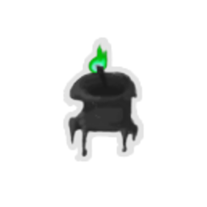
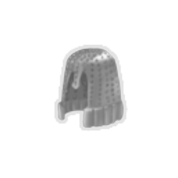
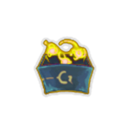
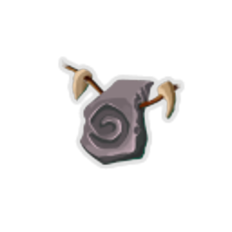
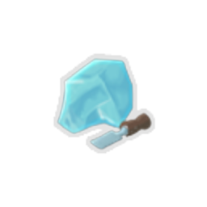

| Image | Name | Rarity | Color | Description | Flavor |
| ----- | ---- | ------ | ----- | ----------- | ------ |
|  | Mesmerising Pendant | Deprecated | Snecko_cyan | Gain [E] at the start of your turn. #ysneckomod:Muddled cards can't cost #b0. | Dazzling dirt. |
|  | Super Snecko Eye | Deprecated |  | Replaces #ySnecko #yEye. At the start of your turn, draw #b4 additional cards. Start each combat #yConfused. | 0121012 |
|  | Tiny Bowler Hat | Deprecated |  | At the start of combat, add a #yStudy #ythe #ySpire card to your hand. It costs #b0 [REMOVE_SPACE]. | Whosoever controls the hat, controls the Spire. |
|  | Bronze Core | Starter | The_bronze_automaton | The first time you create a Function each combat, gain [E] . | Replace once every 50,000 years. |
|  | Bronze Gear | Starter | Guardian | At the start of each combat, gain #yGear #yUp [REMOVE_SPACE]. NL Guardian starts the run with a random common #yGem [REMOVE_SPACE]. | Protection where you need it most. |
|  | Champion's Crown | Starter | The_champ_gray | At the start of combat, choose to enter #bchamp:Defensive or #rchamp:Berserker #yStance [REMOVE_SPACE]. | A WINNER IS YOU! |
|  | Emerald Torch | Starter | The_collector | Start each combat with #b1 #ycollector:Reserve. | The fires of greed never fade. |
|  | Heart of Goo | Starter | Slimebound | Whenever you #yslimeboundmod:Consume [REMOVE_SPACE], heal #b2 HP, up to #b8 each combat. | I feel so funky. |
|  | Mob Leader's Staff | Starter | Gremlin | At the start of each combat, gain [E] , draw #b1 card, and #ySwap to the next Gremlin. | Among gremlin mobs, the one with the best horn maintains complete command over the troupe, until another one manages to steal it. |
|  | Old Locket | Starter | Hermit_yellow | At the start of each combat, add a #yMemento into your hand. | There's a faded picture inside. |
|  | Snecko Soul | Starter | Snecko_cyan | At the start of each combat, add #ySoul #yRoll to your hand. | 0...3...2...2...1 |
|  | Spirit Brand | Starter | Hexa_ghost_purple | The first time you #yIgnite a Ghostflame each turn, gain #b4 #yBlock [REMOVE_SPACE]. | A bound protector. |
|  | Baalor's Lordly Plate | Common | Guardian | Whenever you #yguardianmod:Brace [REMOVE_SPACE], #yBrace 1 more. | One can never have enough armor. |
|  | Bag of Tricks | Common | The_collector | At the start of each combat, draw #b2 Collected cards. | Tricky. |
|  | Berserker's Guide | Common | The_champ_gray | At the start of your turn, gain #b3 #yVigor [REMOVE_SPACE]. | The text is illegible. |
|  | Black Powder | Common | Hermit_yellow | Whenever you trigger a #yhermit:Dead_On effect, deal #b2 damage to ALL enemies. | Handle with care. |
|  | Brass Tacks | Common |  | At the end of your turn, gain #b2 #yBlock [REMOVE_SPACE]. | The luster on these tacks never seems to fade. |
|  | Goop Dweller | Common | Slimebound | At the start of combat, #yslimeboundmod:Split into a #yslimeboundmod:Bruiser #ySlime [REMOVE_SPACE]. | He followed me home. Can I keep it? |
|  | Hexx Talisman | Common |  | At the start of combat, apply #b1 #yWeak and #yVulnerable to a random enemy. | "When I put this on, my rate of toe-stubbing increased drastically. I think it works!" - Ranwid |
|  | Jar of TOBSCo | Common | Hexa_ghost_purple | Start each combat with #b1 #yhexamod:Intensity [REMOVE_SPACE]. | A little extra heat makes everything better. |
|  | Loaded Die | Common | Snecko_cyan | Whenever a card is #ysneckomod:Muddled, gain #b1 #yBlock [REMOVE_SPACE]. | Cheese-stuffed. |
|  | Pick of Rhapsody | Common | Guardian | You can now #gMine for #b2 #yguardianmod:Gems at Rest Sites, you may choose to add them to your deck. (up to #b3 times). | With as many gemstones that litter the Spire, it is hard to imagine anyone so unlucky to have needed this Pick to aid them. |
|  | Protective Goggles | Common | The_bronze_automaton | If you end your turn with no #yEncoded cards, gain #b4 #yBlock [REMOVE_SPACE]. | Look closely. |
|  | Recycler | Common | Hexa_ghost_purple | The first time an non-Status and non-Curse #yEthereal card is #yExhausted each combat, add a copy to your hand that costs #b0 until played. | One day, it shall be recycled too. |
|  | Seal of Approval | Common | Snecko_cyan | Upon pickup, choose #b1 of #b5 Uncommon #ysneckomod:Offclass #yPowers to obtain. | I'm The Ironclad and this is my favorite Relic in the Spire. -Merchant Advertising Pamphlet |
|  | Silver Bullet | Common | The_bronze_automaton | At the start of each combat, add a copy of #yPiercing #yShot to your hand. It costs #b0 . | Spirewolves are long gone. |
|  | Slimy Skull | Common | Slimebound | Whenever you apply #yslimeboundmod:Goop, apply an additional #b1 #yslimeboundmod:Goop [REMOVE_SPACE]. | A Snecko skull in absolutely awful condition. Unclean and slimy, dirt and grime stick to it like glue. |
|  | Stone of Nomakk | Common | Slimebound | At the start of combat, gain #b1 #yslimeboundmod:Potency [REMOVE_SPACE]. | When presented to one of your Goop Gang, it seems to make the blob dance. |
|  | Tricky's Bolster-Rod | Common |  | The first time you play a #yPower card each combat, gain #b6 #yBlock and #b1 #yStrength [REMOVE_SPACE]. | Backed by the study of a thousand books. Knowledge is power! |
|  | Wound Poker | Common | Gremlin | At the end of each turn, deal #b4 damage to each #yWeakened enemy. | Does it hurt when I do this? |
|  | Arumba's Pocket Sentry | Uncommon |  | Every 3 turns, apply #b1 #yWeak to ALL enemies. | Sentry Mode active. Target acquired. No hard feelings. |
|  | Black Candle | Uncommon |  | #yUnplayable #rCurse cards can now be played. Whenever you play an #yUnplayable #rCurse card, #yExhaust it and lose #b1 HP. | The flame shines even brighter from within the darkness. |
|  | Blank Card | Uncommon |  | At the start of each combat, add an #ygremlin:Echo of a random #rnon-Curse [REMOVE_SPACE], #ynon-Status card from your deck to your hand. It costs #b0 [REMOVE_SPACE]. | Card Mimic. |
|  | Bottled Black Hole | Uncommon | Guardian | Upon pickup, choose a card. Start each combat with this card in #yguardianmod:Stasis [REMOVE_SPACE]. | Somewhere, something incredible is waiting to be known. |
|  | Broken Tooth | Uncommon |  | Whenever you defeat an Elite encounter, heal #b7 HP and gain #b35 Gold. | Appears too large to have come from a human jaw... |
|  | Cable Spool | Uncommon | The_bronze_automaton | #yEncode a copy of the first #yEncodable card you play each combat. | Tangled... |
|  | Deca's Washers | Uncommon |  | At the start of the first #b3 turns of each combat, draw an additional card. | It is unclear why Deca collects these. |
|  | Defensive Thesis | Uncommon | The_champ_gray | #bchamp:Defensive #bStance's #ychamp:Finisher #yBonus grants #b3 more #yBlock [REMOVE_SPACE]. | Pro tip: Don't get hit. |
|  | Fragmentation Grenade | Uncommon | Gremlin | Damage dealt to random enemies is increased by #b3 [REMOVE_SPACE]. | Nobody dares to ask where the Gremlin got it from. |
|  | Impeccable Pecs | Uncommon | Gremlin | Whenever you gain #yStrength, gain an equal amount of #yTemporary_HP. NL Start each combat with #b1 #yStrength. | Glorious. |
|  | Jade Ring | Uncommon | The_collector | Enemies take #b6 more damage from #ycollector:Doom [REMOVE_SPACE]. | Jade is the symbol of honesty. |
|  | Jeremiah's Banner | Uncommon | Slimebound | At the start of combat, gain #b1 Slime slot and #yslimeboundmod:Split into a random Slime. | You and ooze army. |
|  | Magic Mallet | Uncommon | Gremlin | Whenever you apply #yWeak, gain #b1 #yWiz [REMOVE_SPACE], up to #b3 times per turn. | Stubs toes twice as hard. |
|  | Olexa's Shield | Uncommon | Hexa_ghost_purple | #yPower cards are counted towards the progression of #ySearing and #yCrushing #yGhostflames [REMOVE_SPACE]. | Protection on-demand. |
|  | Sleeved Ace | Uncommon | Snecko_cyan | At the start of each combat, gain a #yMarked #yCard [REMOVE_SPACE]. | We're all aces. |
|  | Slime Soup | Uncommon |  | When you enter a Rest Site, begin the next combat with a #yPrepare card that costs #b0 [REMOVE_SPACE]. | Tastes awful, but incredibly healthy. |
|  | Soul-lit Lamp | Uncommon | The_collector | Upon pickup, gain #b3 #yEssence [REMOVE_SPACE]. At the start of combat, add an #yEmber into your hand. | A ghoulish decoration. The crackles of fire are replaced by buzzing wails. |
|  | Spyglass | Uncommon | Hermit_yellow | If you end your turn #yhermit:Concentrated [REMOVE_SPACE], gain an additional [E] next turn . | Property of Kestin Highfin. |
|  | Straight Razor | Uncommon | Hermit_yellow | Whenever you remove or #yTransform a card from your deck, heal #b15 HP. | For a cleaner shave... |
|  | Wizard Hat | Uncommon | Gremlin | Whenever you consume #yWiz [REMOVE_SPACE], remove a debuff at random. | The accompanying robes have long since been stolen. |
|  | Bottled Brain | Rare | The_collector | Upon pickup, #yUpgrade a card in your Collection. Start combats with it on top of your Collected pile. | Collected from a wizard's laboratory. |
|  | Charred Glove | Rare | Hermit_yellow | Whenever you draw a #rCurse [REMOVE_SPACE], your next attack deals #b3 more damage. | Parts of the glove still glow with otherworldly cinders. |
|  | Cryo Chamber | Rare | Guardian | At the start of each combat, gain #b1 Stasis slot. Whenever a card enters #yguardianmod:Stasis [REMOVE_SPACE], #yUpgrade it. | Things always seem better coming out than they did going in. |
|  | Deflecting Bracers | Rare |  | At the start of your turn, gain #ychamp:Counter equal to half the amount of expired #yBlock [REMOVE_SPACE]. | If you thought blocking was good then... |
|  | Dueling Glove | Rare |  | After using a single-target #yAttack [REMOVE_SPACE], if the target has no #yVulnerable [REMOVE_SPACE], apply #b1 #yVulnerable [REMOVE_SPACE]. | Count from ten... |
|  | Frost Primer | Rare | The_bronze_automaton | All Functions you create gain #yRetain [REMOVE_SPACE]. | 22 ounces of the chemical compound Ar22, shelf life: 22 years. Best stored in a mahogany fridge. |
|  | Gelatinous Cube | Rare |  | The first #b2 times you draw a #yStatus or #rCurse each turn, draw #b1 card. If the card was a #yVoid [REMOVE_SPACE], gain [E] [REMOVE_SPACE]. | Hey, it stuck to your body. |
|  | Gemstone Gun | Rare |  | Upon pickup, choose #b3 #yguardianmod:Gems. At the start of each combat, gain a card with #yRetain, #yExhaust, and each chosen #yGem socketed. | Bang! Bang! Bang! Hey, I matched three! |
|  | Gladiators Manual | Rare | The_champ_gray | Whenever you play a #ychamp:Combo [REMOVE_SPACE], a #ychamp:Finisher [REMOVE_SPACE], and enter a #yStance in the same turn, gain #b1 #yStrength and #yDexterity [REMOVE_SPACE]. | Try everything - something will stick. |
|  | Gremlin Bomb | Rare | Gremlin | Whenever a Gremlin dies, deal #b30 damage to ALL enemies. | Gremlins have an uncanny knack for finding dangerous things. Sometimes, they even survive looting them. |
|  | Gremlin Gravestone | Rare | Gremlin | Dead Gremlins can be Resurrected at Rest Sites as a Free Action. | Where do gremlins go when they die? Not bloody far enough. |
|  | Horseshoe | Rare | Hermit_yellow | Whenever you gain #yWeak [REMOVE_SPACE], #yFrail or #yVulnerable [REMOVE_SPACE], gain #b1 less. | Lucky charm. Somebody is gonna be missing this. |
|  | Incense | Rare |  | You cannot gain #yWeak [REMOVE_SPACE], #yVulnerable or #yFrail while you are #yWeak [REMOVE_SPACE], #yVulnerable or #yFrail [REMOVE_SPACE]. | An antiquated form of mental clarification. |
|  | Mallet | Rare | The_bronze_automaton | At the start of each combat, add #b2 copies of #yFine #yTuning+ to your hand. | That's it! I'm gettin me mallet! |
|  | Prickly Shields | Rare |  | Whenever you gain #yBlock [REMOVE_SPACE], deal #b2 damage to a random enemy. | Gremlins use whatever scraps they can find as weapons or armor. Some serve as both. |
|  | Red Candle | Rare | Hexa_ghost_purple | Whenever you apply #yhexamod:Soulburn [REMOVE_SPACE], apply #b3 additional #yhexamod:Soulburn [REMOVE_SPACE]. | Fire BURNS... |
|  | Red Scarf | Rare | Hermit_yellow | Whenever you apply a new debuff to an enemy, gain #b3 #yBlock [REMOVE_SPACE]. | It's warm and fuzzy. |
|  | Ring of the Snek | Rare | Snecko_cyan | Whenever you activate #b3 #ysneckomod:Overflow effects, apply #b1 #yWeak and #yVulnerable to a random enemy. | Illegible, unreadable, due by Thursday. |
|  | Rye Stalk | Rare |  | Whenever you lose HP during enemy turn, draw #b1 card. | Still in mint condition, despite being chewed on for so long. |
|  | Signature Finisher | Rare | The_champ_gray | Upon pickup, choose a #ychamp:Finisher [REMOVE_SPACE]. This #yFinisher costs #b0 [REMOVE_SPACE], can be used without a #yStance [REMOVE_SPACE], and never causes your #yStance to be exited. | And now, it's time for my ULTIMATE MOVE! |
|  | Six-Point Brand | Rare |  | Whenever you play #b6 cards, gain an #ygremlin:Echo of a basic #yStrike [REMOVE_SPACE]. It costs #b0 [REMOVE_SPACE]. | Fire, fire, fire, fire, fire, FIRE! |
|  | Slimed Tail | Rare | Slimebound | Whenever you #ySplit [REMOVE_SPACE], gain #b3 #yBlock [REMOVE_SPACE]. | A fake tail to trick enemies during combat, completely covered in slime. |
|  | Sneaky Teakwood Match | Rare | Hexa_ghost_purple | The first time you #yhexamod:Ignite each turn, you can choose whether to #yhexamod:Advance or #yhexamod:Retract [REMOVE_SPACE]. | Lights on any surface! |
|  | Soul Stone | Rare | Hexa_ghost_purple | Whenever you #yExhaust #b3 cards, #yhexamod:Ignite the current Ghostflame. | A soul would liven this thing up! |
|  | Spectre's Hand | Rare | The_champ_gray | Whenever you enter a #yStance [REMOVE_SPACE], gain an #ygremlin:Echo of a basic #yStrike or #yDefend [REMOVE_SPACE]. It costs #b0 [REMOVE_SPACE]. | Some victories stay with you. |
|  | Supply Scroll | Rare |  | At the start of your 3rd turn, gain [E] [E] and draw #b2 cards. | A surprisingly detailed inventory of the mob's various bits and bobbles. |
|  | The Bagpipes | Rare |  | Whenever you apply new #yWeak or #yVulnerable to an enemy, increase the amount applied by #b1 [REMOVE_SPACE]. | This dreaded instrument is said to have driven Kublai the Great mad. |
|  | Thimble Helm | Rare | The_collector | Start each combat with #b3 #yTemporary_HP [REMOVE_SPACE]. While you have #yTemporary_HP [REMOVE_SPACE], cards grant #b1 additional #yBlock [REMOVE_SPACE]. | Worn by the Spire's miniest heroes. |
|  | Unidentified Egg | Rare | Snecko_cyan | Whenever you add an #ysneckomod:Offclass card to your deck, #yUpgrade it. Upon pickup, #yUpgrade #b2 random #ysneckomod:Offclass cards. | What will hatch? Pay $1000 to see. |
|  | Wizard Staff | Rare | Gremlin | #yWiz deals #b7 additional damage. | The pride and joy of every Gremlin Wizard, this staff is a frequent target of theft by rival mobs. |
|  | Bandit Contract | Special |  | At the start of the #b3rd boss combat, Red Mask Bandits will assist you. | An agreement from the Bandit trio - partially in exchange for a trinket, but mostly in exchange for their lives. |
|  | Bandit Contract+ | Special |  | At the start of the #b3rd boss combat, Red Mask Bandits will assist you. | An agreement from the Bandit trio - partially in exchange for a trinket, but mostly in exchange for their lives. |
|  | Black Knight's Helm | Special | The_champ_gray | The first time you enter each #yStance each combat: NL #bchamp:Defensive : Gain #b2 #yDexterity and lose #b1 #yStrength [REMOVE_SPACE]. NL #rchamp:Berserker : Gain #b2 #yStrength and lose #b1 #yDexterity [REMOVE_SPACE]. | Only a flesh wound. |
|  | Bottled Code | Special | The_bronze_automaton | Upon pickup, choose a card with #yEncode [REMOVE_SPACE]. Start each combat with this card #yEncoded [REMOVE_SPACE]. | Actually, I have code for that exact thing... |
|  | Broken Wing Statue | Special |  | The cultists that worship the Awakened One will be interested in this... | A broken hunk of a once-magnificent statue. |
|  | Burden of Knowledge | Special |  | Upon pickup, #rlose #rALL #rHeart #rBlessings and #b10 Max HP. Permanently #yUpgrade #rALL cards #rEVERYWHERE [REMOVE_SPACE]. Start combats with #b1 less #yStrength and #yDexterity [REMOVE_SPACE]. | The truth hurts. |
|  | Coat of Many Faces | Special |  | Upon pickup, gain Cultist Headpiece, Face Of Cleric, N'loth's Hungry Face, Gremlin Visage, and Ssserpent Head. | It was Steve, and Bill, and Ian, and Fred, and John... |
|  | Emerald Heart Blessing | Special |  | Start Boss combats with #b1 #yDexterity [REMOVE_SPACE]. | The heart is everything. |
|  | Extra Cursed Bell | Special |  | Upon pickup, obtain a unique #rCurse and #b3 Common relics. | You think you hear it echoing, but can never confirm it. |
|  | Extra Cursed Key | Special |  | Gain [E] the first time you draw a #rCurse each turn. NL Whenever you open a non-Boss chest, obtain an #rInjury [REMOVE_SPACE]. | Locked away for good reason. |
|  | Greed Ooze | Special | Slimebound | At the start of combat, spawn #yGreed #yOoze (can be revived if #yAbsorbed [REMOVE_SPACE]). NL At Rest Sites, #yGreed #yOoze will take #b50 of your souls, increasing its damage by #b1. | A friend found in the Spire who devours souls. |
|  | Gremlin Sack | Special |  | Upon pickup, add #b6 cards to your deck from the Match Game. | The Gremlin and his bodyguard were no match for you. |
|  | Inner Strength | Special | The_champ_gray | Start each combat with #b1 #yStrength [REMOVE_SPACE]. | It's about the gigantic sword in your heart. |
|  | Knowing Skull | Special |  | At the start of each combat, you may wish for Souls, Potions, or a Colorless card at the price of HP. | Put me down! |
|  | Mystical Octahedron | Special | Snecko_cyan | Upon pickup, choose a card that has an #ysneckomod:Overflow effect. Whenever you play it, gain #b4 #yBlock and activate its #yOverflow effect, even if you don't have more than #b5 cards in hand. | It appears weighted toward one side. |
|  | Neow's Blessing | Special |  | Upon pickup, increase your Maximum HP by #b100. NL Increase your Maximum HP by #b100 at the start of each Act. NL Lose all your Potion slots. NL Draw #b1 less card and lose [E] at the start of your turn. | Ease your rage. Be as tough and unyielding as the Spire itself. |
|  | New Challenger | Special |  | Start each combat in a random Champ #yStance [REMOVE_SPACE]. | Can you take the crown? |
|  | Paradox Artifact | Special |  | At the start of each turn, add a random card with #yEncode to your hand and give it #yEthereal [REMOVE_SPACE]. | You've never seen a coding frenzy like this before. |
|  | Quantum Chamber | Special | Guardian | Upon pickup, choose a card. Start each combat with this card removed from your deck. At the start of your #b4th turn, return it and #b2 copies of it to your hand. | You get the chicken by hatching the egg, not by smashing it. |
|  | Ruby Heart Blessing | Special |  | Start Boss combats with #b1 #yStrength [REMOVE_SPACE]. | The heart is strong. |
|  | Sapphire Heart Blessing | Special |  | Start Boss combats with #b10 #yTemporary #yHP [REMOVE_SPACE]. | The heart is pleased. |
|  | Scrap Ooze | Special | Slimebound | At the start of combat, spawn #yScrap #yOoze (can be revived if #yAbsorbed [REMOVE_SPACE]). NL At Rest Sites, you can donate a card to the #yScrap #yOoze, modifying its damage: NL #b+1 damage for #gUncommons NL #b+2 damage for #yRares NL #b-1 damage for Commons NL #b-2 damage for #rCurses |  |
|  | Sharpened Fragment | Special |  | During Elite and Boss combats, whenever you play a #yPower card, gain #b1 #yStrength [REMOVE_SPACE]. | Once a broken statue - now a makeshift weapon. |
|  | Teleport Stone | Special |  | You may skip any number of rooms the next time you move, but cannot move into a Boss Room. | Never leave home without it. |
|  | The Broken Seal | Special | Hexa_ghost_purple | Upon pickup, raise your Max HP by #b10 [REMOVE_SPACE], then heal all of your HP. Start each combat with #b2 #yStrength [REMOVE_SPACE], #b2 #yDexterity [REMOVE_SPACE], and #b2 #yhexamod:Intensity [REMOVE_SPACE]. You can not receive #pThe #pBroken #pSeal and other seals again. | Unlimited, unrestrained, unquenchable power. |
|  | The Heart's Malice | Special |  | Enemies in your first #b3 combats will flee in terror. | The malice of corruption bestowed by the Heart. |
|  | Wheel of Change | Special |  | At each Rest Site, you may spin the wheel once. Choosing to collect its reward uses up this relic. | No one gets two spins, he says. |
|  | Young Snecko | Special |  | Deals #b9 damage to a random enemy and #ysneckomod:Muddles #b2 random (not #b0 cost, #bX [REMOVE_SPACE], or #yUnplayable [REMOVE_SPACE]) cards in your hand at the start of your turn. | Bewilderingly adorable. |
|  | Amulet of Unyielding | Boss | The_champ_gray | Whenever you spend #yVigor [REMOVE_SPACE], gain #b1 #yStrength for every #b8 #yVigor spent. | Strength once thought fleeting flows through you as if it had always been there. |
|  | Black Heart of Goo | Boss | Slimebound | Replaces [#40c840ff]Heart[] [#40c840ff]of[] [#40c840ff]Goo[][#40c840ff] [REMOVE_SPACE].[] NL Whenever you #yslimeboundmod:Consume [REMOVE_SPACE], heal #b3 HP, up to #b15 each combat. | The Secret of the Ooze. |
|  | Blocked Chakra | Boss | The_collector | Gain [E] at the start of your turn. You don't draw from your Collected pile until your 4th turn. | One pulled muscle is all it takes. |
|  | Clasped Locket | Boss | Hermit_yellow | Replaces #yOld #yLocket [REMOVE_SPACE]. First time you draw a #rCurse each turn, #yExhaust it and draw #b2 cards. Upon pickup, obtain #b2 #rInjuries [REMOVE_SPACE]. | It won't open anymore. |
|  | Dented Plate | Boss | Hermit_yellow | While your HP is at or below #b50% [REMOVE_SPACE], gain [E] and draw #b1 card at the start of your turn. | Several bullets are still lodged inside. |
|  | Electromagnetic Coil | Boss | The_bronze_automaton | Functions are now made up of #b4 cards. | An inefficient but entertaining power source. |
|  | Forbidden Fruit | Boss |  | Upon pickup, choose and obtain one Common, Uncommon, and Rare card from all available. Then, obtain a #ySapped [REMOVE_SPACE]. | This species of fruit looks completely unfamiliar. |
|  | Gremlin Leader's Voucher | Boss | Gremlin | Gain [E] at the start of your turn. NL Upon pickup, #rpermanently #rlose #ra #rGremlin. | IOU 1 Gremlin |
|  | Guardian Gear | Boss | Guardian | Replaces [#937c54ff]Bronze[] [#937c54ff]Gear[][#937c54ff] [REMOVE_SPACE].[] NL At the start of combat, gain #yGear #yUp [REMOVE_SPACE]. NL Whenever you enter #yDefensive #yMode [REMOVE_SPACE], gain [E] and draw #b2 cards. | Replace every 3,000 floors. |
|  | Hecktoplasm | Boss |  | Gain [E] at the start of your turn. You can no longer gain #ySouls. Breaking Keys costs no #ySouls. | This blob of slime seems to pulse with the energy of hundreds of souls. No wonder no one wanted it. |
|  | Idol of Retromation | Boss |  | At the start of your turn, reduce the cost of a random card that costs at least #b1 in your hand by #b1 for this turn. | Often called the Idol of Reto for short. |
|  | Libra | Boss | Hexa_ghost_purple | Choose any number of your Strikes and Defends to #yTransform into their opposite type. | Balance in all things. |
|  | Lucky Horseshoe | Boss | Snecko_cyan | Upon pickup, choose #b1 of #b3 #yCharacters [REMOVE_SPACE]. Choose #b3 #yUpgraded Uncommon cards and #b2 Rare cards to add to your deck. All combats drop an additional card reward of the chosen character's cards. | Make your own luck. |
|  | Makeshift Battery | Boss | The_bronze_automaton | Gain [E] and add a #ySlimed into your discard pile at the start of your turn. | It's an 8.9 volt. |
|  | Mark of the Ether | Boss | Hexa_ghost_purple | Replaces [#723e6dff]Spirit[] [#723e6dff]Brand[][#723e6dff] [REMOVE_SPACE].[] NL Whenever you #yIgnite a Ghostflame, gain #b4 #yBlock [REMOVE_SPACE]. | Let's see if we can do... better. |
|  | Mob Leader's Crown | Boss | Gremlin | Replaces #rMob #rLeader's #rStaff. NL The first time you shuffle your draw pile each turn, gain [E] , draw #b1 card, and #ySwap to the next Gremlin. | The fancier the symbol of office, the more likely it is to be stolen. |
|  | Obsidian Scales | Boss | Guardian | At the start of combat, gain #b3 #yThorns [REMOVE_SPACE]. Whenever you are debuffed or gain a debuff, gain #b1 #yThorns [REMOVE_SPACE]. | Stain the sky black with your blood. Retaliate against all who struck out at you. |
|  | Platinum Core | Boss | The_bronze_automaton | Replaces [#d6ca9eff]Bronze[] [#d6ca9eff]Core[][#d6ca9eff] [REMOVE_SPACE].[] NL The first #b3 Functions you create each combat cost #b0 until played. | Changelog: Improved user experience. |
|  | Power Armor | Boss | The_champ_gray | Gain [E] at the start of your turn. NL Your maximum #yVigor and #ychamp:Counter is #b10 [REMOVE_SPACE]. | Bought used. |
|  | Prismatic Torch | Boss | The_collector | Replaces [#0d9e83ff]Emerald[] [#0d9e83ff]Torch[][#0d9e83ff] [REMOVE_SPACE].[] At the start of each combat, add #b2 #yEmbers into your hand. The first time you #yExhaust an #yEmber each turn, gain #b1 #ycollector:Reserve [REMOVE_SPACE]. | The ever-changing flames reflect fortune's favor. |
|  | Rough Diamond | Boss |  | The first time you play a #yRare card each turn, gain [E] . Upon pickup, obtain a #yRare card reward. | With the mines demolished, even this tarnished stone is valuable. |
|  | Short Statue | Boss | Gremlin | The first time a Gremlin would die each combat, heal it to #b75% of your Max HP instead. | It is surprising how well it works. |
|  | Shotglass | Boss | Hermit_yellow | First #b2 times you use a potion each combat, gain a random potion. You can only use #b2 potions each combat. | Any liquid placed inside changes into something else. |
|  | Snake-Charmer's Flute | Boss | Snecko_cyan | #ysneckomod:Muddled cards can't cost #b3 [REMOVE_SPACE]. | Sssssss... |
|  | Super Snecko Soul | Boss | Snecko_cyan | Replaces [#407B93]Snecko [#407B93]Soul[]. NL At the start of each combat and every other turn, gain a #ySoul #yRoll [REMOVE_SPACE]. NL On other turns, draws an additional card at the start of your turn and #ysneckomod:Muddles it. | 3120231321230320 |
|  | Tarr Blob | Boss | Slimebound | Gain [E] at the start of your turn. At the start of combat, lose #b1 Slime slot. | The bad kind of Slime. |
|  | Victorious Crown | Boss | The_champ_gray | Replaces [#646464ff]Champion's[] [#646464ff]Crown[][#646464ff] [REMOVE_SPACE].[] NL Start each combat in #ychamp:Ultimate #yStance [REMOVE_SPACE], which lasts for #b3 turns. | Conglaturation!! You are the greatest winner. |
|  | Wander Bots | Boss | Guardian | At the start of each combat, lose #b1 Stasis slot. NL Gain [E] at the start of your turn. | These drones find the most wonderful salvage, but require processing power to maintain. |
|  | Xanatos' Icy Charm | Boss | Hexa_ghost_purple | Gain [E] at the start of your turn. Start each combat with #b1 less #yhexamod:Intensity [REMOVE_SPACE], and receive no #yhexamod:Intensity from the #yInferno #yGhostflame [REMOVE_SPACE]. | I feel... cold. |
|  | Barbell | Shop |  | Whenever you enter a Rest Site, if you have at least #b10 Upgradable cards in your deck, #yUpgrade one at random. | 1000 reps? Psh. I can do 1001. |
|  | Bottled Anomaly | Shop |  | Upon pickup, choose a card. At the start of each combat, remove it from your draw pile. At the start of turn #b3 [REMOVE_SPACE], add it into your hand. It costs #b0 for the turn. | Swirling and swirling and finally breaking. |
|  | Bronze Idol | Shop |  | #yStatus cards may now be played for useful effects. | An ancient, weaponised antivirus - who knows who made it, and why? |
|  | Dolphin's Style Guide | Shop | The_champ_gray | If you end your turn while in no #yStance [REMOVE_SPACE], draw #b1 additional card next turn. | Author: Renowned explorer and pugilist Dolphin K. Mist. |
|  | Donu's Washers | Shop | The_bronze_automaton | At the start of combat, gain [E] [E] and add #b1 #yVoid into your draw pile. | It is rather clear why Donu collects these. |
|  | Fuel Canister | Shop |  | At the end of your turn, #yRetain the lowest-cost card in your hand. | Disgusting. |
|  | Krampian Coal | Shop | The_collector | When you would draw from an empty Collected pile, add a #yLucky #yWick to your hand. | "Intriguing! But why only specific chimneys?" - Ranwid |
|  | Pet Ghost | Shop | Hermit_yellow | Prevent your first lethal HP loss each combat. | Poor guy. |
|  | Pilot's Codex | Shop | Guardian | At the end of your first 3 turns, if your #yguardianmod:Stasis slots aren't full, choose #b1 of #b3 cards to place into #yguardianmod:Stasis [REMOVE_SPACE]. | Designs and diagrams of the Spire's earliest manually-driven prototypes, by Master Pilot David. |
|  | Protective Gear | Shop | Slimebound | Reduce the damage you take from #yslimeboundmod:Tackles by #b3 [REMOVE_SPACE]. | The best defense is a good offense. |
|  | Rare Booster Box | Shop | Snecko_cyan | Upon pickup, obtain an #ysneckomod:Offclass #yRare card. | Mint condition. |
|  | Sack of Gems | Shop | Guardian | Upon pickup, you may choose up to #b5 random #yguardianmod:Gems to add to your deck. | Ooh... shiny! |
|  | Soul of Chaos | Shop | Hexa_ghost_purple | The second #ySearing #yGhostflame becomes a #yMayhem #yGhostflame [REMOVE_SPACE]. NL #yMayhem #yGhostflame activates when you end your turn on it. NL #yIgnition [REMOVE_SPACE]: #yScry #bn and then play the top card of your draw pile, #bn is modified by #yIntensity [REMOVE_SPACE]. | Mayhem, made manifest. |
|  | Stolen Merchandise | Shop | Gremlin | Whenever you #ySwap [REMOVE_SPACE], gain an #yEcho of a random Colorless card. NL At the start of combat, the Merchant gains #b2 #yStrength [REMOVE_SPACE]. | "Blasted, thieving Gremlins!". |
|  | Tag Teamwork | Shop | Gremlin | Whenever you draw #yTag #yTeam [REMOVE_SPACE], draw another card. NL Upon pickup, add two copies of #yTag #yTeam to your deck. | Teamwork makes the dream work. |
|  | The Contract | Shop | The_collector | Upon pickup, gain #b10 #yEssence [REMOVE_SPACE]. | Sign in blood. |
