| Name | Image | Upgraded image | Rarity | Type | Cost | Description |
| ---- | ----- | -------------- | ------ | ---- | ---- | ----------- |
| Apparition |  |  | Special | Skill | 1 | Ethereal. (not Ethereal.) Gain 1 Intangible. Exhaust. |
| Batch | 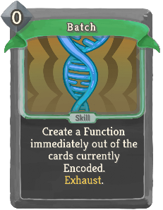 | 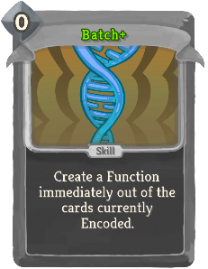 | Special | Skill | 0 | Create a Function immediately out of the cards in the Sequence. Exhaust. (not Exhaust.) |
| Become Almighty |  |  | Special | Power |  | Gain 3 (4) Strength. |
| Beta |  |  | Special | Skill | 2 (1) | Shuffle an Omega into your draw pile. Exhaust. |
| Bite |  |  | Special | Attack | 1 | Deal 7 (8) damage. Heal 2 (3) HP. |
| Branch: Attack | 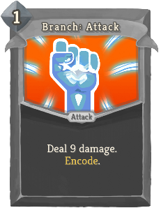 | 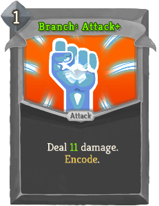 | Special | Attack | 1 | Deal 9 (11) damage. bronze:Encode. |
| Branch: Block | 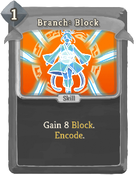 | 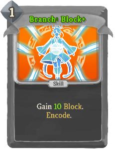 | Special | Skill | 1 | Gain 8 (10) Block. bronze:Encode. |
| Byte Shift | 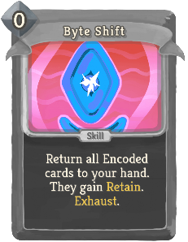 | 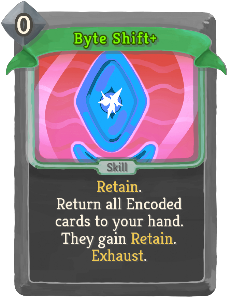 | Special | Skill | 0 | (Retain.)  Return all Encoded cards to your hand. They gain Retain. Exhaust. |
| Council's Justice | 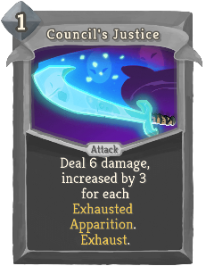 | 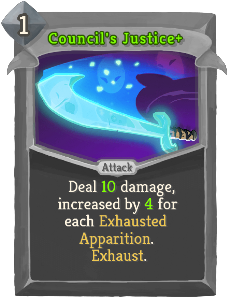 | Special | Attack | 1 | Deal 6 (10) damage, increased by 3 (4) for each Exhausted Apparition. Exhaust. |
| Crystal Shiv | 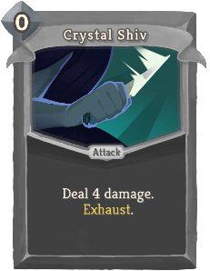 | 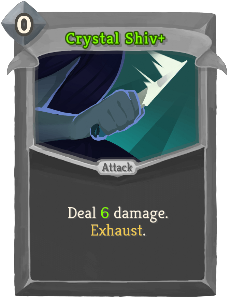 | Special | Attack | 0 | Deal 4 (6) damage. Exhaust. |
| Crystal Ward | 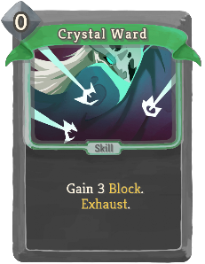 | 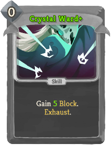 | Special | Skill | 0 | Gain 3 (5) Block. Exhaust. |
| Darkling Duo | 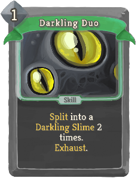 | 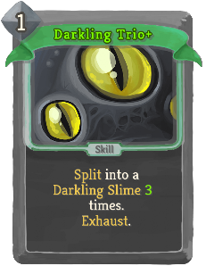 | Special | Skill | 1 | slimeboundmod:Split into a slimeboundmod:Darkling_Slime 2 (3) times. Exhaust. |
| Dazing Pulse | 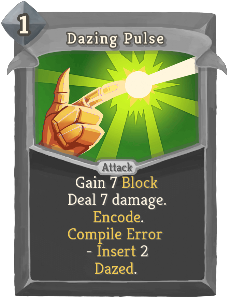 | 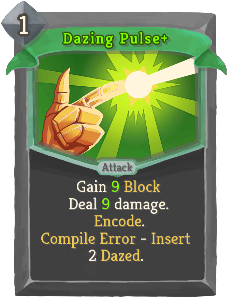 | Special | Attack | 1 | Deal 7 (9) damage. Gain 7 (9) Block bronze:Encode. bronze:Compile Error - bronze:Insert 2 Dazed. |
| Debug | 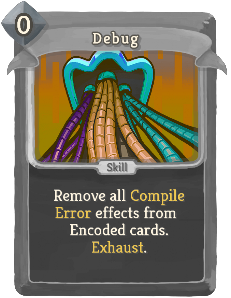 | 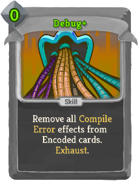 | Special | Skill | 0 | Remove all bronze:Compile Error effects from Encoded cards. Exhaust. |
| Decompile | 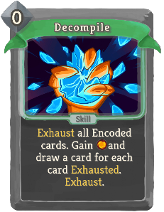 | 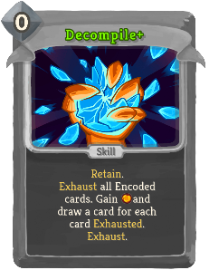 | Special | Skill | 0 | (Retain.)  Exhaust all Encoded cards. Gain [E] and draw a card for each card Exhausted. Exhaust. |
| Explode | 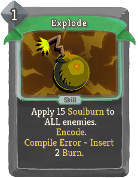 |  | Special | Skill | 1 | Apply 15 (20) hexamod:Soulburn to ALL enemies. bronze:Encode. bronze:Compile Error - bronze:Insert 2 Burn. |
| Expunger |  |  | Special | Attack | 1 | Deal 9 (15) damage X times. |
| Fame and Fortune |  |  | Special | Skill |  | Gain 25 (30) Gold. |
| Finishing Strike | 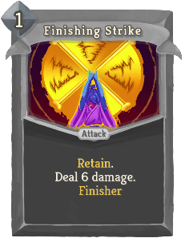 | 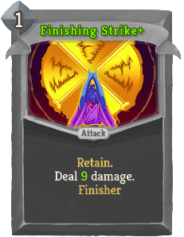 | Special | Attack | 1 | Retain. Deal 6 (9) damage. [fist_icon]   champ:Finisher |
| Insight |  |  | Special | Skill | 0 | Retain. Draw 2 (3) cards. Exhaust. |
| J.A.X. |  |  | Special | Skill | 0 | Lose 3 HP. Gain 2 (3) Strength. |
| Knowing Skull | 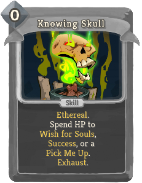 | 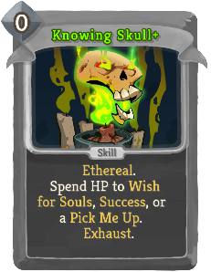 | Special | Skill | 0 | Ethereal. Spend HP to Wish for Souls, Success, or a Pick Me Up. Exhaust. |
| Lick | 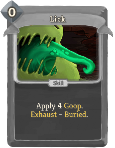 | 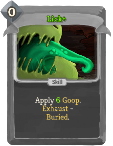 | Special | Skill | 0 | Apply 4 (6) slimeboundmod:Goop. Exhaust - slimeboundmod:Buried. |
| Live Forever |  |  | Special | Power |  | Gain 6 (8) Plated Armor. |
| Minor Beam | 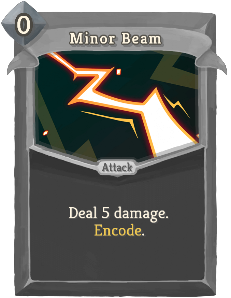 | 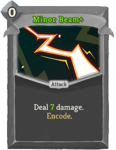 | Special | Attack | 0 | Deal 5 (7) damage. bronze:Encode. |
| Miracle |  |  | Special | Skill | 0 | Retain. Gain [W] ([W]). Exhaust. |
| Omega |  |  | Special | Power | 3 | At the end of your turn, deal 50 (60) damage to ALL enemies. |
| Orb Slam | 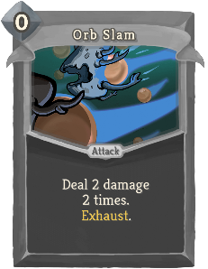 | 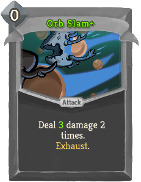 | Special | Attack | 0 | Deal 2 (3) damage 2 times. Exhaust. |
| Package: Ancients | 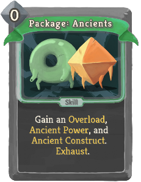 | 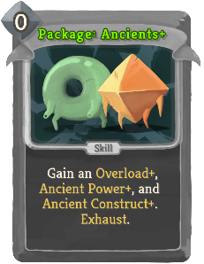 | Special | Skill | 0 | Gain an Overload (*Overload+), Ancient Power (*Power+), and Ancient Construct (*Construct+). Exhaust. |
| Package: Bronze | 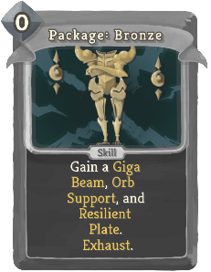 |  | Special | Skill | 0 | Gain a Giga Beam (*Beam+), Orb Support (*Support+), and Resilient Plate (*Plate+). Exhaust. |
| Package: Defect | 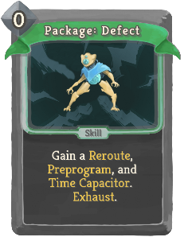 | 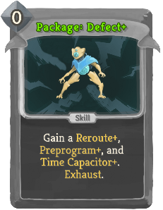 | Special | Skill | 0 | Gain a Reroute (*Reroute+), Preprogram (*Preprogram+), and Time Capacitor (*Capacitor+). Exhaust. |
| Package: Orbwalker | 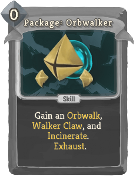 | 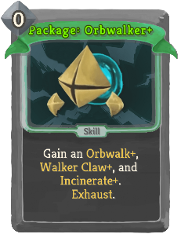 | Special | Skill | 0 | Gain an Orbwalk (*Orbwalk+), Walker Claw (*Claw+), and Incinerate (*Incinerate+). Exhaust. |
| Package: Sentry | 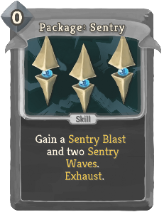 | 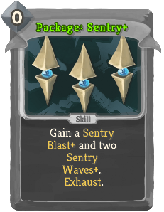 | Special | Skill | 0 | Gain a Sentry Blast (*Blast+) and two Sentry Waves (*Waves+). Exhaust. |
| Package: Shapes | 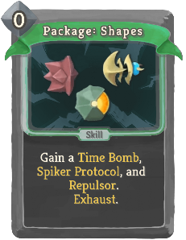 | 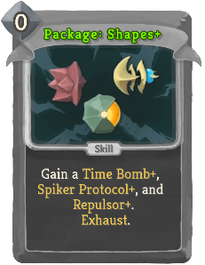 | Special | Skill | 0 | Gain a Time Bomb (*Bomb+), Spiker Protocol (*Protocol+), and Repulsor (*Repulsor+). Exhaust. |
| Package: Spheric | 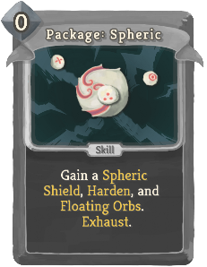 | 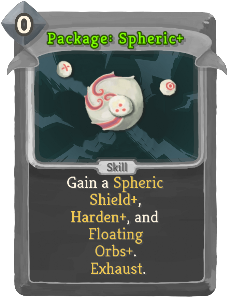 | Special | Skill | 0 | Gain a Spheric Shield (*Shield+), Harden (*Harden+), and Floating Orbs (*Orbs+). Exhaust. |
| Proto-Beam | 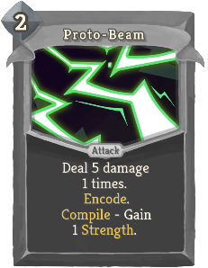 | 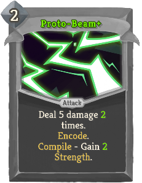 | Special | Attack | 2 | Deal 5 damage 1 (2) times. bronze:Encode. bronze:Compile - Gain 1 (2) Strength. |
| Proto-Shield | 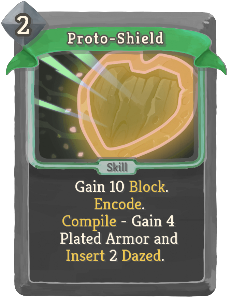 | 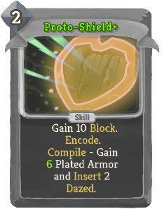 | Special | Skill | 2 | Gain 10 Block. bronze:Encode. bronze:Compile - Gain 4 (6) Plated Armor and bronze:Insert 2 Dazed. |
| Ritual Dagger |  |  | Special | Attack | 1 | Deal 15 damage. If Fatal, permanently increase this card's damage by 3 (5). Exhaust. |
| SLIME CRUSH!!! |  |  | Special | Attack | 4 | Ethereal. Deal 35 (40) damage (to ALL enemies). Exhaust. |
| Safety |  |  | Special | Skill | 1 | Retain. Gain 12 (16) Block. Exhaust. |
| Sentry Wave |  |  | Special | Skill | 0 | Apply 1 Weak. (guardianmod:Brace 2.)  Place a Sentry Blast (*Blast+) into guardianmod:Stasis. Exhaust. |
| Shadow Guise |  |  | Special | Skill | 2 | Ethereal. Gain 7 (9) Block twice. expansioncontent:Reclaim Nightmare Guise. Exhaust. |
| Shadow Strike |  |  | Special | Attack | 2 | Ethereal. Deal 8 (10) damage twice. expansioncontent:Reclaim Nightmare Strike. Exhaust. |
| Shiv |  |  | Special | Attack | 0 | Deal 4 (6) damage. Exhaust. |
| Smite |  |  | Special | Attack | 1 | Retain. Deal 12 (16) damage. Exhaust. |
| Spike |  |  | Special | Attack | 0 | Deal 4 (6) damage. bronze:Encode. bronze:Compile - Gain 4 (6) Thorns. |
| Through Violence |  |  | Special | Attack | 0 | Retain. Deal 20 (30) damage. Exhaust. |
| Ward |  |  | Special | Skill | 0 | Gain 3 (5) Block. Exhaust. |
| Burn |  |  | Common | Status |  | Unplayable. At the end of your turn, take 2 damage. |
| Dazed |  |  | Common | Status |  | Unplayable. Ethereal. |
| Slimed |  |  | Common | Status | 1 | Exhaust. |
| Void |  |  | Common | Status |  | Unplayable. Ethereal. Whenever this card is drawn, lose 1 Energy. |
| Wound |  |  | Common | Status |  | Unplayable. |
| Bandage Up |  |  | Uncommon | Skill | 0 | Heal 4 (6) HP. Exhaust. |
| Blind |  |  | Uncommon | Skill | 0 | Apply 2 Weak (to ALL enemies). |
| Dark Shackles |  |  | Uncommon | Skill | 0 | Enemy loses 9 (15) Strength this turn. Exhaust. |
| Deep Breath |  |  | Uncommon | Skill | 0 | Shuffle your discard pile into your draw pile. Draw 1 (2) card(s). |
| Discovery |  |  | Uncommon | Skill | 1 | Choose 1 of 3 random cards to add into your hand. It costs 0 this turn. Exhaust. (not Exhaust.) |
| Dramatic Entrance |  |  | Uncommon | Attack | 0 | Innate. Deal 8 (12) damage to ALL enemies. Exhaust. |
| Enlightenment |  |  | Uncommon | Skill | 0 | Reduce the cost of all cards in your hand to 1 this turn (combat). |
| Finesse |  |  | Uncommon | Skill | 0 | Gain 2 (4) Block. Draw 1 card. |
| Flash of Steel |  |  | Uncommon | Attack | 0 | Deal 3 (6) damage. Draw 1 card. |
| Forethought |  |  | Uncommon | Skill | 0 | Put a (any number of) card(s) from your hand to the bottom of your draw pile. It costs (They cost) 0 until played. |
| Good Instincts |  |  | Uncommon | Skill | 0 | Gain 6 (9) Block. |
| Impatience |  |  | Uncommon | Skill | 0 | If you have no Attacks in your hand, draw 2 (3) cards. |
| Jack of All Trades |  |  | Uncommon | Skill | 0 | Add 1 (2) random Colorless card(s) into your hand. Exhaust. |
| Madness |  |  | Uncommon | Skill | 1 (0) | Reduce the cost of a random card in your hand to 0 this combat. Exhaust. |
| Mind Blast |  |  | Uncommon | Attack | 2 (1) | Innate. Deal damage equal to the number of cards in your draw pile. |
| Panacea |  |  | Uncommon | Skill | 0 | Gain 1 (2) Artifact. Exhaust. |
| Panic Button |  |  | Uncommon | Skill | 0 | Gain 30 (40) Block. You cannot gain Block from cards for 2 turns. Exhaust. |
| Purity |  |  | Uncommon | Skill | 0 | Exhaust up to 3 (5) cards in your hand. Exhaust. |
| Swift Strike |  |  | Uncommon | Attack | 0 | Deal 7 (10) damage. |
| Trip |  |  | Uncommon | Skill | 0 | Apply 2 Vulnerable (to ALL enemies). |
| Apotheosis |  |  | Rare | Skill | 2 (1) | Upgrade ALL your cards for the rest of combat. Exhaust. |
| Chrysalis |  |  | Rare | Skill | 2 | Shuffle 3 (5) random Skills into your draw pile. They cost 0 this combat. Exhaust. |
| Hand of Greed |  |  | Rare | Attack | 2 | Deal 20 (25) damage. If Fatal, gain 20 (25) Gold. |
| Magnetism |  |  | Rare | Power | 2 (1) | At the start of your turn, add a random Colorless card into your hand. |
| Master of Strategy |  |  | Rare | Skill | 0 | Draw 3 (4) cards. Exhaust. |
| Mayhem |  |  | Rare | Power | 2 (1) | At the start of your turn, play the top card of your draw pile. |
| Metamorphosis |  |  | Rare | Skill | 2 | Shuffle 3 (5) random Attacks into your draw pile. They cost 0 this combat. Exhaust. |
| Panache |  |  | Rare | Power | 0 | Every time you play 5 cards in a single turn, deal 10 (14) damage to ALL enemies. |
| Sadistic Nature |  |  | Rare | Power | 0 | Whenever you apply a debuff to an enemy, they take 5 (7) damage. |
| Secret Technique |  |  | Rare | Skill | 0 | Put a Skill from your draw pile into your hand. Exhaust. (not Exhaust.) |
| Secret Weapon |  |  | Rare | Skill | 0 | Put an Attack from your draw pile into your hand. Exhaust. (not Exhaust.) |
| The Bomb |  |  | Rare | Skill | 2 | At the end of 3 turns, deal 40 (50) damage to ALL enemies. |
| Thinking Ahead |  |  | Rare | Skill | 0 | Draw 2 cards. Put a card from your hand on top of your draw pile. Exhaust. (not Exhaust.) |
| Transmutation |  |  | Rare | Skill | X | Add X random (Upgraded) Colorless cards into your hand. They cost 0 this turn. Exhaust. |
| Violence |  |  | Rare | Skill | 0 | Put 3 (4) random Attacks from your draw pile into your hand. Exhaust. |
