| Name | Image | Upgraded image | Rarity | Type | Cost | Description |
| ---- | ----- | -------------- | ------ | ---- | ---- | ----------- |
| Corrosive Spit | 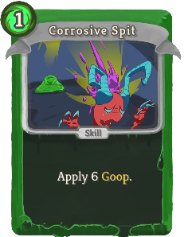 | 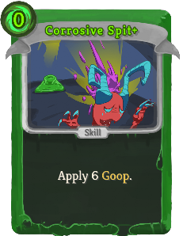 | Basic | Skill | 1 (0) | Apply 6 slimeboundmod:Goop. |
| Defend |  | 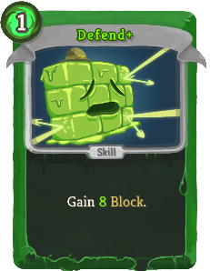 | Basic | Skill | 1 | Gain 5 (8) Block. |
| Split | 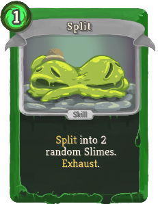 | 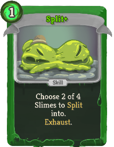 | Basic | Skill | 1 | slimeboundmod:Split into (Choose) 2 random (of 4) Slimes (to slimeboundmod:Split into). Exhaust. |
| Strike | 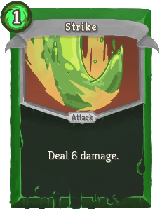 | 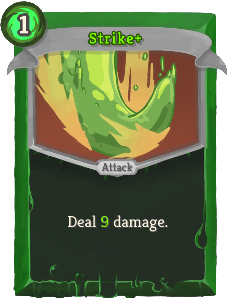 | Basic | Attack | 1 | Deal 6 (9) damage. |
| Tackle | 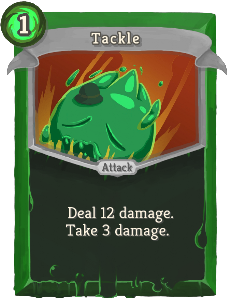 |  | Basic | Attack | 1 | Deal 12 (16) damage. Take 3 damage. |
| Combo Tackle |  | 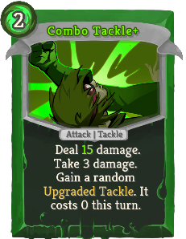 | Common | Attack | 2 | Deal 12 (15) damage. Take 3 damage. Gain a random (Upgraded) slimeboundmod:Tackle. It costs 0 this turn. |
| Goop Spray | 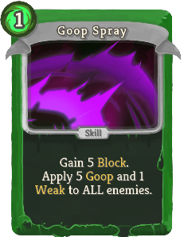 | 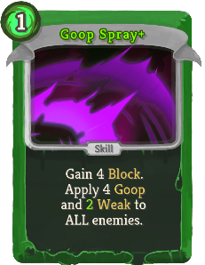 | Common | Skill | 1 | Gain 4 Block. Apply 4 slimeboundmod:Goop and 1 (2) Weak to ALL enemies. |
| Haunting Lick | 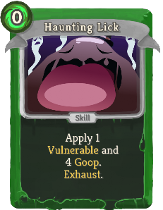 | 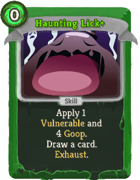 | Common | Skill | 0 | Apply 1 Vulnerable and 4 slimeboundmod:Goop. (Draw a card.)  Exhaust. |
| It Looks Tasty | 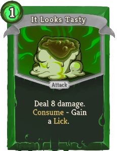 | 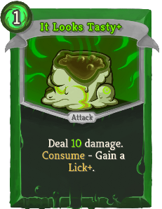 | Common | Attack | 1 | Deal 8 (10) damage. slimeboundmod:Consume - Gain a Lick (*Lick+). |
| Leech Energy | 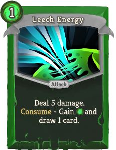 | 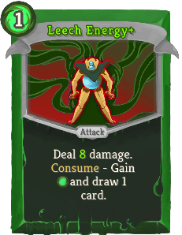 | Common | Attack | 1 | Deal 5 (8) damage. slimeboundmod:Consume - Gain [E] and draw 1 card. |
| Leeching Strike | 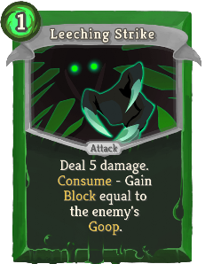 | 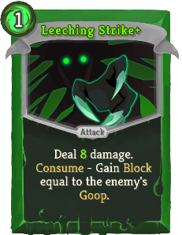 | Common | Attack | 1 | Deal 5 (8) damage. slimeboundmod:Consume - Gain Block equal to the enemy's slimeboundmod:Goop. |
| Living Wall | 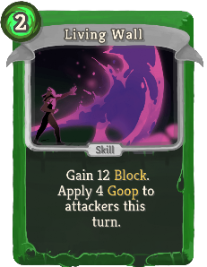 | 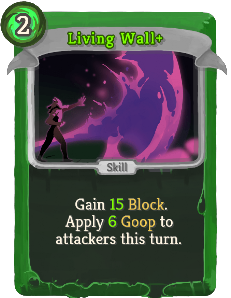 | Common | Skill | 2 | Gain 12 (15) Block. Apply 4 (6) slimeboundmod:Goop to attackers this turn. |
| Opening Tackle | 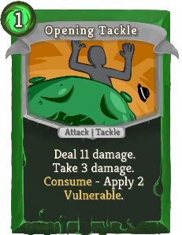 | 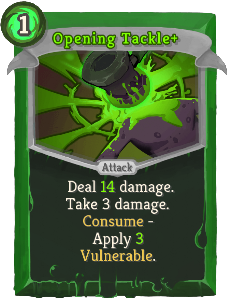 | Common | Attack | 1 | Deal 11 (14) damage. Take 3 damage. slimeboundmod:Consume - Apply 2 (3) Vulnerable. |
| Press the Attack | 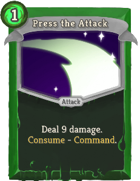 | 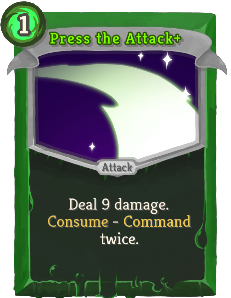 | Common | Attack | 1 | Deal 9 damage. slimeboundmod:Consume - slimeboundmod:Command (twice). |
| Roll Through |  | 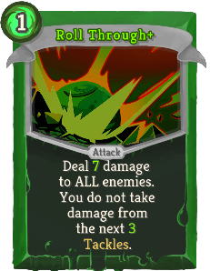 | Common | Attack | 1 | Deal 5 (7) damage to ALL enemies. You do not take damage from the next 2 (3) slimeboundmod:Tackles. |
| Sampling Lick | 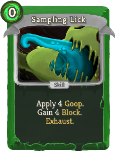 |  | Common | Skill | 0 | Apply 4 slimeboundmod:Goop. Gain 4 Block. (Draw a card.)  Exhaust. |
| Schlurp | 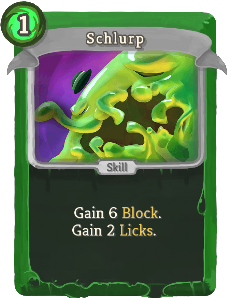 | 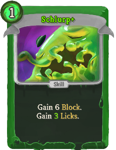 | Common | Skill | 1 | Gain 6 Block. Gain 2 (3) Licks. |
| Slime Spikes |  | 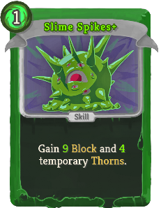 | Common | Skill | 1 | Gain 7 (9) Block and 3 (4) temporary Thorns. |
| Spear Tackle | 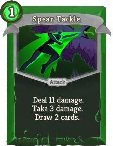 | 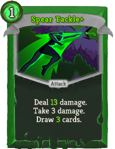 | Common | Attack | 1 | Deal 11 (13) damage. Take 3 damage. Draw 2 (3) cards. |
| Split: Bruiser | 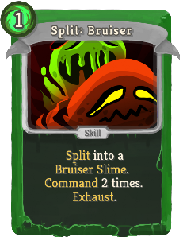 | 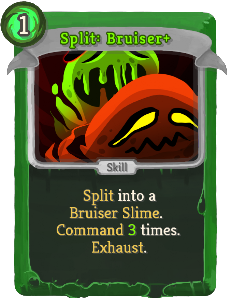 | Common | Skill | 1 | slimeboundmod:Split into a slimeboundmod:Bruiser_Slime. slimeboundmod:Command 2 (3) times. Exhaust. |
| Split: Guerilla | 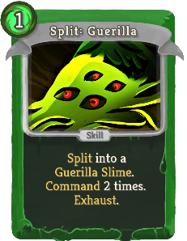 | 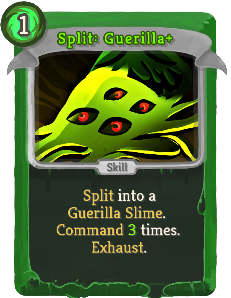 | Common | Skill | 1 | slimeboundmod:Split into a slimeboundmod:Guerilla_Slime. slimeboundmod:Command 2 (3) times. Exhaust. |
| Split: Leeching | 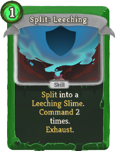 | 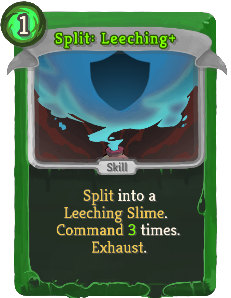 | Common | Skill | 1 | slimeboundmod:Split into a slimeboundmod:Leeching_Slime. slimeboundmod:Command 2 (3) times. Exhaust. |
| Split: Mire | 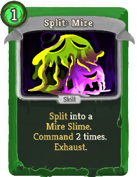 | 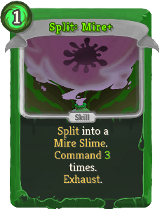 | Common | Skill | 1 | slimeboundmod:Split into a slimeboundmod:Mire_Slime. slimeboundmod:Command 2 (3) times. Exhaust. |
| Chomp | 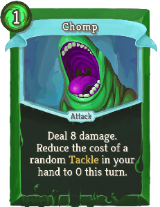 | 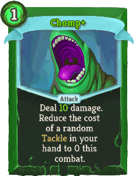 | Uncommon | Attack | 1 | Deal 8 (10) damage. Reduce the cost of a random slimeboundmod:Tackle in your hand to 0 this turn (combat). |
| Divide & Conquer | 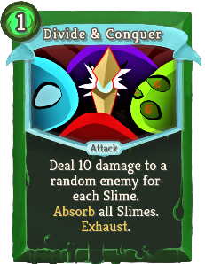 | 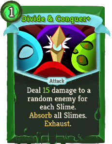 | Uncommon | Attack | 1 | Deal 10 (15) damage to a random enemy for each Slime. slimeboundmod:Absorb all Slimes. Exhaust. |
| Double Lick | 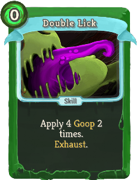 | 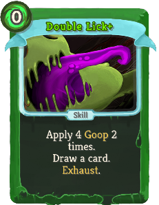 | Uncommon | Skill | 0 | Apply 4 slimeboundmod:Goop 2 times. (Draw a card.)  Exhaust. |
| Equalize |  | 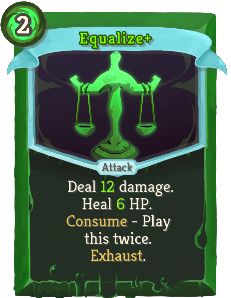 | Uncommon | Attack | 2 | Deal 8 (12) damage. Heal 4 (6) HP. slimeboundmod:Consume - Play this twice. Exhaust. |
| Flame Tackle | 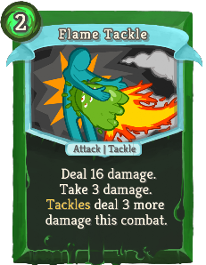 | 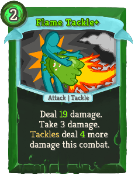 | Uncommon | Attack | 2 | Deal 16 (19) damage. Take 3 damage. slimeboundmod:Tackles deal 3 (4) more damage this combat. |
| Forward Tackle | 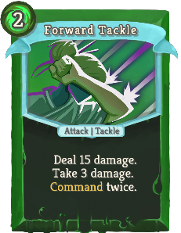 |  | Uncommon | Attack | 2 | Deal 15 (17) damage. Take 3 damage. slimeboundmod:Command twice (three times). |
| Gluttony |  |  | Uncommon | Power | 1 | (Innate.)  The first time you slimeboundmod:Consume each turn, gain a Lick. |
| Goop Armor |  |  | Uncommon | Power | 1 | Gain 3 (4) Block whenever you slimeboundmod:Consume. |
| Grow |  |  | Uncommon | Power | 2 (1) | Lose 1 Slime slot in exchange for 2 Strength and 2 Dexterity. |
| Growth Punch |  |  | Uncommon | Attack | 1 | Deal 4 (5) damage. Gain 4 (5) Block. slimeboundmod:Consume - Increase this card's effects by 4 (5) this combat. |
| Hungry Tackle |  |  | Uncommon | Attack | 1 | Deal 10 (14) damage. Take 3 damage. expansioncontent:Exhume a random Lick. |
| Just Desserts |  |  | Uncommon | Attack | 1 | Deal 6 (8) damage to ALL enemies. expansioncontent:Exhume 2 (3) random Lick cards. |
| Lead By Example |  |  | Uncommon | Power | 1 | The first (!M!) card(s) you play each turn that targets enemies also slimeboundmod:Commands (slimeboundmod:Command). |
| Level Up |  |  | Uncommon | Power | 1 | Gain 1 (2) slimeboundmod:Potency. |
| Mega-Lick |  |  | Uncommon | Skill | 0 | Apply 1 Weak and 4 slimeboundmod:Goop to ALL enemies. (Draw a card.)  Exhaust. |
| Nibble and Lick |  |  | Uncommon | Attack | 0 | Deal 1 damage. Gain a Lick. (Draw a card.)  Exhaust. |
| Pile On! |  |  | Uncommon | Attack | 2 | Deal 8 damage. slimeboundmod:Command ALL slimes (twice). |
| Prepare |  |  | Uncommon | Skill | 2 | Gain 10 (15) Block. Next turn, gain [E] and draw 2 cards. Exhaust. |
| Protect the Boss |  |  | Uncommon | Power | 1 (0) | Prevent the next time you would be damaged by an enemy attack, slimeboundmod:Absorbing your leading Slime instead. |
| Quick Snack |  |  | Uncommon | Skill | 0 | Draw 2 (3) cards. Exhaust a card. Gain Licks equal to its cost. Exhaust. |
| Rain of Goop |  |  | Uncommon | Skill | 1 | Apply 3 slimeboundmod:Goop to a random enemy 4 (6) times. |
| Recklessness |  |  | Uncommon | Power | 1 | slimeboundmod:Tackles deal 6 (9) more damage to enemies, and 1 more damage to you. |
| Recollect |  |  | Uncommon | Skill | 1 | Gain 8 (11) Block. expansioncontent:Exhume a random Lick card. |
| Replication |  |  | Uncommon | Skill | 1 (0) | Choose a card. Put a copy on top of your draw pile. Exhaust. |
| Repurpose |  |  | Uncommon | Skill | 0 | slimeboundmod:Absorb - Split into a random slimeboundmod:Specialist. (slimeboundmod:Command.)  Exhaust. |
| Serve & Protect |  |  | Uncommon | Skill | 1 | Gain 10 (15) Block and 1 bronze:Blur for each Slime. slimeboundmod:Absorb all Slimes. Exhaust. |
| Shape of Puddle |  |  | Uncommon | Skill | 3 (2) | Gain 1 Intangible. Exhaust. |
| Slime Brawl |  |  | Uncommon | Skill | 3 (2) | Play the top card of your draw pile. Repeat for each of your spawned Slimes. Exhaust. |
| Slime Tap |  |  | Uncommon | Skill | 0 | slimeboundmod:Absorb - Gain [E] ([E]) and draw 2 cards. Exhaust. |
| Split: Specialist |  |  | Uncommon | Skill | 1 | Choose 1 of 3 slimeboundmod:Specialist to slimeboundmod:Split into. (slimeboundmod:Command.)  Exhaust. |
| Spreading Slime |  |  | Uncommon | Power | 2 | Effects that apply slimeboundmod:Goop apply 2 (3) more. |
| Tongue Lash |  |  | Uncommon | Attack | 1 | Deal 6 damage. Deals 2 (3) additional damage for each Exhausted card containing "Lick". |
| Vicious Tackle |  |  | Uncommon | Attack | 2 | Deal 16 (20) damage. Take 3 damage. This gains twice the damage bonus from slimeboundmod:Goop. |
| Consult Playbook |  |  | Rare | Skill | 2 (1) | Gain 4 random slimeboundmod:Tackles. They cost 1 less this combat. Exhaust. |
| Douse in Slime |  |  | Rare | Skill | 3 (2) | Apply 14 slimeboundmod:Goop. The next Attack used on this enemy does not remove slimeboundmod:Goop. |
| Duplicated Form |  |  | Rare | Power | 3 | (Gain [E] each turn.)  The first card each turn that targets enemies is played twice. |
| Glop Chop |  |  | Rare | Attack | 2 | Deal 12 damage. slimeboundmod:Split into a random Slime (slimeboundmod:Specialist). slimeboundmod:Command 2 (3) times. |
| Leech Life |  |  | Rare | Attack | 2 | Ethereal. Deal 8 (10) damage. Heal HP equal to unblocked damage. Exhaust. |
| Liquidate |  |  | Rare | Skill | 0 | Unplayable if you have negative Strength. Lose 2 Strength. Gain 2 (3) slimeboundmod:Potency. |
| Mass Feed |  |  | Rare | Attack | 2 | Deal 10 (12) damage to ALL enemies. If Fatal, raise your Max HP by 3 (4). Exhaust. |
| Mass Repurpose |  |  | Rare | Skill | 1 | slimeboundmod:Absorb ALL Slimes. Split into a random slimeboundmod:Specialist for each. (slimeboundmod:Command them.) Exhaust. |
| Minion Master |  |  | Rare | Power | 2 | (Innate.)  Whenever you play a card with slimeboundmod:Command, slimeboundmod:Command again. |
| One-Two Combo |  |  | Rare | Attack | 0 | Deal 3 damage. (slimeboundmod:Command.)  When you slimeboundmod:Split, return this from the discard pile to your hand. |
| Ooze Bath |  |  | Rare | Skill | 1 | Apply 6 (9) slimeboundmod:Goop to target enemy at the start of each of its turns. Exhaust. |
| Overexert |  |  | Rare | Power | 1 | Gain 4 slimeboundmod:Potency. (slimeboundmod:Command twice.)  2 turns from now, slimeboundmod:Absorb all Slimes. |
| Prepare: Crush |  |  | Rare | Skill | 2 | Next turn, gain SLIME CRUSH (*CRUSH+), [E] [E] [E] ([E]) and 3 Strength. Exhaust. |
| Rally the Troops |  |  | Rare | Attack | 1 | Deal 7 (9) damage. The next 2 (3) cards played this turn trigger a slimeboundmod:Command. |
| Recycling |  |  | Rare | Power | 1 | (Innate.)  At the start of your turn, expansioncontent:Exhume a random Lick card. |
| Reformation |  |  | Rare | Power | 1 | Whenever you slimeboundmod:Absorb a Slime, gain 1 Strength (and 1 Dexterity). |
| Slime Slap |  |  | Rare | Attack | 2 (1) | Deal 8 damage. slimeboundmod:Consume - Does not remove slimeboundmod:Goop. |
| Teamwork |  |  | Rare | Skill | X | slimeboundmod:Command X (X+1) times. Gain 5 Block X (X+1) times. |
| Waste Not |  |  | Rare | Skill | 2 | expansioncontent:Exhume all Lick cards. Exhaust. (not Exhaust.) |
