| Image | Name | Rarity | Color | Description | Flavor |
| ----- | ---- | ------ | ----- | ----------- | ------ |
|  | Bronze Core | Starter | The_bronze_automaton | The first time you #yCompile a #yFunction each combat, gain [E] . | Replace once every 50,000 years. |
|  | Bronze Gear | Starter | Guardian | The first time you enter #yguardianmod:Defensive_Mode each combat, gain an additional #b10 #yBlock. NL Guardian starts the run with a random common #yGem. | Protection where you need it most. |
|  | Burning Blood | Starter | Red | At the end of combat, heal #b6 HP. | Your body's own blood burns with an undying rage. |
|  | Champion's Crown | Starter | The_champ_gray | At the start of combat, enter #bDefensive or #rBerserker Stance. | A WINNER IS YOU! |
|  | Cracked Core | Starter | Blue | At the start of each combat, #yChannel #b1 #yLightning. | The mysterious life force which powers the Automatons within the Spire. It appears to be cracked. |
|  | Heart of Goo | Starter | Slimebound | Whenever you #yslimeboundmod:Consume, heal #b2 HP, up to #b8 each combat. | I feel so funky. |
|  | Mob Leader's Staff | Starter | Gremlin | At the start of each combat, gain [E] , draw #b1 card, and #ySwap to the next Gremlin. | Among gremlin mobs, the one with the best horn maintains complete command over the troupe, until another one manages to steal it. |
|  | Old Locket | Starter | Hermit_yellow | At the start of each combat, add a #yMemento into your hand. | There's a faded picture inside. |
|  | Pure Water | Starter | Purple | At the start of each combat, add a #yMiracle into your hand. | Filtered through fine sand and free of impurities. |
|  | Ring of the Snake | Starter | Green | At the start of each combat, draw #b2 additional cards. | Made from a fossilized snake. Represents great skill as a huntress. |
|  | Snecko Soul | Starter | Snecko_cyan | The first time you play an #ysneckomod:Offclass card in a combat, gain [E] and draw a card. | 0...3...2...2...1 |
|  | Spirit Brand | Starter | Hexa_ghost_purple | The first time you #yIgnite a Ghostflame each turn, gain #b4 #yBlock. | A bound protector. |
|  | Akabeko | Common |  | Your first Attack each combat deals #b8 additional damage. | "Muuu~" |
|  | Anchor | Common |  | Start each combat with #b10 #yBlock. | Holding this miniature trinket, you feel heavier and more stable. |
|  | Ancient Tea Set | Common |  | Whenever you enter a Rest Site, start the next combat with [E] [E] . | The key to a refreshing night's rest. |
|  | Art of War | Common |  | If you do not play any #yAttacks during your turn, gain an additional [E] next turn. | This ancient manuscript contains wisdom from a past age. |
|  | Arumba's Pocket Sentry | Common |  | At the start of each turn, alternates between: NL Deal #b7 damage to a random enemy. NL Apply #b1 #yWeak to ALL enemies. | Sentry Mode active. Target acquired. No hard feelings. |
| 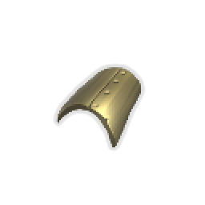 | Baalor's Lordly Plate | Common | Guardian | Whenever you #yguardianmod:Brace, #yBrace 1 more. | One can never have enough armor. |
|  | Bag of Marbles | Common |  | At the start of each combat, apply #b1 #yVulnerable to ALL enemies. | A once popular toy in the City. Useful for throwing enemies off balance. |
|  | Bag of Preparation | Common |  | At the start of each combat, draw #b2 additional cards. | Oversized adventurer's pack. Has many pockets and straps. |
|  | Blank Card | Common |  | At the start of each combat, play a copy of a random card from your deck. | Card Mimic. |
|  | Blood Vial | Common |  | At the start of each combat, heal #b2 HP. | A vial containing the blood of a pure and elder vampire. |
|  | Brass Tacks | Common |  | Start each combat with #b2 #yMetallicize. | The luster on these tacks never seems to fade. |
|  | Bronze Idol | Common |  | #yStatus cards may now be played for useful effects. | An ancient, weaponised antivirus - who knows who made it, and why? |
|  | Bronze Scales | Common |  | Start each combat with #b3 #yThorns. | The sharp scales of the Guardian. Rearranges itself to protect its user. |
|  | Centennial Puzzle | Common |  | The first time you lose HP each combat, draw #b3 cards. | Upon solving the puzzle, you feel a powerful warmth in your chest. |
|  | Ceramic Fish | Common |  | Whenever you add a card to your deck, gain #b9 #yGold. | Meticulously painted, these fish were revered to bring great fortune. |
|  | Damaru | Common | Purple | At the start of your turn, gain #b1 #yMantra. | The sound of the small drum keeps your mind awake, revealing a path forward. |
|  | Data Disk | Common | Blue | Start each combat with #b1 #yFocus. | This disk contains precious data on birds and snakes. |
|  | Defensive Thesis | Common | The_champ_gray | Defensive Stance's #yFinisher #yBonus grants #b5 more #yBlock. | Pro tip: Don't get hit. |
|  | Dolphin's Style Guide | Common | The_champ_gray | If you end your turn while in no #yStance, draw #b1 additional card next turn. | Author: Renowned explorer and pugilist Dolphin K. Mist. |
|  | Dream Catcher | Common |  | Whenever you #yRest, you may add a card into your deck. | The northern tribes would often use dream catchers at night, believing they led to self improvement. |
|  | Fragmentation Grenade | Common | Gremlin | Damage dealt to random enemies is increased by #b3. | Nobody dares to ask where the Gremlin got it from. |
|  | Goop Dweller | Common | Slimebound | At the start of combat, #yslimeboundmod:Split into a #yslimeboundmod:Bruiser #ySlime. | He followed me home. Can I keep it? |
|  | Happy Flower | Common |  | Every #b3 turns, gain [E] . | This unceasingly joyous plant is a popular novelty item among nobles. |
|  | Juzu Bracelet | Common |  | Normal enemy combats are no longer encountered in #y? rooms. | A ward against the unknown. |
|  | Lantern | Common |  | Start each combat with an additional [E] . | An eerie lantern which illuminates only for the wielder. |
|  | Loaded Die | Common | Snecko_cyan | Cards that choose random numbers have +1 minimum. | Cheese-stuffed. |
|  | Maw Bank | Common |  | Whenever you climb a floor, gain #b12 #yGold. No longer works when you spend any #yGold at a shop. | Surprisingly popular, despite maw attacks being a regular occurrence. |
|  | Meal Ticket | Common |  | Whenever you enter a shop, heal #b15 HP. | "Complimentary meatballs with every visit!" |
|  | Nunchaku | Common |  | Every time you play #b10 #yAttacks, gain [E] . | A good training tool. Improves the posture and agility of the wielder. |
|  | Oddly Smooth Stone | Common |  | Start each combat with #b1 #yDexterity. | You have never seen something so smooth and pristine. This must be the work of the Ancients. |
|  | Omamori | Common |  | Negate the next #b2 #rCurses you obtain. | A common charm for staving off vile spirits. This one seems to possess a spark of divine energy. |
|  | Orichalcum | Common |  | If you end your turn without #yBlock, gain #b6 #yBlock. | A green tinted metal of an unknown origin. Seemingly indestructible. |
|  | Pen Nib | Common |  | Every #b10th #yAttack you play deals double damage. | Holding the nib, you can see everyone ever slain by a previous owner of the pen. A violent history. |
|  | Pick of Rhapsody | Common | Guardian | You can now #gMine for #b2 #yguardianmod:Gems at Rest Sites (up to #b3 times). | With as many gemstones that litter the Spire, it is hard to imagine anyone so unlucky to have needed this Pick to aid them. |
|  | Potion Belt | Common |  | Upon pickup, gain #b2 Potion slots. | I can hold more Potions using this belt! |
|  | Preserved Insect | Common |  | Enemies in Elite combats have #b25% less HP. | The insect seems to create a shrinking aura that targets particularly large enemies. |
|  | Protective Goggles | Common | The_bronze_automaton | If you end your turn with no cards in the #ySequence, gain #b4 #yBlock. | Look closely. |
|  | Red Skull | Common | Red | While your HP is at or below #b50%, you have #b3 additional #yStrength. | A small skull covered in ornamental paint. |
|  | Regal Pillow | Common |  | Whenever you #yRest, heal an additional #b15 HP. | Now you can get a proper night's rest. |
|  | Rye Stalk | Common | Hermit_yellow | At the end of your turn, ALL enemies lose HP equal to their #yhermit:Bruise. | Still in mint condition, despite being chewed on for so long. |
|  | Seal of Approval | Common | Snecko_cyan | Upon pickup, choose #b1 of #b3 #yUnidentified #yCharacter cards to add to your deck. All future #yUnidentified #yCharacter cards found will be of this character. | I'm The Ironclad and this is my favorite Relic in the Spire. -Merchant Advertising Pamphlet |
|  | Silver Bullet | Common | The_bronze_automaton | Start each combat with a #yPiercing #yShot in the #ySequence. | Spirewolves are long gone. |
|  | Smiling Mask | Common |  | The Merchant's card removal service now always costs #b50 #yGold. | Mask worn by the Merchant. He must have spares... |
| 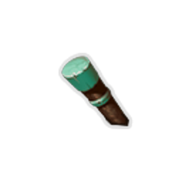 | Sneaky Teakwood Match | Common | Hexa_ghost_purple | At the start of each combat, #yhexamod:Ignite the current Ghostflame and #yhexamod:Advance. | Lights on any surface! |
|  | Snecko Skull | Common | Green | Whenever you apply #yPoison, apply an additional #b1 #yPoison. | A snecko skull in pristine condition. Mysteriously clean and smooth, dirt and grime fall off inexplicably. |
|  | Strawberry | Common |  | Upon pickup, raise your Max HP by #b7. | "Delicious! Haven't seen any of these since the blight." - Ranwid |
|  | Supply Scroll | Common |  | At the start of your 3rd turn, gain a #ySupply #yScroll. | A surprisingly detailed inventory of the mob's various bits and bobbles. |
|  | The Boot | Common |  | Whenever you would deal #b4 or less unblocked attack damage, increase it to #b5. | When wound up, the boot grows larger in size. |
|  | Tiny Chest | Common |  | Every #b4th #y? room is a #yTreasure room. | "A fine prototype." - The Architect |
|  | Toy Ornithopter | Common |  | Whenever you use a potion, heal #b5 HP. | "This little toy is the perfect companion for the lone adventurer!" |
| 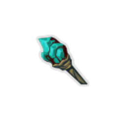 | Tricky's Bolster-Rod | Common |  | The first time you play a #yPower card each combat, gain #b6 #yBlock and #b1 #yStrength. | Backed by the study of a thousand books. Knowledge is power! |
|  | Vajra | Common |  | Start each combat with #b1 #yStrength. | An ornamental relic given to warriors displaying glory in battle. |
|  | War Paint | Common |  | Upon pickup, #yUpgrade #b2 random #ySkills. | In the past, Ironclads would create wards using enchanted war paint before charging into battle. |
|  | Whetstone | Common |  | Upon pickup, #yUpgrade #b2 random #yAttacks. | "Flesh never beats steel." - Kublai the Great |
|  | Wizard Hat | Common | Gremlin | Whenever you consume #yWiz, remove a debuff at random. | The accompanying robes have long since been stolen. |
|  | Blue Candle | Uncommon |  | #yUnplayable #rCurse cards can now be played. NL Whenever you play a #rCurse, lose #b1 HP and #yExhaust it. | The flame ignites when shrouded in darkness. |
|  | Bottled Flame | Uncommon |  | Upon pickup, choose an #yAttack. Start each combat with this card in your hand. | Inside the bottle resides a flame that eternally burns. |
|  | Bottled Lightning | Uncommon |  | Upon pickup, choose a #ySkill. Start each combat with this card in your hand. | Peering into the swirling maelstrom, you see a part of yourself staring back. |
|  | Bottled Tornado | Uncommon |  | Upon pickup, choose a #yPower card. Start each combat with this card in your hand. | The bottle gently hums and whirs. |
|  | Broken Tooth | Uncommon |  | Whenever you beat an Elite encounter, gain #b1 #yStrength at the start of each combat for the rest of the Act. | Appears too large to have come from a human jaw... |
| 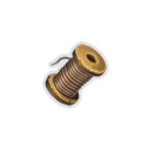 | Cable Spool | Uncommon | The_bronze_automaton | Add a copy of the first card you play with #yEncode each combat to the #ySequence. | Tangled... |
|  | Darkstone Periapt | Uncommon |  | Whenever you obtain a #rCurse, increase your Max HP by #b6. | The stone draws power from dark energy, converting it into vitality for the wearer. |
|  | Deca's Washers | Uncommon |  | At the start of each combat, draw #b3 additional cards and add a #yDazed into your draw pile. | It is unclear why Deca collects these. |
|  | Duality | Uncommon | Purple | Whenever you play an #yAttack, gain #b1 temporary #yDexterity. | "And the sun was extinguished forever, as if curtains fell before it." - Zoroth |
|  | Eternal Feather | Uncommon |  | For every #b5 cards in your deck, heal #b3 HP whenever you enter a Rest Site. | This feather appears to be completely indestructible. What bird does this possibly come from? |
|  | Frozen Egg | Uncommon |  | Whenever you add a #yPower card into your deck, #yUpgrade it. | The egg lies inert and frozen, never to hatch. |
|  | Gelatinous Cube | Uncommon |  | Whenever you draw a #yStatus card, draw #b1 card. | Hey, it stuck to your body. |
|  | Gold-Plated Cables | Uncommon | Blue | Your rightmost Orb triggers its passive an additional time. | "Interesting! Even automatons are affected by placebo." - Ranwid |
|  | Gremlin Horn | Uncommon |  | Whenever an enemy dies, gain [E] and draw #b1 card. | "Gremlin Nobs are capable of growing until the day they die. Remarkable." - Ranwid |
|  | Horn Cleat | Uncommon |  | At the start of your 2nd turn, gain #b14 #yBlock. | Pleasant to hold in the hand. What was it for? |
|  | Impeccable Pecs | Uncommon |  | Whenever you gain #yStrength, gain an equal amount of #yTemporary_HP. NL Start each combat with #b1 #yStrength. | Glorious. |
|  | Ink Bottle | Uncommon |  | Whenever you play #b10 cards, draw #b1 card. | Once exhausted, appears to refill itself in a different color. |
|  | Jar of TOBSCo | Uncommon | Hexa_ghost_purple | Start each combat with #b1 #yhexamod:Intensity. | A little extra heat makes everything better. |
|  | Jeremiah's Banner | Uncommon | Slimebound | At the start of combat, #yslimeboundmod:Split into a #yslimeboundmod:Leeching #ySlime and gain #b1 Slime slot. | You and ooze army. |
|  | Kunai | Uncommon |  | Every time you play #b3 #yAttacks in a single turn, gain #b1 #yDexterity. | A blade favored by assassins for its lethality at range. |
|  | Letter Opener | Uncommon |  | Every time you play #b3 #ySkills in a single turn, deal #b5 damage to ALL enemies. | Unnaturally sharp. |
|  | Magic Mallet | Uncommon | Gremlin | Whenever you apply #yWeak, gain #b1 #yWiz, up to #b3 times per turn. | Stubs toes twice as hard. |
|  | Matryoshka | Uncommon |  | The next #b2 non-Boss chests you open contain #b2 #yRelics. | A stackable set of painted dolls. The paint depicts an unknown bird with white eyes and blue feathers. |
|  | Meat on the Bone | Uncommon |  | If your HP is at or below #b50% at the end of combat, heal #b12 HP. | The meat keeps replenishing, never seeming to fully run out. |
|  | Mercury Hourglass | Uncommon |  | At the start of your turn, deal #b3 damage to ALL enemies. | An enchanted hourglass that endlessly drips. |
|  | Molten Egg | Uncommon |  | Whenever you add an #yAttack into your deck, #yUpgrade it. | The egg of a Phoenix. It glows red hot with a simmering lava. |
|  | Mummified Hand | Uncommon |  | Whenever you play a #yPower card, a random card in your hand costs #b0 that turn. | Frequently twitches, especially when your pulse is high. |
|  | Ninja Scroll | Uncommon | Green | At the start of each combat, add #b3 #yShivs into your hand. | Contains the secrets of assassination. |
|  | Ornamental Fan | Uncommon |  | Every time you play #b3 #yAttacks in a single turn, gain #b4 #yBlock. | The fan seems to extend and harden as blood is spilled. |
|  | Pantograph | Uncommon |  | At the start of Boss combats, heal #b25 HP. | "Solid foundations are not accidental. Tools for planning are a must." - The Architect |
|  | Paper Krane | Uncommon | Green | Enemies with #yWeak deal #b40% less damage rather than #b25%. | An origami of a creature from a past age. |
|  | Paper Phrog | Uncommon | Red | Enemies with #yVulnerable take #b75% more damage rather than #b50%. | The paper continually folds and unfolds itself into the shape of a small creature. |
|  | Pear | Uncommon |  | Upon pickup, raise your Max HP by #b10. | A common fruit before the Spireblight. |
|  | Pilot's Codex | Uncommon | Guardian | If you end your turn with no cards in #yguardianmod:Stasis, choose #b1 of #b3 cards to place into #yguardianmod:Stasis. | Designs and diagrams of the Spire's earliest manually-driven prototypes, by Master Pilot David. |
|  | Question Card | Uncommon |  | Future card rewards have #b1 additional card to choose from. | "Those with more choices minimize the downside to chaos." - Kublai the Great |
|  | Red Candle | Uncommon |  | Whenever an #yAttack deals unblocked damage, apply #b2 #yhexamod:Soulburn. | Fire BURNS... |
|  | Ring of the Snek | Uncommon | Snecko_cyan | At the start of combat, apply #b0-2 #yWeak and #yVulnerable to ALL enemies. | Illegible, unreadable, due by Thursday. |
|  | Self-Forming Clay | Uncommon | Red | Whenever you lose HP, gain #b3 #yBlock next turn. | "Most curious! It appears to form itself loosely on my thoughts! Tele-clay?" - Ranwid |
|  | Shuriken | Uncommon |  | Every time you play #b3 #yAttacks in a single turn, gain #b1 #yStrength. | Lightweight throwing weapons. Recommend going for the eyes. |
|  | Singing Bowl | Uncommon |  | When adding cards into your deck, you may raise your Max HP by #b2 instead. | This well-used artifact rings out with a beautiful melody when struck. |
|  | Slime Soup | Uncommon |  | When you enter a Rest Site, begin the next combat with a #yPrepare card that costs #b0. | Tastes awful, but incredibly healthy. |
|  | Spectre's Hand | Uncommon | The_champ_gray | Whenever you Enter a Stance, gain a basic #yStrike or #yDefend. It costs #b0 and has #yExhaust. | Some victories stay with you. |
| 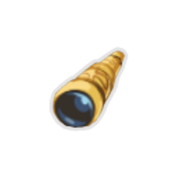 | Spyglass | Uncommon | Hermit_yellow | If you end your turn #yhermit:Concentrated, gain an additional [E] next turn . | Property of Kestin Highfin. |
|  | Straight Razor | Uncommon | Hermit_yellow | Whenever you remove a card from your deck, heal #b15 HP. | For a cleaner shave... |
|  | Strike Dummy | Uncommon |  | Cards containing "Strike" deal #b3 additional damage. | It's beat up. |
|  | Sundial | Uncommon |  | Every #b3 times you shuffle your draw pile, gain [E] [E] . | "Early man's foolish obsession with time caused them to look to the sky for guidance, hoping for something permanent." - Zoroth |
|  | Super Snecko Eye | Uncommon |  | Replaces #ySnecko #yEye. At the start of your turn, draw #b2 additional cards. Start each combat #yConfused. The first time you draw a card that costs #b3 each combat, reduce its cost to #b0. | 0121012 |
|  | Symbiotic Virus | Uncommon | Blue | At the start of each combat, #yChannel #b1 #yDark. | A little bit of bad can do a lot of good... |
|  | Teardrop Locket | Uncommon | Purple | Start each combat in #yCalm. | Its owner blind, its contents unseen. |
|  | The Courier | Uncommon |  | The Merchant restocks cards, relics, and potions. All prices are reduced by #b20%. | The Merchant's personal pet! |
|  | Toxic Egg | Uncommon |  | Whenever you add a #ySkill into your deck, #yUpgrade it. | "What a marvelous discovery! This appears to be the inert egg of some magical creature. Who or what created this?" - Ranwid |
|  | White Beast Statue | Uncommon |  | Potions always appear in combat rewards. | A small white statue of a creature you have never seen before. |
|  | Wizard Staff | Uncommon | Gremlin | #yWiz deals #b7 additional damage. | The pride and joy of every Gremlin Wizard, this staff is a frequent target of theft by rival mobs. |
|  | Wound Poker | Uncommon | Gremlin | At the end of each turn, deal #b6 damage to each #yWeakened enemy. | Does it hurt when I do this?. |
|  | Bird-Faced Urn | Rare |  | Whenever you play a #yPower card, heal #b2 HP. | This urn shows the crow god Mazaleth looking mischievous. |
| 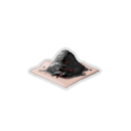 | Black Powder | Rare | Hermit_yellow | At the end of your turn, deal #b2 damage to ALL enemies for each #yhermit:Dead_On effect triggered. | Handle with care. |
|  | Calipers | Rare |  | At the start of your turn, lose #b15 #yBlock rather than all of your #yBlock. | "Mechanical precision leads to greatness" - The Architect |
|  | Captain's Wheel | Rare |  | At the start of your 3rd turn, gain #b18 #yBlock. | Wooden trinket carved with delicate precision. A name is carved into it but the language is foreign. |
|  | Champion Belt | Rare | Red | Whenever you apply #yVulnerable, apply #b1 #yWeak. | Only the greatest may wear this belt. |
|  | Charon's Ashes | Rare | Red | Whenever you #yExhaust a card, deal #b3 damage to ALL enemies. | Charon was said to be the god of rebirth, eternally dying and reviving in a burst of flame. |
|  | Charred Glove | Rare | Hermit_yellow | Whenever you draw a #rCurse, your next attack deals #b4 more damage. | Parts of the glove still glow with otherworldly cinders. |
|  | Cloak Clasp | Rare | Purple | At the end of your turn, gain #b1 #yBlock for each card in your hand. | A simple but sturdy design. |
|  | Dead Branch | Rare |  | Whenever you #yExhaust a card, add a random card into your hand. | The branch of a tree from a forgotten era. |
|  | Deflecting Bracers | Rare |  | At the start of your turn, gain #ychamp:Counter equal to half the amount of expired #yBlock. | If you thought blocking was good then... |
|  | Du-Vu Doll | Rare |  | For each #rCurse in your deck, start each combat with #b1 #yStrength. | A doll devised to gain strength from malicious energy. |
| 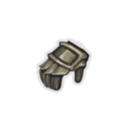 | Dueling Glove | Rare |  | After using a single-target #yAttack, if the target has no #yVulnerable, apply #b1 #yVulnerable. | Count from ten... |
|  | Emotion Chip | Rare | Blue | If you lost HP during the previous turn, trigger the passive ability of all Orbs at the start of your turn. | ...<3...? |
|  | Fossilized Helix | Rare |  | Prevent the first time you would lose HP each combat. | Seemingly indestructible, you wonder what kind of creature this belonged to. |
|  | Gambling Chip | Rare |  | At the start of each combat, discard any number of cards, then draw that many cards. | You can see a small inscription on one side. It reads: "Bear's Lucky Chip!" |
|  | Gemstone Gun | Rare |  | Upon pickup, choose #b3 #yguardianmod:Gems. At the start of each combat, gain a card with #yRetain, #yExhaust, and each chosen #yGem socketed. | Bang! Bang! Bang! Hey, I matched three! |
|  | Ginger | Rare |  | You can no longer become #yWeakened. | A potent tool in many tonics. |
|  | Girya | Rare |  | You can now gain #yStrength at Rest Sites (up to 3 times). | This Girya is unfathomably heavy. You could train with this to get significantly stronger. |
|  | Gladiators Manual | Rare | The_champ_gray | Whenever you play a #yCombo, a #yFinisher, and enter a #yStance in the same turn, gain #b1 #yStrength and #yDexterity. | Try everything - something will stick. |
|  | Golden Eye | Rare | Purple | Whenever you #yScry, #yScry #b2 additional cards. | See into the minds of those nearby, predicting their future moves. |
|  | Gremlin Bomb | Rare | Gremlin | Whenever a Gremlin dies, deal #b30 damage to ALL enemies. | Gremlins have an uncanny knack for finding dangerous things. Sometimes, they even survive looting them. |
|  | Gremlin Gravestone | Rare | Gremlin | Dead Gremlins can be Resurrected at Rest Sites as a Free Action. | Where do gremlins go when they die? Not bloody far enough. |
|  | Horseshoe | Rare |  | Whenever you gain #yWeak, #yFrail or #yVulnerable, gain #b1 less. | Lucky charm. Somebody is gonna be missing this. |
|  | Ice Cream | Rare |  | Energy is now conserved between turns. | "Delicious!" |
|  | Incense Burner | Rare |  | Every #b6 turns, gain #b1 #yIntangible. | The smoke imbues its owner with the spirit of the burned. |
|  | Lizard Tail | Rare |  | When you would die, heal to #b50% of your Max HP instead (works once). | A fake tail to trick enemies during combat. |
|  | Magic Flower | Rare | Red | Healing is #b50% more effective during combat. | A flower long thought extinct, somehow preserved in perfect condition. |
|  | Mallet | Rare | The_bronze_automaton | At the start of each combat, add #b2 copies of #yFine #yTuning+ to your hand. | That's it! I'm gettin me mallet! |
|  | Mango | Rare |  | Upon pickup, raise your Max HP by #b14. | The most coveted forgotten fruit. Impeccably preserved with no signs of Spireblight. |
|  | Old Coin | Rare |  | Upon pickup, gain #b300 #yGold. | Unique coins are highly valued by merchants for their historical value and rare metallic composition. |
|  | Peace Pipe | Rare |  | You can now remove cards from your deck at Rest Sites. | Clears the mind and cleanses the soul. |
|  | Pocketwatch | Rare |  | Whenever you play #b3 or less cards during your turn, draw #b3 additional cards at the start of your next turn. | The hands seem stuck on the 3 o'clock position. |
|  | Prayer Wheel | Rare |  | Normal enemies drop an additional card reward. | The wheel continues to spin, never stopping. |
|  | Prickly Shields | Rare |  | Whenever you gain #yBlock, deal #b2 damage to a random enemy. | Gremlins use whatever scraps they can find as weapons or armor. Some serve as both. |
|  | Red Scarf | Rare | Hermit_yellow | Whenever you apply a debuff to an enemy, gain #b2 #yBlock. | It's warm and fuzzy. |
|  | Sack of Gems | Rare | Guardian | Upon pickup, add #b5 random #yguardianmod:Gems to your deck. | Ooh... shiny! |
|  | Shovel | Rare |  | You can now #yDig for relics at Rest Sites. | The Spire houses all number of relics from past civilizations and powerful adventurers lost to time. Time to go dig them up! |
|  | Signature Finisher | Rare | The_champ_gray | Upon pickup, choose a #yFinisher. This #yFinisher costs #b0, can be used without a #yStance, and never causes your #yStance to be exited. | And now, it's time for my ULTIMATE MOVE! |
|  | Six-Point Brand | Rare |  | Whenever you play #b6 cards, deal #b6 damage to a random enemy. | Fire, fire, fire, fire, fire, FIRE! |
|  | Slimed Tail | Rare | Slimebound | When you fall below #b50% of your Maximum HP, #yslimeboundmod:Split into a #yslimeboundmod:Guerilla #ySlime, and the next time you take damage, your leading slime is #yslimeboundmod:Absorbed instead. (works once per combat). | A fake tail to trick enemies during combat, completely covered in slime. |
|  | Slimy Skull | Rare | Slimebound | Whenever you apply #yslimeboundmod:Goop, apply an additional #b1 #yslimeboundmod:Goop. | A Snecko skull in absolutely awful condition. Unclean and slimy, dirt and grime stick to it like glue. |
|  | Snake-Charmer's Flute | Rare | Snecko_cyan | #ysneckomod:Muddled cards can't cost #b3. | Sssssss... |
|  | Soul of Chaos | Rare | Hexa_ghost_purple | The fourth Ghostflame becomes a #yMayhem #yGhostflame. NL #yMayhem #yGhostflame activates when you end your turn on it. NL #yIgnition: Play the top card of your draw pile. | Mayhem, made manifest. |
|  | Stone Calendar | Rare |  | At the end of turn #b7, deal #b52 damage to ALL enemies. | The passage of time is imperceptible in the Spire. |
|  | Stone of Nomakk | Rare | Slimebound | At the start of combat, #ySplit into a #yslimeboundmod:Mire #ySlime and gain #b1 #yslimeboundmod:Potency. | When presented to one of your Goop Gang, it seems to make the blob dance. |
|  | The Specimen | Rare | Green | Whenever an enemy dies, transfer any #yPoison it has to a random enemy. | "Fascinating! I found a mutated creature demonstrating astounding toxic properties. Storing a sample for later examination." - Ranwid |
|  | Thermal Stone | Rare | Hexa_ghost_purple | If #yhexamod:Soulburn detonates, heal #b4 HP at the end of combat. | A fire would liven this thing up! |
|  | Thread and Needle | Rare |  | Start each combat with #b4 #yPlated #yArmor. | Wrapping the magical thread around your body, you feel harder to the touch. |
|  | Timepiece | Rare | The_bronze_automaton | All #yFunctions you #yCompile gain #yRetain. | From his collection of identical clocks. |
|  | Tingsha | Rare | Green | Whenever you discard a card during your turn, deal #b3 damage to a random enemy. | The sound this instrument generates seems to be capable of reverberating to painful levels of volume. |
|  | Torii | Rare |  | Whenever you would receive #b5 or less unblocked attack damage, reduce it to #b1. | Holding the small Torii, you feel a sense of calm and safety drift through your mind. |
|  | Tough Bandages | Rare | Green | Whenever you discard a card during your turn, gain #b3 #yBlock. | Loss gives strength. |
|  | Tungsten Rod | Rare |  | Whenever you would lose HP, lose #b1 less. | It's very very heavy. |
|  | Turnip | Rare |  | You can no longer become #yFrail. | Best with Ginger. |
|  | Unceasing Top | Rare |  | Whenever you have no cards in hand during your turn, draw a card. | The top continues to spin effortlessly as if you were in a dream. |
|  | Unidentified Egg | Rare | Snecko_cyan | #yIdentifying becomes a free action. NL #yUnidentified cards in card rewards are #yUpgraded. | What will hatch? Pay $1000 to see. |
|  | Wing Boots | Rare |  | You may ignore paths when choosing the next room to travel to #b3 times. | Stylish. |
|  | Bandit Contract | Special |  | At the start of the #b3rd boss combat, Red Mask Bandits will assist you. | An agreement from the Bandit trio - partially in exchange for a trinket, but mostly in exchange for their lives. |
|  | Bandit Contract+ | Special |  | At the start of the #b3rd boss combat, Red Mask Bandits will assist you. | An agreement from the Bandit trio - partially in exchange for a trinket, but mostly in exchange for their lives. |
|  | Black Knight's Helm | Special | The_champ_gray | The first time you enter each Stance each combat: NL #bDefensive: Gain #b2 Dexterity and lose #b1 Strength. NL #rBerserker: Gain #b2 Strength and lose #b1 Dexterity. | Only a flesh wound. |
|  | Bloody Idol | Special |  | Whenever you gain #yGold, heal #b5 HP. | The idol now weeps a constant stream of blood. |
|  | Bottled Code | Special | The_bronze_automaton | Upon pickup, choose a card with #yEncode. Start each combat with this card in the #ySequence. | Actually, I have code for that exact thing... |
|  | Broken Wing Statue | Special |  | The cultists that worship the Awakened One will be interested in this. | A broken hunk of a once-magnificent statue. |
|  | Coat of Many Faces | Special |  | Upon pickup, gain Cultist Headpiece, Face Of Cleric, N'loth's Hungry Face, Gremlin Visage, and Ssserpent Head. | It was Steve, and Bill, and Ian, and Fred, and John... |
|  | Cultist Headpiece | Special |  | You feel more talkative. | Part of the Flock! |
| 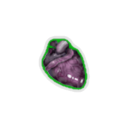 | Emerald Heart Blessing | Special |  | Start each combat with #b1 #yDexterity. | The heart is everything. |
|  | Enchiridion | Special |  | At the start of each combat, add a random #yPower card into your hand. It costs #b0 for that turn. | The legendary journal of an ancient lich. |
|  | Extra Cursed Bell | Special |  | Upon pickup, obtain #b2 of a unique #rCurse and #b3 relics. | You think you hear it echoing, but can never confirm it. |
|  | Extra Cursed Key | Special |  | Gain [E] at the start of your turn. NL Whenever you open a non-Boss chest, obtain #b2 #rCurses. | Locked away for good reason. |
|  | Face Of Cleric | Special |  | At the end of combat, raise your Max HP by #b1. | Everyone loves Cleric. |
|  | Golden Idol | Special |  | Enemies drop #b25% more #yGold. | Made of solid gold, you feel richer just holding it. |
|  | Greed Ooze | Special | Slimebound | At the start of combat, spawn #yGreed #yOoze (can be revived if #yAbsorbed). NL At Rest Sites, #yGreed #yOoze will take #b50 of your souls, increasing its damage by #b1. | A friend found in the Spire who devours souls. |
|  | Gremlin Sack | Special |  | Upon pickup, add #b6 cards to your deck from the Match Game. | The Gremlin and his bodyguard were no match for you. |
|  | Gremlin Visage | Special |  | Start each combat with #b1 #yWeak. | Time to run. |
|  | Inner Strength | Special | The_champ_gray | Start each combat with #b1 #yStrength. | It's about the gigantic sword in your heart. |
|  | Knowing Skull | Special |  | At the start of each combat, you may wish for Souls, Success, or a Pick me Up. | Put me down! |
|  | Mark of the Bloom | Special |  | You can no longer heal. | In the Beyond, thoughts and reality are one. |
|  | Mutagenic Strength | Special |  | Start each combat with #b3 #yStrength. At the end of your first turn, lose #b3 #yStrength. | "The results seem fleeting, triggering when the subject is in danger." - Unknown |
|  | Mystical Octahedron | Special | Snecko_cyan | Upon pickup, choose a card that selects a random number for its effects. This card always selects its maximum possible number. | It appears weighted toward one side. |
|  | N'loth's Gift | Special |  | Triple the chance of finding #yRare cards from combat rewards. | The strange gift from N'loth. Whenever you try and unwrap it, another wrapped box of the same size lies within. |
|  | N'loth's Hungry Face | Special |  | The next non-Boss chest you open is empty. | You feel hungry. |
|  | Necronomicon | Special |  | The first #yAttack played each turn that costs #b2 or more is played twice. Upon pickup, obtain a special #rCurse. | Only a fool would try and harness this evil power. At night your dreams are haunted by images of the book devouring your mind. |
| 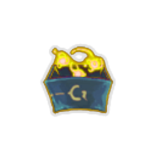 | Neow's Blessing | Special |  | Upon pickup, increase your Maximum HP by #b100. NL Increase your Maximum HP by #b100 at the start of each Act. NL Lose all your Potion slots. NL Draw #b1 less card and lose [E] at the start of your turn. | Ease your rage. Be as tough and unyielding as the Spire itself. |
|  | Neow's Lament | Special |  | Enemies in your first #b3 combats will have #b1 HP. | The blessing of lamentation bestowed by Neow. |
|  | New Challenger | Special |  | Start each combat in a random Champ #yStance. | Can you take the crown? |
|  | Nilry's Codex | Special |  | At the end of your turn, you may shuffle #b1 of #b3 random cards into your draw pile. | Crafted by the infamous game master himself. Said to expand one's mind. |
|  | Odd Mushroom | Special |  | When #yVulnerable, take #b25% more attack damage rather than #b50%. | "After consuming trichella parastius I felt larger and less... susceptible." - Ranwid |
|  | Paradox Artifact | Special |  | At the start of each turn, add a random card with #yEncode to your hand and give it #yEthereal. | You've never seen a coding frenzy like this before. |
|  | Quantum Chamber | Special | Guardian | Upon pickup, choose a card. Start each combat with this card removed from your deck. At the start of your #b4th turn, return it and #b2 copies of it to your hand. | You get the chicken by hatching the egg, not by smashing it. |
|  | Red Mask | Special |  | At the start of each combat, apply #b1 #yWeak to ALL enemies. | This very stylish looking mask belongs to the leader of the Red Mask Bandits. Technically that makes you the leader now? |
| 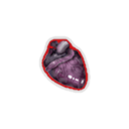 | Ruby Heart Blessing | Special |  | Start each combat with #b1 #yStrength. | The heart is strong. |
|  | Sapphire Heart Blessing | Special |  | Upon pickup, raise your Max HP by #b10. | The heart is pleased. |
|  | Scrap Ooze | Special | Slimebound | At the start of combat, spawn #yScrap #yOoze (can be revived if #yAbsorbed). NL At Rest Sites, you can donate a card to the #yScrap #yOoze, modifying its damage: NL #b+1 damage for #gUncommons NL #b+2 damage for #yRares NL #b-1 damage for Commons NL #b-2 damage for #rCurses |  |
|  | Sharpened Fragment | Special |  | At the start of each turn, gain a #yCrystal #yShiv. | Once a broken statue - now a makeshift weapon. |
|  | Spirit Poop | Special |  | It's unpleasant. | The charred remains of your offering to the spirits. |
|  | Ssserpent Head | Special |  | Whenever you enter a #y? room, gain #b50 #yGold. | The most fulfilling of lives is that in which you can buy anything! |
|  | Teleport Stone | Special |  | You may skip any number of rooms the next time you move, but cannot move into a Boss Room. | Never leave home without it. |
| 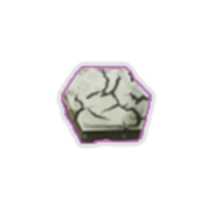 | The Broken Seal | Special | Hexa_ghost_purple | Upon pickup, raise your Max HP by #b10, then heal all of your HP. Start each combat with #b2 #yStrength, #b2 #yDexterity, and #b2 #yhexamod:Intensity. You can not receive #pThe #pBroken #pSeal again. | Unlimited, unrestrained, unquenchable power. |
| 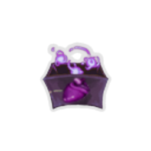 | The Heart's Malice | Special |  | Enemies in your first #b3 combats will flee in terror. | The malice of corruption bestowed by the Heart. |
|  | Warped Tongs | Special |  | At the start of your turn, #yUpgrade a random card in your hand for the rest of combat. | The cursed tongs emit a strong desire to return to where they were stolen from. |
|  | Wheel of Change | Special |  | At each Rest Site, you may spin the wheel once. Choosing to collect its reward uses up this relic. | No one gets two spins, he says. |
|  | Young Snecko | Special |  | Deals #b5 damage to a random enemy at the start of your turn. | Bewilderingly adorable. |
|  | Astrolabe | Boss |  | Upon pickup, #yTransform #b3 cards, then #yUpgrade them. | A tool to glean invaluable knowledge from the stars. |
|  | Black Blood | Boss | Red | Replaces #rBurning #rBlood. At the end of combat, heal #b12 HP. | The rage grows darker. |
|  | Black Heart of Goo | Boss | Slimebound | Replaces [#40c840ff]Heart[] [#40c840ff]of[] [#40c840ff]Goo[][#40c840ff].[] NL Whenever you #yslimeboundmod:Consume, heal #b3 HP, up to #b15 each combat. | The Secret of the Ooze. |
|  | Black Star | Boss |  | Elites drop an additional relic when defeated. | Originally discovered in the town of the serpent, beside a solitary candle. |
|  | Busted Crown | Boss |  | Gain [E] at the start of your turn. Future card rewards have #b2 less cards to choose from. | The Champ's crown... or a pale imitation? |
|  | Calling Bell | Boss |  | Upon pickup, obtain a unique #rCurse and #b3 relics. | This dark iron bell rang 3 times when you found it, but now stays silent. |
|  | Clasped Locket | Boss | Hermit_yellow | Replaces #yOld #yLocket. First time you draw a curse each turn, #yExhaust it and draw #b2 cards. Upon pickup, obtain #b2 #rInjuries. | It won't open anymore. |
|  | Coffee Dripper | Boss |  | Gain [E] at the start of your turn. You can no longer #yRest at Rest Sites. | "Yes, another cup please. Back to work. Back to work!" - The Architect |
|  | Cursed Key | Boss |  | Gain [E] at the start of your turn. Whenever you open a non-Boss chest, obtain a #rCurse. | You can feel the malicious energy emanating from the key. Power comes at a price. |
|  | Dented Plate | Boss | Hermit_yellow | While your HP is at or below #b50%, gain [E] and draw #b1 card at the start of your turn. | Several bullets are still lodged inside. |
|  | Ectoplasm | Boss |  | Gain [E] at the start of your turn. You can no longer gain #yGold. | This blob of slime and energy seems to pulse with life. |
| 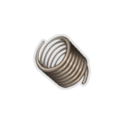 | Electromagnetic Coil | Boss | The_bronze_automaton | #yFunctions are now made up of #b4 cards. | An inefficient but entertaining power source. |
|  | Empty Cage | Boss |  | Upon pickup, remove #b2 cards from your deck. | "How unusual to cage that which you worship." - Ranwid |
|  | Frozen Core | Boss | Blue | Replaces #bCracked #bCore. If you end your turn with any empty Orb slots, #yChannel #b1 #yFrost. | The crack in your core has been filled with a pulsating cold energy. |
|  | Fusion Hammer | Boss |  | Gain [E] at the start of your turn. You can no longer #ySmith at Rest Sites. | Once wielded, the owner can never let go. |
|  | Gremlin Leader's Voucher | Boss | Gremlin | Gain [E] at the start of your turn. NL Upon pickup, #rpermanently #rlose #ra #rGremlin.Gain [E] at the start of your turn. NL Upon pickup, #rpermanently #rlose #ra #rGremlin. | IOU 1 Gremlin |
|  | Guardian Gear | Boss | Guardian | Replaces #rBronze #rGear. NL Begin each combat in #yguardianmod:Defensive_Mode, which persists for #b3 turns. | Replace every 3,000 floors. |
|  | Holy Water | Boss | Purple | Replaces #pPure #pWater. At the start of each combat, add #b3 #yMiracles into your hand. | Collected from a time before the Spire. |
|  | Hovering Kite | Boss | Green | The first time you discard a card each turn, gain [E] . | The Kite floats around you in battle, propelled by a mysterious force. |
|  | Idol of Retromation | Boss |  | At the start of your turn, reduce the cost of the most expensive card in your hand by #b1 for this turn. | Often called the Idol of Reto for short. |
|  | Inserter | Boss | Blue | Every #b2 turns, gain #b1 Orb slot. | Push. Pull. Stack. Repeat. |
|  | Lucky Horseshoe | Boss | Snecko_cyan | Upon pickup, choose #b1 of #b3 #yUnidentified #yCharacter cards. Add #b5 copies of it to your deck. All combats drop an additional card reward of the chosen character's cards. | Make your own luck. |
| 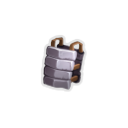 | Makeshift Battery | Boss |  | Gain [E] and add a #ySlimed into your discard pile at the start of your turn. | It's an 8.9 volt. |
|  | Mark of Pain | Boss | Red | Gain [R] at the start of your turn. At the start of combat, shuffle #b2 #rWounds into your draw pile. | This brand was used by the northern tribes to signify warriors who had mastered pain in battle. |
|  | Mark of the Ether | Boss | Hexa_ghost_purple | Replaces [#723e6dff]Spirit[] [#723e6dff]Brand[][#723e6dff].[] NL The first time you #yIgnite a Ghostflame each turn, gain [E] . | Let’s see if we can do... better. |
|  | Mob Leader's Crown | Boss | Gremlin | Replaces #rMob #rLeader's #rStaff. NL The first time you shuffle your draw pile each turn, gain [E] , draw #b1 card, and #ySwap to the next Gremlin. | The fancier the symbol of office, the more likely it is to be stolen. |
|  | Nuclear Battery | Boss | Blue | At the start of each combat, #yChannel #b1 #yPlasma. | Ooooh... |
|  | Pandora's Box | Boss |  | Upon pickup, #bTransform all Strike and Defend cards. | You have a bad feeling about opening this. |
|  | Philosopher's Stone | Boss |  | Gain [E] at the start of your turn. ALL enemies start combat with #b1 #yStrength. | Raw energy emanates from the stone, empowering all nearby. |
|  | Platinum Core | Boss | The_bronze_automaton | Replaces [#d6ca9eff]Bronze[] [#d6ca9eff]Core[][#d6ca9eff].[] NL The first #b3 #yFunctions you create each combat cost #b0 until played. | Changelog: Improved user experience. |
|  | Power Armor | Boss | The_champ_gray | Gain [E] at the start of your turn. NL Your maximum #yVigor and #ychamp:Counter is #b10. | Bought used. |
|  | Ring of the Serpent | Boss | Green | Replaces #gRing #gof #gthe #gSnake. At the start of your turn, draw #b1 additional card. | Your ring has morphed and changed forms. |
|  | Runic Cube | Boss | Red | Whenever you lose HP, draw #b1 card. | The runes are indecipherable. |
|  | Runic Dome | Boss |  | Gain [E] at the start of your turn. You can no longer see enemy intents. | The runes are indecipherable. |
|  | Runic Pyramid | Boss |  | At the end of your turn, you no longer discard your hand. | The runes are indecipherable. |
|  | Sacred Bark | Boss |  | Double the effectiveness of potions. | A bark rumored to originate from the World tree. |
|  | Short Stature | Boss | Gremlin | The first time a Gremlin would die each combat, heal it to #b75% of your Max HP instead. | It is easy to get away with mischief if you are literally beneath their notice. |
|  | Shotglass | Boss | Hermit_yellow | First #b2 times you use a potion each combat, gain a random potion. You can only use #b2 potions each combat. | Any liquid placed inside changes into something else. |
|  | Slaver's Collar | Boss |  | During Boss and Elite combats, gain [E] at the start of your turn. | Rusty miserable chains. |
|  | Snecko Eye | Boss |  | At the start of your turn, draw #b2 additional cards. Start each combat #yConfused. | An eye of a fallen snecko. Much larger than you imagined. |
|  | Sozu | Boss |  | Gain [E] at the start of your turn. You can no longer obtain potions. | You notice that magical liquids seem to lose their properties when near this relic. |
|  | Super Snecko Soul | Boss | Snecko_cyan | Replaces [#407b93ff]Snecko[] [#407b93ff]Soul[][#407b93ff].[] NL The first time you play an #ysneckomod:Offclass each turn, gain [E] . | 3120231321230320 |
|  | Tarr Blob | Boss | Slimebound | Gain [E] at the start of your turn. At the start of combat, lose #b1 Slime slot. | The bad kind of Slime. |
|  | Tiny Bowler Hat | Boss |  | At the start of combat, add a #yStudy #ythe #ySpire card to your hand. It costs 0. | Whosoever controls the hat, controls the Spire. |
|  | Tiny House | Boss |  | Upon pickup, obtain #b1 potion. NL Gain #b50 #yGold. NL Raise your Max HP by #b5. NL Obtain #b1 card. NL Upgrade #b1 random card. | "A near perfect implementation of miniaturization. My finest work to date, but still not adequate." - The Architect |
|  | Velvet Choker | Boss |  | Gain [E] at the start of your turn. You cannot play more than #b6 cards per turn. | "Immense power, but too limited." - Kublai the Great |
|  | Victorious Crown | Boss | The_champ_gray | Replaces #rChampion's #rCrown. NL Start each combat in #ychamp:Ultimate #yStance, which lasts for #b1 turn. | Conglaturation!! You are the greatest winner. |
|  | Violet Lotus | Boss | Purple | Whenever you exit #yCalm, gain an additional [E] . | The old texts describe that the surface of "mana pools" were littered with these flowers. |
|  | Wander Bots | Boss | Guardian | On pickup, lose #b2 Stasis slots. NL Gain [E] at the start of your turn. | These drones find the most wonderful salvage, but require processing power to maintain. |
|  | Wrist Blade | Boss | Green | #yAttacks that cost #b0 deal #b4 additional damage. | Handy for assassinations. |
|  | Xanatos' Icy Charm | Boss | Hexa_ghost_purple | Gain [E] at the start of your turn. #yhexamod:Soulburn takes #b4 turns to activate. | I feel... cold. |
|  | Barbell | Shop |  | Whenever you enter a Rest Site, if you have at least #b10 non-Upgraded cards in your deck, #yUpgrade one at random. | 1000 reps? Psh. I can do 1001. |
| 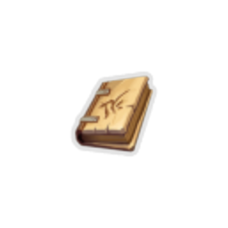 | Berserker's Guide | Shop | The_champ_gray | At the start of your turn, gain #b3 #yVigor. | The text is illegible. |
|  | Bottled Anomaly | Shop |  | Upon pickup, choose a card. At the start of each combat, remove it from your draw pile. At the start of turn #b3, add it into your hand. It costs #b0. | Swirling and swirling and finally breaking. |
|  | Bottled Black Hole | Shop | Guardian | Upon pickup, choose a card. Start each combat with this card in #yguardianmod:Stasis. | Somewhere, something incredible is waiting to be known. |
|  | Brimstone | Shop | Red | At the start of your turn, gain #b2 #yStrength and ALL enemies gain #b1 #yStrength. | Emanates an infernal heat. |
|  | Cauldron | Shop |  | Upon pickup, brews #b5 random potions. | The Merchant is actually a rather skilled potion brewer. Buy 4 get 1 free. |
|  | Chemical X | Shop |  | The effects of your cost #bX cards are increased by #b2. | WARNING: Do not combine with sugar, spice, and everything nice. |
|  | Clockwork Souvenir | Shop |  | Start each combat with #b1 #yArtifact. | "So many intricate gears." |
|  | Cryo Chamber | Shop | Guardian | Gain #b1 Stasis slot. Whenever a card enters #yguardianmod:Stasis, #yUpgrade it. | Things always seem better coming out than they did going in. |
|  | Dolly's Mirror | Shop |  | Upon pickup, obtain an additional copy of a card in your deck. | "I look funny in this." |
|  | Donu's Washers | Shop |  | At the start of combat, gain [E] [E] and add #b1 #yVoid into your draw pile. | It is rather clear why Donu collects these. |
|  | Frozen Eye | Shop |  | When viewing your #yDraw #yPile, the cards are now shown in order. | Staring into the eye, you see a glimpse of your future. |
|  | Hand Drill | Shop |  | Whenever you break an enemy's #yBlock, apply #b2 #yVulnerable. | "Spirals are dangerous." |
|  | Lee's Waffle | Shop |  | Upon pickup, raise your Max HP by #b7 and heal all of your HP. | "Tastiest treat you will find in all the Spire! Baked today just for you." |
|  | Medical Kit | Shop |  | #yUnplayable #yStatus cards can now be played. Whenever you play a #yStatus card, #yExhaust it. | "Has everything you need! Anti-itch, anti-burn, anti-venom, and more!" |
|  | Melange | Shop | Purple | Whenever you shuffle your draw pile, #yScry #b3. | Mysterious sands from an unknown origin. Smells of cinnamon. |
|  | Membership Card | Shop |  | #b50% discount on all products! | "Bonus membership offer for my most valuable customers!" |
|  | Olexa's Shield | Shop | Hexa_ghost_purple | Swap the positions of the #yBolstering #yGhostflame and the first #ySearing #yGhostflame. | Protection on-demand. |
|  | Orange Pellets | Shop |  | Whenever you play a #yPower, #yAttack, and #ySkill in the same turn, remove all of your debuffs. | "Made from various fungi found throughout the Spire, they will stave off any affliction." |
|  | Orrery | Shop |  | Upon pickup, choose and add #b5 cards to your deck. | "Once you understand the universe..." - Zoroth |
|  | Pet Ghost | Shop | Hermit_yellow | First time you would die each combat, survive with #b1 HP instead. | Poor guy. |
|  | Prismatic Shard | Shop |  | Combat reward screens now contain Colorless cards and cards from other colors. | Looking through the shard, you are able to see entirely new perspectives. |
|  | Protective Gear | Shop | Slimebound | Reduce the damage you take from #yslimeboundmod:Tackles by #b3. | The best defense is a good offense. |
|  | Rare Booster Box | Shop | Snecko_cyan | Upon pickup, obtain a #yUnidentified #yRare card of each card type. | Mint condition. |
|  | Recycler | Shop | Hexa_ghost_purple | The first time an non-Status and non-Curse #yEthereal card is #yExhausted each combat, add a copy to your hand that costs #b0 until played. | One day, it shall be recycled too. |
|  | Runic Capacitor | Shop | Blue | Start each combat with #b3 additional Orb slots. | More is better. |
|  | Sleeved Ace | Shop | Snecko_cyan | At the start of each combat, gain a #yPure #yLuck with #yRetain. | We're all aces. |
|  | Sling of Courage | Shop |  | Start each Elite combat with #b2 #yStrength. | "A handy tool for dealing with particularly tough opponents." |
| 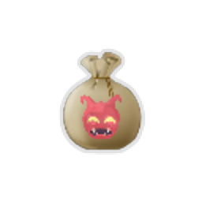 | Stolen Merchandise | Shop | Gremlin | Whenever you #ySwap, gain an #yEcho of a random Colorless card. NL At the start of combat, the Merchant gains #b2 Strength. | "Blasted, thieving Gremlins!". |
|  | Strange Spoon | Shop |  | Cards which #yExhaust when played will instead discard #b50% of the time. | Staring at the spoon, it appears to bend and twist around before your eyes. |
| 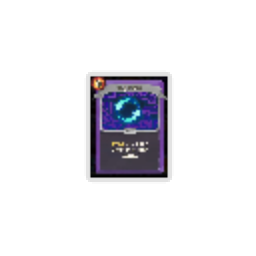 | Tag Teamwork | Shop | Gremlin | Whenever you draw #yTag #yTeam, draw another card. NL Upon pickup, add two copies of #yTag #yTeam to your deck. | Teamwork makes the dream work. |
|  | The Abacus | Shop |  | Whenever you shuffle your draw pile, gain #b6 #yBlock. | "One...Two...Three..." |
|  | Toolbox | Shop |  | At the start of each combat, choose #b1 of #b3 random Colorless cards and add the chosen card into your hand. | A tool for every job. |
|  | Twisted Funnel | Shop | Green | At the start of each combat, apply #b4 #yPoison to ALL enemies. | "I wouldn't drink out of it." |
