## Cards

| Name | Image | Upgraded image | Rarity | Type | Cost | Description |
| ---- | ----- | -------------- | ------ | ---- | ---- | ----------- |
| Bash |  |  | Basic | Attack | 2 | Deal 8 (10) damage. Apply 2 (3) Vulnerable. |
| Defend |  |  | Basic | Skill | 1 | Gain 5 (8) Block. |
| Strike |  |  | Basic | Attack | 1 | Deal 6 (9) damage. |
| Anger |  |  | Common | Attack | 0 | Deal 6 (8) damage. Add a copy of this card into your discard pile. |
| Armaments |  |  | Common | Skill | 1 | Gain 5 Block. Upgrade a (all) card(s) in your hand for the rest of combat. |
| Body Slam |  |  | Common | Attack | 1 (0) | Deal damage equal to your Block. |
| Clash |  |  | Common | Attack | 0 | Can only be played if every card in your hand is an Attack. Deal 14 (18) damage. |
| Cleave |  |  | Common | Attack | 1 | Deal 8 (11) damage to ALL enemies. |
| Clothesline |  |  | Common | Attack | 2 | Deal 12 (14) damage. Apply 2 (3) Weak. |
| Flex |  |  | Common | Skill | 0 | Gain 2 (4) Strength. At the end of this turn, lose 2 (4) Strength. |
| Havoc |  |  | Common | Skill | 1 (0) | Play the top card of your draw pile and Exhaust it. |
| Headbutt |  |  | Common | Attack | 1 | Deal 9 (12) damage. Put a card from your discard pile on top of your draw pile. |
| Heavy Blade |  |  | Common | Attack | 2 | Deal 14 damage. Strength affects this card 3 (5) times. |
| Iron Wave |  |  | Common | Attack | 1 | Gain 5 (7) Block. Deal 5 (7) damage. |
| Perfected Strike |  |  | Common | Attack | 2 | Deal 6 damage. Deals 2 (3) additional damage for ALL your cards containing "Strike". |
| Pommel Strike |  |  | Common | Attack | 1 | Deal 9 (10) damage. Draw 1 (2) card(s). |
| Shrug It Off |  |  | Common | Skill | 1 | Gain 8 (11) Block. Draw 1 card. |
| Sword Boomerang |  |  | Common | Attack | 1 | Deal 3 damage to a random enemy 3 (4) times. |
| Thunderclap |  |  | Common | Attack | 1 | Deal 4 (7) damage and apply 1 Vulnerable to ALL enemies. |
| True Grit |  |  | Common | Skill | 1 | Gain 7 (9) Block. Exhaust 1 card at random (not at random). |
| Twin Strike |  |  | Common | Attack | 1 | Deal 5 (7) damage twice. |
| Warcry |  |  | Common | Skill | 0 | Draw 1 (2) card(s). Put a card from your hand onto the top of your draw pile. Exhaust. |
| Wild Strike |  |  | Common | Attack | 1 | Deal 12 (17) damage. Shuffle a Wound into your draw pile. |
| Battle Trance |  |  | Uncommon | Skill | 0 | Draw 3 (4) cards. You cannot draw additional cards this turn. |
| Blood for Blood |  |  | Uncommon | Attack | 4 (3) | Costs 1 less [R] for each time you lose HP this combat. Deal 18 (22) damage. |
| Bloodletting |  |  | Uncommon | Skill | 0 | Lose 3 HP. Gain [R] [R] ([R]). |
| Burning Pact |  |  | Uncommon | Skill | 1 | Exhaust 1 card. Draw 2 (3) cards. |
| Carnage |  |  | Uncommon | Attack | 2 | Ethereal. Deal 20 (28) damage. |
| Combust |  |  | Uncommon | Power | 1 | At the end of your turn, lose 1 HP and deal 5 (7) damage to ALL enemies. |
| Dark Embrace |  |  | Uncommon | Power | 2 (1) | Whenever a card is Exhausted, draw 1 card. |
| Disarm |  |  | Uncommon | Skill | 1 | Enemy loses 2 (3) Strength. Exhaust. |
| Dropkick |  |  | Uncommon | Attack | 1 | Deal 5 (8) damage. If the enemy has Vulnerable, gain [R] and draw 1 card. |
| Dual Wield |  |  | Uncommon | Skill | 1 | Choose an Attack or Power card. Add a copy (2 copies) of that card into your hand. |
| Entrench |  |  | Uncommon | Skill | 2 (1) | Double your Block. |
| Evolve |  |  | Uncommon | Power | 1 | Whenever you draw a Status card, draw 1 (2) card(s). |
| Feel No Pain |  |  | Uncommon | Power | 1 | Whenever a card is Exhausted, gain 3 (4) Block. |
| Fire Breathing |  |  | Uncommon | Power | 1 | Whenever you draw a Status or Curse card, deal 6 (10) damage to ALL enemies. |
| Flame Barrier |  |  | Uncommon | Skill | 2 | Gain 12 (16) Block. Whenever you are attacked this turn, deal 4 (6) damage back. |
| Ghostly Armor |  |  | Uncommon | Skill | 1 | Ethereal. Gain 10 (13) Block. |
| Hemokinesis |  |  | Uncommon | Attack | 1 | Lose 2 HP. Deal 15 (20) damage. |
| Infernal Blade |  |  | Uncommon | Skill | 1 (0) | Add a random Attack into your hand. It costs 0 this turn. Exhaust. |
| Inflame |  |  | Uncommon | Power | 1 | Gain 2 (3) Strength. |
| Intimidate |  |  | Uncommon | Skill | 0 | Apply 1 (2) Weak to ALL enemies. Exhaust. |
| Metallicize |  |  | Uncommon | Power | 1 | At the end of your turn, gain 3 (4) Block. |
| Power Through |  |  | Uncommon | Skill | 1 | Add 2 Wounds into your hand. Gain 15 (20) Block. |
| Pummel |  |  | Uncommon | Attack | 1 | Deal 2 damage 4 (5) times. Exhaust. |
| Rage |  |  | Uncommon | Skill | 0 | Whenever you play an Attack this turn, gain 3 (5) Block. |
| Rampage |  |  | Uncommon | Attack | 1 | Deal 8 damage. Increase this card's damage by 5 (8) this combat. |
| Reckless Charge |  |  | Uncommon | Attack | 0 | Deal 7 (10) damage. Shuffle a Dazed into your draw pile. |
| Rupture |  |  | Uncommon | Power | 1 | Whenever you lose HP from a card, gain 1 (2) Strength. |
| Searing Blow |  |  | Uncommon | Attack | 2 | Deal 12 (16) damage. Can be Upgraded any number of times. |
| Second Wind |  |  | Uncommon | Skill | 1 | Exhaust all non-Attack cards in your hand. Gain 5 (7) Block for each card Exhausted. |
| Seeing Red |  |  | Uncommon | Skill | 1 (0) | Gain [R] [R]. Exhaust. |
| Sentinel |  |  | Uncommon | Skill | 1 | Gain 5 (8) Block. If this card is Exhausted, gain [R] [R] ([R]). |
| Sever Soul |  |  | Uncommon | Attack | 2 | Exhaust all non-Attack cards in your hand. Deal 16 (22) damage. |
| Shockwave |  |  | Uncommon | Skill | 2 | Apply 3 (5) Weak and Vulnerable to ALL enemies. Exhaust. |
| Spot Weakness |  |  | Uncommon | Skill | 1 | If the enemy intends to attack, gain 3 (4) Strength. |
| Uppercut |  |  | Uncommon | Attack | 2 | Deal 13 damage. Apply 1 (2) Weak. Apply 1 (2) Vulnerable. |
| Whirlwind |  |  | Uncommon | Attack | X | Deal 5 (8) damage to ALL enemies X times. |
| Barricade |  |  | Rare | Power | 3 (2) | Block is not removed at the start of your turn. |
| Berserk |  |  | Rare | Power | 0 | Gain 2 (1) Vulnerable. At the start of your turn, gain [R]. |
| Bludgeon |  |  | Rare | Attack | 3 | Deal 32 (42) damage. |
| Brutality |  |  | Rare | Power | 0 | (Innate.)  At the start of your turn, lose 1 HP and draw 1 card. |
| Corruption |  |  | Rare | Power | 3 (2) | Skills cost 0. Whenever you play a Skill, Exhaust it. |
| Demon Form |  |  | Rare | Power | 3 | At the start of your turn, gain 2 (3) Strength. |
| Double Tap |  |  | Rare | Skill | 1 | This turn, your next (2) Attack(s) is (are) played twice. |
| Exhume |  |  | Rare | Skill | 1 (0) | Put a card from your exhaust pile into your hand. Exhaust. |
| Feed |  |  | Rare | Attack | 1 | Deal 10 (12) damage. If Fatal, raise your Max HP by 3 (4). Exhaust. |
| Fiend Fire |  |  | Rare | Attack | 2 | Exhaust your hand. Deal 7 (10) damage for each card Exhausted. Exhaust. |
| Immolate |  |  | Rare | Attack | 2 | Deal 21 (28) damage to ALL enemies. Add a Burn into your discard pile. |
| Impervious |  |  | Rare | Skill | 2 | Gain 30 (40) Block. Exhaust. |
| Juggernaut |  |  | Rare | Power | 2 | Whenever you gain Block, deal 5 (7) damage to a random enemy. |
| Limit Break |  |  | Rare | Skill | 1 | Double your Strength. Exhaust. (not Exhaust.) |
| Offering |  |  | Rare | Skill | 0 | Lose 6 HP. Gain [R] [R]. Draw 3 (5) cards. Exhaust. |
| Reaper |  |  | Rare | Attack | 2 | Deal 4 (5) damage to ALL enemies. Heal HP equal to unblocked damage. Exhaust. |
| Defend | 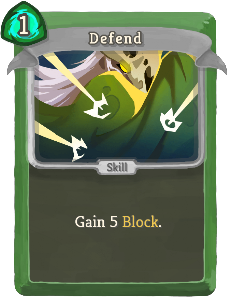 | 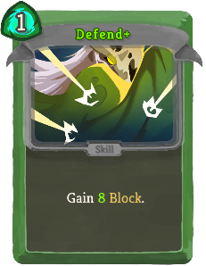 | Basic | Skill | 1 | Gain 5 (8) Block. |
| Neutralize | 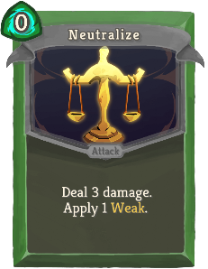 | 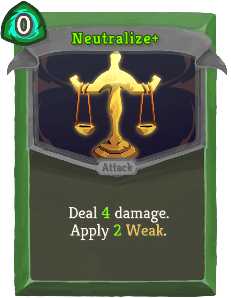 | Basic | Attack | 0 | Deal 3 (4) damage. Apply 1 (2) Weak. |
| Strike | 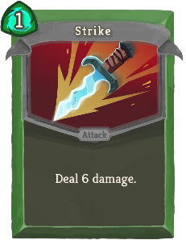 | 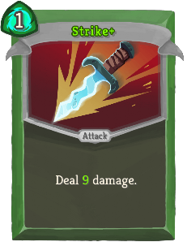 | Basic | Attack | 1 | Deal 6 (9) damage. |
| Survivor | 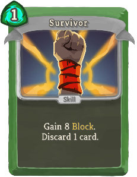 | 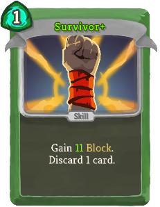 | Basic | Skill | 1 | Gain 8 (11) Block. Discard 1 card. |
| Acrobatics | 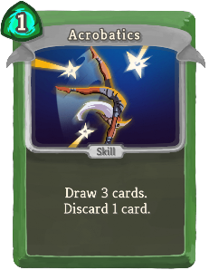 |  | Common | Skill | 1 | Draw 3 (4) cards. Discard 1 card. |
| Backflip | 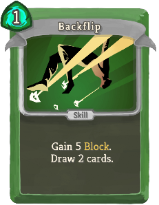 | 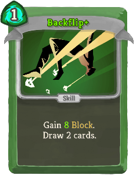 | Common | Skill | 1 | Gain 5 (8) Block. Draw 2 cards. |
| Bane | 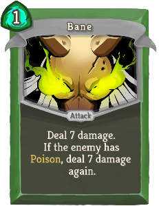 | 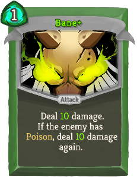 | Common | Attack | 1 | Deal 7 (10) damage. If the enemy has Poison, deal 7 (10) damage again. |
| Blade Dance | 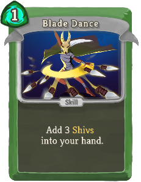 | 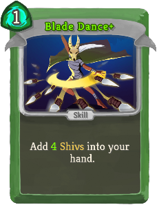 | Common | Skill | 1 | Add 3 (4) Shivs into your hand. |
| Cloak and Dagger | 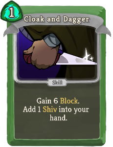 | 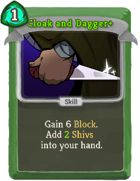 | Common | Skill | 1 | Gain 6 Block. Add 1 (2) Shiv(s) into your hand. |
| Dagger Spray |  | 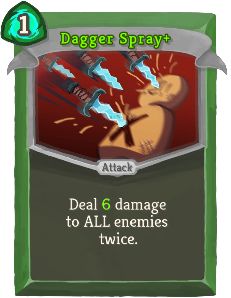 | Common | Attack | 1 | Deal 4 (6) damage to ALL enemies twice. |
| Dagger Throw | 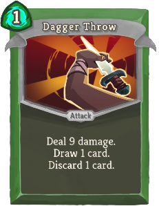 | 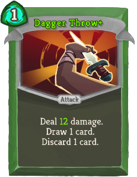 | Common | Attack | 1 | Deal 9 (12) damage. Draw 1 card. Discard 1 card. |
| Deadly Poison | 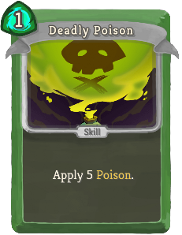 | 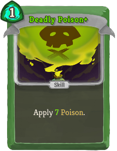 | Common | Skill | 1 | Apply 5 (7) Poison. |
| Deflect | 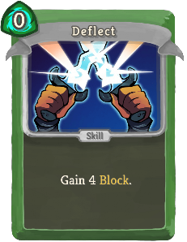 | 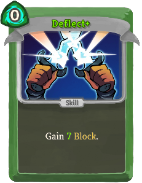 | Common | Skill | 0 | Gain 4 (7) Block. |
| Dodge and Roll | 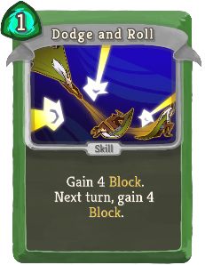 | 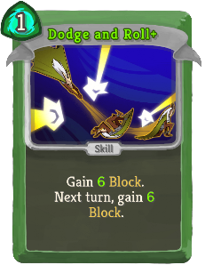 | Common | Skill | 1 | Gain 4 (6) Block. Next turn, gain 4 (6) Block. |
| Flying Knee | 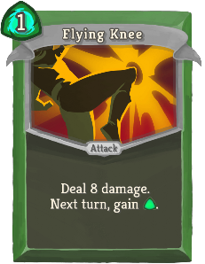 |  | Common | Attack | 1 | Deal 8 (11) damage. Next turn, gain [G]. |
| Outmaneuver | 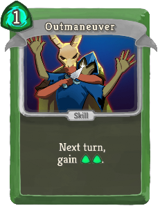 | 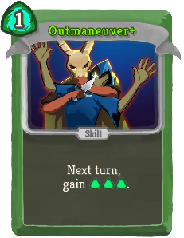 | Common | Skill | 1 | Next turn, gain [G] [G] ([G]). |
| Piercing Wail |  | 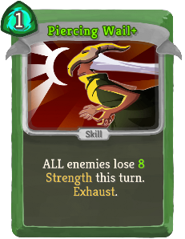 | Common | Skill | 1 | ALL enemies lose 6 (8) Strength this turn. Exhaust. |
| Poisoned Stab | 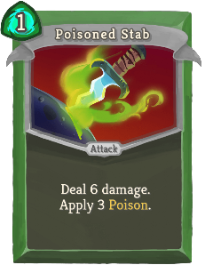 | 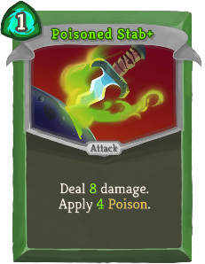 | Common | Attack | 1 | Deal 6 (8) damage. Apply 3 (4) Poison. |
| Prepared |  | 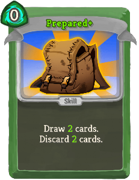 | Common | Skill | 0 | Draw 1 (2) card(s). Discard 1 (2) card(s). |
| Quick Slash | 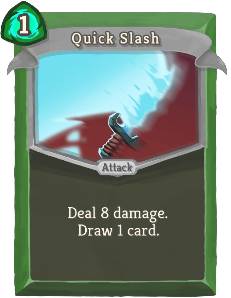 |  | Common | Attack | 1 | Deal 8 (12) damage. Draw 1 card. |
| Slice |  | 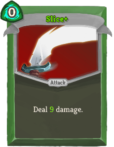 | Common | Attack | 0 | Deal 6 (9) damage. |
| Sneaky Strike | 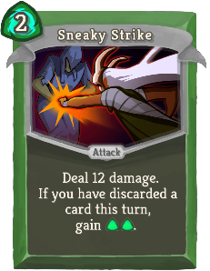 | 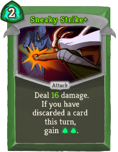 | Common | Attack | 2 | Deal 12 (16) damage. If you have discarded a card this turn, gain [G] [G]. |
| Sucker Punch | 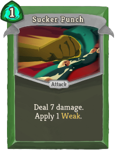 | 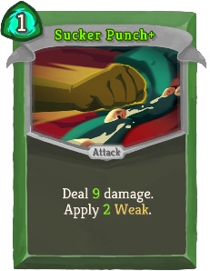 | Common | Attack | 1 | Deal 7 (9) damage. Apply 1 (2) Weak. |
| Accuracy | 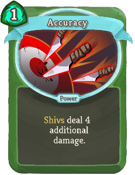 | 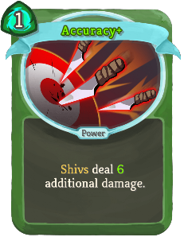 | Uncommon | Power | 1 | *Shivs deal 4 (6) additional damage. |
| All-Out Attack | 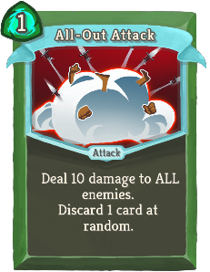 | 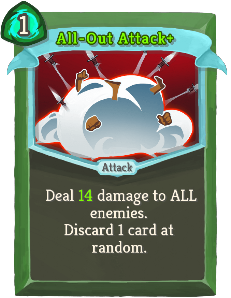 | Uncommon | Attack | 1 | Deal 10 (14) damage to ALL enemies. Discard 1 card at random. |
| Backstab | 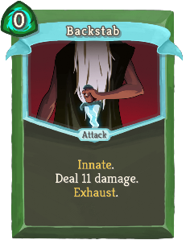 | 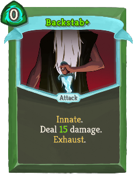 | Uncommon | Attack | 0 | Innate. Deal 11 (15) damage. Exhaust. |
| Blur | 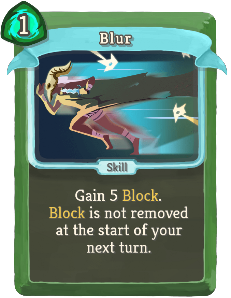 | 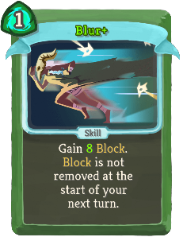 | Uncommon | Skill | 1 | Gain 5 (8) Block. Block is not removed at the start of your next turn. |
| Bouncing Flask | 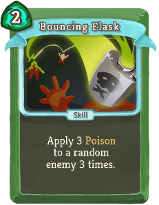 | 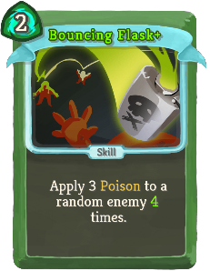 | Uncommon | Skill | 2 | Apply 3 Poison to a random enemy 3 (4) times. |
| Calculated Gamble | 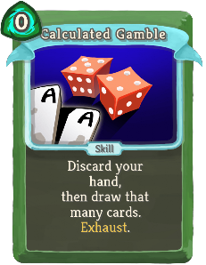 |  | Uncommon | Skill | 0 | Discard your hand, then draw that many cards. Exhaust. (not Exhaust.) |
| Caltrops |  |  | Uncommon | Power | 1 | Whenever you are attacked, deal 3 (5) damage back. |
| Catalyst |  |  | Uncommon | Skill | 1 | Double (Triple) the enemy's Poison. Exhaust. |
| Choke |  |  | Uncommon | Attack | 2 | Deal 12 damage. Whenever you play a card this turn, the enemy loses 3 (5) HP. |
| Concentrate |  |  | Uncommon | Skill | 0 | Discard 3 (2) cards. Gain [G] [G]. |
| Crippling Cloud |  |  | Uncommon | Skill | 2 | Apply 4 (7) Poison and 2 Weak to ALL enemies. Exhaust. |
| Dash |  |  | Uncommon | Attack | 2 | Gain 10 (13) Block. Deal 10 (13) damage. |
| Distraction |  |  | Uncommon | Skill | 1 (0) | Add a random Skill into your hand. It costs 0 this turn. Exhaust. |
| Endless Agony |  |  | Uncommon | Attack | 0 | Deal 4 (6) damage. Whenever you draw this card, add a copy of it into your hand. Exhaust. |
| Escape Plan |  |  | Uncommon | Skill | 0 | Draw 1 card. If you draw a Skill, gain 3 (5) Block. |
| Eviscerate |  |  | Uncommon | Attack | 3 | Costs 1 less [G] for each card discarded this turn. Deal 7 (9) damage 3 times. |
| Expertise |  |  | Uncommon | Skill | 1 | Draw cards until you have 6 (7) in your hand. |
| Finisher |  |  | Uncommon | Attack | 1 | Deal 6 (8) damage for each Attack played this turn. |
| Flechettes |  |  | Uncommon | Attack | 1 | Deal 4 (6) damage for each Skill in your hand. |
| Footwork |  |  | Uncommon | Power | 1 | Gain 2 (3) Dexterity. |
| Heel Hook |  |  | Uncommon | Attack | 1 | Deal 5 (8) damage. If the enemy has Weak, gain [G] and draw 1 card. |
| Infinite Blades |  |  | Uncommon | Power | 1 | (Innate.)  At the start of your turn, add a Shiv into your hand. |
| Leg Sweep |  |  | Uncommon | Skill | 2 | Apply 2 (3) Weak. Gain 11 (14) Block. |
| Masterful Stab |  |  | Uncommon | Attack | 0 | Costs 1 additional [G] for each time you lose HP this combat. Deal 12 (16) damage. |
| Noxious Fumes |  |  | Uncommon | Power | 1 | At the start of your turn, apply 2 (3) Poison to ALL enemies. |
| Predator |  |  | Uncommon | Attack | 2 | Deal 15 (20) damage. Next turn, draw 2 additional cards. |
| Reflex |  |  | Uncommon | Skill |  | Unplayable. If this card is discarded from your hand, draw 2 (3) cards. |
| Riddle with Holes |  |  | Uncommon | Attack | 2 | Deal 3 (4) damage 5 times. |
| Setup |  |  | Uncommon | Skill | 1 (0) | Put a card from your hand on top of your draw pile. It costs 0 until played. |
| Skewer |  |  | Uncommon | Attack | X | Deal 7 (10) damage X times. |
| Tactician |  |  | Uncommon | Skill |  | Unplayable. If this card is discarded from your hand, gain [G] ([G]). |
| Terror |  |  | Uncommon | Skill | 1 (0) | Apply 99 Vulnerable. Exhaust. |
| Well-Laid Plans |  |  | Uncommon | Power | 1 | At the end of your turn, Retain up to 1 (2) card(s). |
| A Thousand Cuts |  |  | Rare | Power | 2 | Whenever you play a card, deal 1 (2) damage to ALL enemies. |
| Adrenaline |  |  | Rare | Skill | 0 | Gain [G] ([G]). Draw 2 cards. Exhaust. |
| After Image |  |  | Rare | Power | 1 | (Innate.)  Whenever you play a card, gain 1 Block. |
| Alchemize |  |  | Rare | Skill | 1 (0) | Obtain a random potion. Exhaust. |
| Bullet Time |  |  | Rare | Skill | 3 (2) | You cannot draw additional cards this turn. Reduce the cost of all cards in your hand to 0 this turn. |
| Burst |  |  | Rare | Skill | 1 | This turn, your next (2) Skill(s) is (are) played twice. |
| Corpse Explosion |  |  | Rare | Skill | 2 | Apply 6 (9) Poison. When the enemy dies, deal damage equal to its Max HP to ALL enemies. |
| Die Die Die |  |  | Rare | Attack | 1 | Deal 13 (17) damage to ALL enemies. Exhaust. |
| Doppelganger |  |  | Rare | Skill | X | Next turn, draw X (X+1) cards and gain X (X+1) [G]. Exhaust. |
| Envenom |  |  | Rare | Power | 2 (1) | Whenever an Attack deals unblocked damage, apply 1 Poison. |
| Glass Knife |  |  | Rare | Attack | 1 | Deal 8 (12) damage twice. Decrease the damage of this card by 2 this combat. |
| Grand Finale |  |  | Rare | Attack | 0 | Can only be played if there are no cards in your draw pile. Deal 50 (60) damage to ALL enemies. |
| Malaise |  |  | Rare | Skill | X | Enemy loses X (X+1) Strength. Apply X (X+1) Weak. Exhaust. |
| Nightmare |  |  | Rare | Skill | 3 (2) | Choose a card. Next turn, add 3 copies of that card into your hand. Exhaust. |
| Phantasmal Killer |  |  | Rare | Skill | 1 (0) | Next turn, your Attacks deal double damage. |
| Storm of Steel |  |  | Rare | Skill | 1 | Discard your hand. Add 1 Shiv (*Shiv+) into your hand for each card discarded. |
| Tools of the Trade |  |  | Rare | Power | 1 (0) | At the start of your turn, draw 1 card and discard 1 card. |
| Unload |  |  | Rare | Attack | 1 | Deal 14 (18) damage. Discard all non-Attack cards in your hand. |
| Wraith Form |  |  | Rare | Power | 3 | Gain 2 (3) Intangible. At the end of your turn, lose 1 Dexterity. |
| Defend |  |  | Basic | Skill | 1 | Gain 5 (8) Block. |
| Dualcast |  |  | Basic | Skill | 1 (0) | Evoke your next Orb twice. |
| Strike |  |  | Basic | Attack | 1 | Deal 6 (9) damage. |
| Zap |  |  | Basic | Skill | 1 (0) | Channel 1 Lightning. |
| Ball Lightning |  |  | Common | Attack | 1 | Deal 7 (10) damage. Channel 1 Lightning. |
| Barrage |  |  | Common | Attack | 1 | Deal 4 (6) damage for each Channeled Orb. |
| Beam Cell |  |  | Common | Attack | 0 | Deal 3 (4) damage. Apply 1 (2) Vulnerable. |
| Charge Battery |  |  | Common | Skill | 1 | Gain 7 (10) Block. Next turn, gain [B]. |
| Claw |  |  | Common | Attack | 0 | Deal 3 (5) damage. Increase the damage of ALL Claw cards by 2 this combat. |
| Cold Snap |  |  | Common | Attack | 1 | Deal 6 (9) damage. Channel 1 Frost. |
| Compile Driver |  |  | Common | Attack | 1 | Deal 7 (10) damage. Draw 1 card for each unique Orb you have. |
| Coolheaded |  |  | Common | Skill | 1 | Channel 1 Frost. Draw 1 (2) card(s). |
| Go for the Eyes |  |  | Common | Attack | 0 | Deal 3 (4) damage. If the enemy intends to attack, apply 1 (2) Weak. |
| Hologram |  |  | Common | Skill | 1 | Gain 3 (5) Block. Put a card from your discard pile into your hand. Exhaust. (not Exhaust.) |
| Leap |  |  | Common | Skill | 1 | Gain 9 (12) Block. |
| Rebound |  |  | Common | Attack | 1 | Deal 9 (12) damage. Put the next card you play this turn on top of your draw pile. |
| Recursion |  |  | Common | Skill | 1 (0) | Evoke your next Orb. Channel the Orb that was just Evoked. |
| Stack |  |  | Common | Skill | 1 | Gain Block equal to the number of cards in your discard pile (+3). |
| Steam Barrier |  |  | Common | Skill | 0 | Gain 6 (8) Block. Decrease this card's Block by 1 this combat. |
| Streamline |  |  | Common | Attack | 2 | Deal 15 (20) damage. Reduce this card's cost by 1 this combat. |
| Sweeping Beam |  |  | Common | Attack | 1 | Deal 6 (9) damage to ALL enemies. Draw 1 card. |
| TURBO |  |  | Common | Skill | 0 | Gain [B] [B] ([B]). Add a Void into your discard pile. |
| Aggregate |  |  | Uncommon | Skill | 1 | Gain [B] for every 4 (3) cards in your draw pile. |
| Auto-Shields |  |  | Uncommon | Skill | 1 | If you have no Block, gain 11 (15) Block. |
| Blizzard |  |  | Uncommon | Attack | 1 | Deal damage equal to 2 (3) times the number of Frost Channeled this combat to ALL enemies. |
| Boot Sequence |  |  | Uncommon | Skill | 0 | Innate. Gain 10 (13) Block. Exhaust. |
| Bullseye |  |  | Uncommon | Attack | 1 | Deal 8 (11) damage. Apply 2 (3) Lock-On. |
| Capacitor |  |  | Uncommon | Power | 1 | Gain 2 (3) Orb slots. |
| Chaos |  |  | Uncommon | Skill | 1 | Channel 1 (2) random Orb(s). |
| Chill |  |  | Uncommon | Skill | 0 | (Innate.)  Channel 1 Frost for each enemy in combat. Exhaust. |
| Consume |  |  | Uncommon | Skill | 2 | Gain 2 (3) Focus. Lose 1 Orb slot. |
| Darkness |  |  | Uncommon | Skill | 1 | Channel 1 Dark.  (Trigger the passive ability of all Dark orbs.) |
| Defragment |  |  | Uncommon | Power | 1 | Gain 1 (2) Focus. |
| Doom and Gloom |  |  | Uncommon | Attack | 2 | Deal 10 (14) damage to ALL enemies. Channel 1 Dark. |
| Double Energy |  |  | Uncommon | Skill | 1 (0) | Double your Energy. Exhaust. |
| Equilibrium |  |  | Uncommon | Skill | 2 | Gain 13 (16) Block. Retain your hand this turn. |
| FTL |  |  | Uncommon | Attack | 0 | Deal 5 (6) damage. If you have played less than 3 (4) cards this turn, draw 1 card. |
| Force Field |  |  | Uncommon | Skill | 4 | Costs 1 less [B] for each Power card played this combat. Gain 12 (16) Block. |
| Fusion |  |  | Uncommon | Skill | 2 (1) | Channel 1 Plasma. |
| Genetic Algorithm |  |  | Uncommon | Skill | 1 | Gain 1 Block. Permanently increase this card's Block by 2 (3). Exhaust. |
| Glacier |  |  | Uncommon | Skill | 2 | Gain 7 (10) Block. Channel 2 Frost. |
| Heatsinks |  |  | Uncommon | Power | 1 | Whenever you play a Power card, draw 1 (2) card(s). |
| Hello World |  |  | Uncommon | Power | 1 | (Innate.)  At the start of your turn, add a random Common card into your hand. |
| Loop |  |  | Uncommon | Power | 1 | At the start of your turn, trigger the passive ability of your next Orb (2 times). |
| Melter |  |  | Uncommon | Attack | 1 | Remove all Block from the enemy. Deal 10 (14) damage. |
| Overclock |  |  | Uncommon | Skill | 0 | Draw 2 (3) cards. Add a Burn into your discard pile. |
| Recycle |  |  | Uncommon | Skill | 1 (0) | Exhaust a card. Gain [B] equal to its cost. |
| Reinforced Body |  |  | Uncommon | Skill | X | Gain 7 (9) Block X times. |
| Reprogram |  |  | Uncommon | Skill | 1 | Lose 1 (2) Focus. Gain 1 (2) Strength. Gain 1 (2) Dexterity. |
| Rip and Tear |  |  | Uncommon | Attack | 1 | Deal 7 (9) damage to a random enemy twice. |
| Scrape |  |  | Uncommon | Attack | 1 | Deal 7 (10) damage. Draw 4 (5) cards. Discard all cards drawn this way that do not cost 0. |
| Self Repair |  |  | Uncommon | Power | 1 | At the end of combat, heal 7 (10) HP. |
| Skim |  |  | Uncommon | Skill | 1 | Draw 3 (4) cards. |
| Static Discharge |  |  | Uncommon | Power | 1 | Whenever you receive unblocked attack damage, Channel 1 (2) Lightning. |
| Storm |  |  | Uncommon | Power | 1 | (Innate.)  Whenever you play a Power card, Channel 1 Lightning. |
| Sunder |  |  | Uncommon | Attack | 3 | Deal 24 (32) damage. If this kills an enemy, gain [B] [B] [B]. |
| Tempest |  |  | Uncommon | Skill | X | Channel X (X+1) Lightning. Exhaust. |
| White Noise |  |  | Uncommon | Skill | 1 (0) | Add a random Power card into your hand. It costs 0 this turn. Exhaust. |
| All for One |  |  | Rare | Attack | 2 | Deal 10 (14) damage. Put all cost 0 cards from your discard pile into your hand. |
| Amplify |  |  | Rare | Skill | 1 | This turn, your next (2) Power card(s) is (are) played twice. |
| Biased Cognition |  |  | Rare | Power | 1 | Gain 4 (5) Focus. At the start of your turn, lose 1 Focus. |
| Buffer |  |  | Rare | Power | 2 | Prevent the next (2) time(s) you would lose HP. |
| Core Surge |  |  | Rare | Attack | 1 | Deal 11 (15) damage. Gain 1 Artifact. Exhaust. |
| Creative AI |  |  | Rare | Power | 3 (2) | At the start of your turn, add a random Power card into your hand. |
| Echo Form |  |  | Rare | Power | 3 | Ethereal. (not Ethereal.) The first card you play each turn is played twice. |
| Electrodynamics |  |  | Rare | Power | 2 | Lightning now hits ALL enemies. Channel 2 (3) Lightning. |
| Fission |  |  | Rare | Skill | 0 | Remove (Evoke) all your Orbs. Gain [B] and draw 1 card for each Orb removed (Evoked). Exhaust. |
| Hyperbeam |  |  | Rare | Attack | 2 | Deal 26 (34) damage to ALL enemies. Lose 3 Focus. |
| Machine Learning |  |  | Rare | Power | 1 | (Innate.)  At the start of your turn, draw 1 additional card. |
| Meteor Strike |  |  | Rare | Attack | 5 | Deal 24 (30) damage. Channel 3 Plasma. |
| Multi-Cast |  |  | Rare | Skill | X | Evoke your next Orb X (X+1) times. |
| Rainbow |  |  | Rare | Skill | 2 | Channel 1 Lightning. Channel 1 Frost. Channel 1 Dark. Exhaust. (not Exhaust.) |
| Reboot |  |  | Rare | Skill | 0 | Shuffle ALL your cards into your draw pile. Draw 4 (6) cards. Exhaust. |
| Seek |  |  | Rare | Skill | 0 | Put 1 (2) card(s) from your draw pile into your hand. Exhaust. |
| Thunder Strike |  |  | Rare | Attack | 3 | Deal 7 (9) damage to a random enemy for each Lightning Channeled this combat. |
| Defend |  |  | Basic | Skill | 1 | Gain 5 (8) Block. |
| Eruption |  |  | Basic | Attack | 2 (1) | Deal 9 damage. Enter Wrath. |
| Strike |  |  | Basic | Attack | 1 | Deal 6 (9) damage. |
| Vigilance |  |  | Basic | Skill | 2 | Gain 8 (12) Block. Enter Calm. |
| Bowling Bash |  |  | Common | Attack | 1 | Deal 7 (10) damage for each enemy in combat. |
| Consecrate |  |  | Common | Attack | 0 | Deal 5 (8) damage to ALL enemies. |
| Crescendo |  |  | Common | Skill | 1 (0) | Retain. Enter Wrath. Exhaust. |
| Crush Joints |  |  | Common | Attack | 1 | Deal 8 (10) damage. If the last card played this combat was a Skill, apply 1 (2) Vulnerable. |
| Cut Through Fate |  |  | Common | Attack | 1 | Deal 7 (9) damage. Scry 2 (3). Draw 1 card. |
| Empty Body |  |  | Common | Skill | 1 | Gain 7 (10) Block. Exit your Stance. |
| Empty Fist |  |  | Common | Attack | 1 | Deal 9 (14) damage. Exit your Stance. |
| Evaluate |  |  | Common | Skill | 1 | Gain 6 (10) Block. Shuffle an Insight into your draw pile. |
| Flurry of Blows |  |  | Common | Attack | 0 | Deal 4 (6) damage. Whenever you change Stances, return this from the discard pile to your hand. |
| Flying Sleeves |  |  | Common | Attack | 1 | Retain. Deal 4 (6) damage twice. |
| Follow-Up |  |  | Common | Attack | 1 | Deal 7 (11) damage. If the last card played this combat was an Attack, gain [W]. |
| Halt |  |  | Common | Skill | 0 | Gain 3 (4) Block. If you are in Wrath, gain 9 (14) additional Block. |
| Just Lucky |  |  | Common | Attack | 0 | Scry 1 (2). Gain 2 (3) Block. Deal 3 (4) damage. |
| Pressure Points |  |  | Common | Skill | 1 | Apply 8 (11) Mark. ALL enemies lose HP equal to their Mark. |
| Prostrate |  |  | Common | Skill | 0 | Gain 2 (3) Mantra. Gain 4 Block. |
| Protect |  |  | Common | Skill | 2 | Retain. Gain 12 (16) Block. |
| Sash Whip |  |  | Common | Attack | 1 | Deal 8 (10) damage. If the last card played this combat was an Attack, apply 1 (2) Weak. |
| Third Eye |  |  | Common | Skill | 1 | Gain 7 (9) Block. Scry 3 (5). |
| Tranquility |  |  | Common | Skill | 1 (0) | Retain. Enter Calm. Exhaust. |
| Battle Hymn |  |  | Uncommon | Power | 1 | (Innate.)  At the start of each turn, add a Smite into your hand. |
| Carve Reality |  |  | Uncommon | Attack | 1 | Deal 6 (10) damage. Add a Smite into your hand. |
| Collect |  |  | Uncommon | Skill | X | Put a Miracle+ into your hand at the start of your next X (X+1) turns. Exhaust. |
| Conclude |  |  | Uncommon | Attack | 1 | Deal 12 (16) damage to ALL enemies. End your turn. |
| Deceive Reality |  |  | Uncommon | Skill | 1 | Gain 4 (7) Block. Add a Safety into your hand. |
| Empty Mind |  |  | Uncommon | Skill | 1 | Draw 2 (3) cards. Exit your Stance. |
| Fasting |  |  | Uncommon | Power | 2 | Gain 3 (4) Strength. Gain 3 (4) Dexterity. Gain 1 less [W] at the start of each turn. |
| Fear No Evil |  |  | Uncommon | Attack | 1 | Deal 8 (11) damage. If the enemy intends to Attack, enter Calm. |
| Foreign Influence |  |  | Uncommon | Skill | 0 | Choose 1 of 3 Attacks of any color to add into your hand. (It costs 0 this turn.)  Exhaust. |
| Foresight |  |  | Uncommon | Power | 1 | At the start of your turn, Scry 3 (4). |
| Indignation |  |  | Uncommon | Skill | 1 | If you are in Wrath, apply 3 (5) Vulnerable to ALL enemies, otherwise enter Wrath. |
| Inner Peace |  |  | Uncommon | Skill | 1 | If you are in Calm, draw 3 (4) cards, otherwise enter Calm. |
| Like Water |  |  | Uncommon | Power | 1 | At the end of your turn, if you are in Calm, gain 5 (7) Block. |
| Meditate |  |  | Uncommon | Skill | 1 | Put a (2) card(s) from your discard pile into your hand and Retain it (them). Enter Calm. End your turn. |
| Mental Fortress |  |  | Uncommon | Power | 1 | Whenever you change Stances, gain 4 (6) Block. |
| Nirvana |  |  | Uncommon | Power | 1 | Whenever you Scry, gain 3 (4) Block. |
| Perseverance |  |  | Uncommon | Skill | 1 | Retain. Gain 5 (7) Block. When Retained, increase its Block by 2 (3) this combat. |
| Pray |  |  | Uncommon | Skill | 1 | Gain 3 (4) Mantra. Shuffle an Insight into your draw pile. |
| Reach Heaven |  |  | Uncommon | Attack | 2 | Deal 10 (15) damage. Shuffle a Through Violence into your draw pile. |
| Rushdown |  |  | Uncommon | Power | 1 (0) | Whenever you enter Wrath, draw 2 cards. |
| Sanctity |  |  | Uncommon | Skill | 1 | Gain 6 (9) Block. If the last card played this combat was a Skill, draw 2 cards. |
| Sands of Time |  |  | Uncommon | Attack | 4 | Retain. Deal 20 (26) damage. When Retained, lower its cost by 1 this combat. |
| Signature Move |  |  | Uncommon | Attack | 2 | Can only be played if this is the only Attack in your hand. Deal 30 (40) damage. |
| Simmering Fury |  |  | Uncommon | Skill | 1 | At the start of your next turn, enter Wrath and draw 2 (3) cards. |
| Study |  |  | Uncommon | Power | 2 (1) | At the end of your turn, shuffle an Insight into your draw pile. |
| Swivel |  |  | Uncommon | Skill | 2 | Gain 8 (11) Block. The next Attack you play costs 0. |
| Talk to the Hand |  |  | Uncommon | Attack | 1 | Deal 5 (7) damage. Whenever you attack this enemy, gain 2 (3) Block. Exhaust. |
| Tantrum |  |  | Uncommon | Attack | 1 | Deal 3 damage 3 (4) times. Enter Wrath. Shuffle this card into your draw pile. |
| Wallop |  |  | Uncommon | Attack | 2 | Deal 9 (12) damage. Gain Block equal to unblocked damage dealt. |
| Wave of the Hand |  |  | Uncommon | Skill | 1 | Whenever you gain Block this turn, apply 1 (2) Weak to ALL enemies. |
| Weave |  |  | Uncommon | Attack | 0 | Deal 4 (6) damage. Whenever you Scry, return this from the discard pile to your Hand. |
| Wheel Kick |  |  | Uncommon | Attack | 2 | Deal 15 (20) damage. Draw 2 cards. |
| Windmill Strike |  |  | Uncommon | Attack | 2 | Retain. Deal 7 (10) damage. When Retained, increase its damage by 4 (5) this combat. |
| Worship |  |  | Uncommon | Skill | 2 | (Retain.)  Gain 5 Mantra. |
| Wreath of Flame |  |  | Uncommon | Skill | 1 | Your next Attack deals 5 (8) additional damage. |
| Alpha |  |  | Rare | Skill | 1 | (Innate.)  Shuffle a Beta into your draw pile. Exhaust. |
| Blasphemy |  |  | Rare | Skill | 1 | (Retain.)  Enter Divinity. Die next turn. Exhaust. |
| Brilliance |  |  | Rare | Attack | 1 | Deal 12 (16) damage. Deals additional damage equal to Mantra gained this combat. |
| Conjure Blade |  |  | Rare | Skill | X | Shuffle an Expunger (with X+1) into your draw pile. Exhaust. |
| Deus Ex Machina |  |  | Rare | Skill |  | Unplayable. When you draw this card, add 2 (3) Miracles to your hand and Exhaust. |
| Deva Form |  |  | Rare | Power | 3 | Ethereal. (not Ethereal.) At the start of your turn, gain [W] and increase this gain by 1. |
| Devotion |  |  | Rare | Power | 1 | At the start of your turn, gain 2 (3) Mantra. |
| Establishment |  |  | Rare | Power | 1 | (Innate.)  Whenever a card is Retained, reduce its cost by 1 this combat. |
| Judgment |  |  | Rare | Skill | 1 | If the enemy has 30 (40) or less HP, set their HP to 0. |
| Lesson Learned |  |  | Rare | Attack | 2 | Deal 10 (13) damage. If Fatal, Upgrade a random card in your deck. Exhaust. |
| Master Reality |  |  | Rare | Power | 1 (0) | Whenever a card is created during combat, Upgrade it. |
| Omniscience |  |  | Rare | Skill | 4 (3) | Choose a card in your draw pile. Play the chosen card twice and exhaust it. Exhaust. |
| Ragnarok |  |  | Rare | Attack | 3 | Deal 5 (6) damage to a random enemy 5 (6) times. |
| Scrawl |  |  | Rare | Skill | 1 (0) | Draw cards until your hand is full. Exhaust. |
| Spirit Shield |  |  | Rare | Skill | 2 | Gain 3 (4) Block for each card in your hand. |
| Vault |  |  | Rare | Skill | 3 (2) | Take an extra turn after this one. End your turn. Exhaust. |
| Wish |  |  | Rare | Skill | 3 | Choose one: Gain 6 (8) Plated Armor, 3 (4) Strength, or 25 (30) Gold. Exhaust. |
| Apparition |  |  | Special | Skill | 1 | Ethereal. (not Ethereal.) Gain 1 Intangible. Exhaust. |
| Become Almighty |  |  | Special | Power |  | Gain 3 (4) Strength. |
| Beta |  |  | Special | Skill | 2 (1) | Shuffle an Omega into your draw pile. Exhaust. |
| Bite |  |  | Special | Attack | 1 | Deal 7 (8) damage. Heal 2 (3) HP. |
| Expunger |  |  | Special | Attack | 1 | Deal 9 (15) damage X times. |
| Fame and Fortune |  |  | Special | Skill |  | Gain 25 (30) Gold. |
| Insight |  |  | Special | Skill | 0 | Retain. Draw 2 (3) cards. Exhaust. |
| J.A.X. |  |  | Special | Skill | 0 | Lose 3 HP. Gain 2 (3) Strength. |
| Live Forever |  |  | Special | Power |  | Gain 6 (8) Plated Armor. |
| Miracle |  |  | Special | Skill | 0 | Retain. Gain [W] ([W]). Exhaust. |
| Omega |  |  | Special | Power | 3 | At the end of your turn, deal 50 (60) damage to ALL enemies. |
| Ritual Dagger |  |  | Special | Attack | 1 | Deal 15 damage. If Fatal, permanently increase this card's damage by 3 (5). Exhaust. |
| Safety |  |  | Special | Skill | 1 | Retain. Gain 12 (16) Block. Exhaust. |
| Shiv |  |  | Special | Attack | 0 | Deal 4 (6) damage. Exhaust. |
| Smite |  |  | Special | Attack | 1 | Retain. Deal 12 (16) damage. Exhaust. |
| Through Violence |  |  | Special | Attack | 0 | Retain. Deal 20 (30) damage. Exhaust. |
| Burn |  |  | Common | Status |  | Unplayable. At the end of your turn, take 2 damage. |
| Dazed |  |  | Common | Status |  | Unplayable. Ethereal. |
| Slimed |  |  | Common | Status | 1 | Exhaust. |
| Void |  |  | Common | Status |  | Unplayable. Ethereal. Whenever this card is drawn, lose 1 Energy. |
| Wound |  |  | Common | Status |  | Unplayable. |
| Bandage Up |  |  | Uncommon | Skill | 0 | Heal 4 (6) HP. Exhaust. |
| Blind |  |  | Uncommon | Skill | 0 | Apply 2 Weak (to ALL enemies). |
| Dark Shackles |  |  | Uncommon | Skill | 0 | Enemy loses 9 (15) Strength this turn. Exhaust. |
| Deep Breath |  |  | Uncommon | Skill | 0 | Shuffle your discard pile into your draw pile. Draw 1 (2) card(s). |
| Discovery |  |  | Uncommon | Skill | 1 | Choose 1 of 3 random cards to add into your hand. It costs 0 this turn. Exhaust. (not Exhaust.) |
| Dramatic Entrance |  |  | Uncommon | Attack | 0 | Innate. Deal 8 (12) damage to ALL enemies. Exhaust. |
| Enlightenment |  |  | Uncommon | Skill | 0 | Reduce the cost of all cards in your hand to 1 this turn (combat). |
| Finesse |  |  | Uncommon | Skill | 0 | Gain 2 (4) Block. Draw 1 card. |
| Flash of Steel |  |  | Uncommon | Attack | 0 | Deal 3 (6) damage. Draw 1 card. |
| Forethought |  |  | Uncommon | Skill | 0 | Put a (any number of) card(s) from your hand to the bottom of your draw pile. It costs (They cost) 0 until played. |
| Good Instincts |  |  | Uncommon | Skill | 0 | Gain 6 (9) Block. |
| Impatience |  |  | Uncommon | Skill | 0 | If you have no Attacks in your hand, draw 2 (3) cards. |
| Jack of All Trades |  |  | Uncommon | Skill | 0 | Add 1 (2) random Colorless card(s) into your hand. Exhaust. |
| Madness |  |  | Uncommon | Skill | 1 (0) | Reduce the cost of a random card in your hand to 0 this combat. Exhaust. |
| Mind Blast |  |  | Uncommon | Attack | 2 (1) | Innate. Deal damage equal to the number of cards in your draw pile. |
| Panacea |  |  | Uncommon | Skill | 0 | Gain 1 (2) Artifact. Exhaust. |
| Panic Button |  |  | Uncommon | Skill | 0 | Gain 30 (40) Block. You cannot gain Block from cards for 2 turns. Exhaust. |
| Purity |  |  | Uncommon | Skill | 0 | Exhaust up to 3 (5) cards in your hand. Exhaust. |
| Swift Strike |  |  | Uncommon | Attack | 0 | Deal 7 (10) damage. |
| Trip |  |  | Uncommon | Skill | 0 | Apply 2 Vulnerable (to ALL enemies). |
| Apotheosis |  |  | Rare | Skill | 2 (1) | Upgrade ALL your cards for the rest of combat. Exhaust. |
| Chrysalis |  |  | Rare | Skill | 2 | Shuffle 3 (5) random Skills into your draw pile. They cost 0 this combat. Exhaust. |
| Hand of Greed |  |  | Rare | Attack | 2 | Deal 20 (25) damage. If Fatal, gain 20 (25) Gold. |
| Magnetism |  |  | Rare | Power | 2 (1) | At the start of your turn, add a random Colorless card into your hand. |
| Master of Strategy |  |  | Rare | Skill | 0 | Draw 3 (4) cards. Exhaust. |
| Mayhem |  |  | Rare | Power | 2 (1) | At the start of your turn, play the top card of your draw pile. |
| Metamorphosis |  |  | Rare | Skill | 2 | Shuffle 3 (5) random Attacks into your draw pile. They cost 0 this combat. Exhaust. |
| Panache |  |  | Rare | Power | 0 | Every time you play 5 cards in a single turn, deal 10 (14) damage to ALL enemies. |
| Sadistic Nature |  |  | Rare | Power | 0 | Whenever you apply a debuff to an enemy, they take 5 (7) damage. |
| Secret Technique |  |  | Rare | Skill | 0 | Put a Skill from your draw pile into your hand. Exhaust. (not Exhaust.) |
| Secret Weapon |  |  | Rare | Skill | 0 | Put an Attack from your draw pile into your hand. Exhaust. (not Exhaust.) |
| The Bomb |  |  | Rare | Skill | 2 | At the end of 3 turns, deal 40 (50) damage to ALL enemies. |
| Thinking Ahead |  |  | Rare | Skill | 0 | Draw 2 cards. Put a card from your hand on top of your draw pile. Exhaust. (not Exhaust.) |
| Transmutation |  |  | Rare | Skill | X | Add X random (Upgraded) Colorless cards into your hand. They cost 0 this turn. Exhaust. |
| Violence |  |  | Rare | Skill | 0 | Put 3 (4) random Attacks from your draw pile into your hand. Exhaust. |
| Ascender's Bane |  |  | Special | Curse |  | Unplayable. Ethereal. Cannot be removed from your deck. |
| Curse of the Bell |  |  | Special | Curse |  | Unplayable. Cannot be removed from your deck. |
| Necronomicurse |  |  | Special | Curse |  | Unplayable. There is no escape from this Curse. |
| Pride |  |  | Special | Curse | 1 | Innate. At the end of your turn, put a copy of this card on top of your draw pile. Exhaust. |
| Clumsy |  |  | Curse | Curse |  | Unplayable. Ethereal. |
| Decay |  |  | Curse | Curse |  | Unplayable. At the end of your turn, take 2 damage. |
| Doubt |  |  | Curse | Curse |  | Unplayable. At the end of your turn, gain 1 Weak. |
| Injury |  |  | Curse | Curse |  | Unplayable. |
| Normality |  |  | Curse | Curse |  | Unplayable. While in hand, you cannot play more than 3 cards this turn. |
| Pain |  |  | Curse | Curse |  | Unplayable. While in hand, lose 1 HP whenever you play another card. |
| Parasite |  |  | Curse | Curse |  | Unplayable. If transformed or removed from your deck, lose 3 Max HP. |
| Regret |  |  | Curse | Curse |  | Unplayable. At the end of your turn, lose HP equal to the number of cards in your hand. |
| Shame |  |  | Curse | Curse |  | Unplayable. At the end of your turn, gain 1 Frail. |
| Writhe |  |  | Curse | Curse |  | Unplayable. Innate. |

## Potions

| Image | Name | Rarity | Description |
| ----- | ---- | ------ | ----------- |
|  | Attack Potion | Common | Choose 1 of 3 random Attack cards to add to your hand, it costs 0 this turn. |
|  | Blessing of the Forge | Common | Upgrade all cards in your hand for the rest of combat. |
|  | Block Potion | Common | Gain 12 Block. |
|  | Blood Potion | Common | Heal for 20% of your Max HP. |
|  | Bottled Miracle | Common | Add 2 Miracles to your hand. |
|  | Colorless Potion | Common | Choose 1 of 3 random Colorless cards to add to your hand, it costs 0 this turn. |
|  | Dexterity Potion | Common | Gain 2 Dexterity. |
|  | Energy Potion | Common | Gain 2 Energy. |
|  | Explosive Potion | Common | Deal 10 damage to ALL enemies. |
|  | Fear Potion | Common | Apply 3 Vulnerable. |
|  | Fire Potion | Common | Deal 20 damage. |
|  | Flex Potion | Common | Gain 5 Strength. At the end of your turn, lose 5 Strength. |
|  | Focus Potion | Common | Gain 2 Focus. |
|  | Poison Potion | Common | Apply 6 Poison. |
|  | Power Potion | Common | Choose 1 of 3 random Power cards to add to your hand, it costs 0 this turn. |
|  | Skill Potion | Common | Choose 1 of 3 random Skill cards to add to your hand, it costs 0 this turn. |
|  | Speed Potion | Common | Gain 5 Dexterity. At the end of your turn, lose 5 Dexterity. |
|  | Strength Potion | Common | Gain 2 Strength. |
|  | Swift Potion | Common | Draw 3 cards. |
|  | Weak Potion | Common | Apply 3 Weak. |
|  | Ancient Potion | Uncommon | Gain 1 Artifact. |
|  | Cunning Potion | Uncommon | Add 3 Shiv+ to your hand. |
|  | Distilled Chaos | Uncommon | Play the top 3 cards of your draw pile. |
|  | Duplication Potion | Uncommon | This turn, your next card is played twice. |
|  | Elixir | Uncommon | Exhaust any number of cards in your hand. |
|  | Essence of Steel | Uncommon | Gain 4 Plated Armor. |
|  | Gambler's Brew | Uncommon | Discard any number of cards then draw that many. |
|  | Liquid Bronze | Uncommon | Gain 3 Thorns. |
|  | Liquid Memories | Uncommon | Choose a card in your discard pile and return it to your hand. It costs 0 this turn. |
|  | Potion Of Capacity | Uncommon | Gain 2 Orb slots. |
|  | Regen Potion | Uncommon | Gain 5 Regen. |
|  | Stance Potion | Uncommon | Enter Calm or Wrath. |
|  | Ambrosia | Rare | Enter Divinity Stance. |
|  | Cultist Potion | Rare | Gain 1 Ritual. |
|  | Entropic Brew | Rare | Fill all your empty potion slots with random potions. |
|  | Essence Of Darkness | Rare | Channel 1 Dark for each orb slot. |
|  | Fairy in a Bottle | Rare | When you would die, heal to 30% of your Max HP instead and discard this potion. |
|  | Fruit Juice | Rare | Gain 5 Max HP. |
|  | Ghost in a Jar | Rare | Gain 1 Intangible. |
|  | Heart of Iron | Rare | Gain 6 Metallicize. |
|  | Smoke Bomb | Rare | Escape from a non-boss combat. Receive no rewards. |
|  | Snecko Oil | Rare | Draw 5 cards. Randomize the cost of cards in your hand. |

## Relics

| Image | Name | Rarity | Color | Description | Flavor |
| ----- | ---- | ------ | ----- | ----------- | ------ |
|  | Burning Blood | Starter | Red | At the end of combat, heal #b6 HP. | Your body's own blood burns with an undying rage. |
|  | Cracked Core | Starter | Blue | At the start of each combat, #yChannel #b1 #yLightning. | The mysterious life force which powers the Automatons within the Spire. It appears to be cracked. |
|  | Pure Water | Starter | Purple | At the start of each combat, add a #yMiracle into your hand. | Filtered through fine sand and free of impurities. |
|  | Ring of the Snake | Starter | Green | At the start of each combat, draw #b2 additional cards. | Made from a fossilized snake. Represents great skill as a huntress. |
|  | Akabeko | Common |  | Your first Attack each combat deals #b8 additional damage. | "Muuu~" |
|  | Anchor | Common |  | Start each combat with #b10 #yBlock. | Holding this miniature trinket, you feel heavier and more stable. |
|  | Ancient Tea Set | Common |  | Whenever you enter a Rest Site, start the next combat with [E] [E] . | The key to a refreshing night's rest. |
|  | Art of War | Common |  | If you do not play any #yAttacks during your turn, gain an additional [E] next turn. | This ancient manuscript contains wisdom from a past age. |
|  | Bag of Marbles | Common |  | At the start of each combat, apply #b1 #yVulnerable to ALL enemies. | A once popular toy in the City. Useful for throwing enemies off balance. |
|  | Bag of Preparation | Common |  | At the start of each combat, draw #b2 additional cards. | Oversized adventurer's pack. Has many pockets and straps. |
|  | Blood Vial | Common |  | At the start of each combat, heal #b2 HP. | A vial containing the blood of a pure and elder vampire. |
|  | Bronze Scales | Common |  | Start each combat with #b3 #yThorns. | The sharp scales of the Guardian. Rearranges itself to protect its user. |
|  | Centennial Puzzle | Common |  | The first time you lose HP each combat, draw #b3 cards. | Upon solving the puzzle, you feel a powerful warmth in your chest. |
|  | Ceramic Fish | Common |  | Whenever you add a card to your deck, gain #b9 #ySouls. | Meticulously painted, these fish were revered to bring great fortune. |
|  | Damaru | Common | Purple | At the start of your turn, gain #b1 #yMantra. | The sound of the small drum keeps your mind awake, revealing a path forward. |
|  | Data Disk | Common | Blue | Start each combat with #b1 #yFocus. | This disk contains precious data on birds and snakes. |
|  | Dream Catcher | Common |  | Whenever you #yRest, you may add a card into your deck. | The northern tribes would often use dream catchers at night, believing they led to self improvement. |
|  | Happy Flower | Common |  | Every #b3 turns, gain [E] . | This unceasingly joyous plant is a popular novelty item among nobles. |
|  | Juzu Bracelet | Common |  | Normal enemy combats are no longer encountered in #y? rooms. | A ward against the unknown. |
|  | Lantern | Common |  | Start each combat with an additional [E] . | An eerie lantern which illuminates only for the wielder. |
|  | Maw Bank | Common |  | Whenever you climb a floor, gain #b12 #ySouls. No longer works when you spend any #ySouls at a shop. | Surprisingly popular, despite maw attacks being a regular occurrence. |
|  | Meal Ticket | Common |  | Whenever you enter a shop, heal #b15 HP. | "Complimentary meatballs with every visit!" |
|  | Nunchaku | Common |  | Every time you play #b10 #yAttacks, gain [E] . | A good training tool. Improves the posture and agility of the wielder. |
|  | Oddly Smooth Stone | Common |  | Start each combat with #b1 #yDexterity. | You have never seen something so smooth and pristine. This must be the work of the Ancients. |
|  | Omamori | Common |  | Negate the next #b2 #rCurses you obtain. | A common charm for staving off vile spirits. This one seems to possess a spark of divine energy. |
|  | Orichalcum | Common |  | If you end your turn without #yBlock, gain #b6 #yBlock. | A green tinted metal of an unknown origin. Seemingly indestructible. |
|  | Pen Nib | Common |  | Every #b10th #yAttack you play deals double damage. | Holding the nib, you can see everyone ever slain by a previous owner of the pen. A violent history. |
|  | Potion Belt | Common |  | Upon pickup, gain #b2 Potion slots. | I can hold more Potions using this belt! |
|  | Preserved Insect | Common |  | Enemies in Elite combats have #b25% less HP. | The insect seems to create a shrinking aura that targets particularly large enemies. |
|  | Red Skull | Common | Red | While your HP is at or below #b50%, you have #b3 additional #yStrength. | A small skull covered in ornamental paint. |
|  | Regal Pillow | Common |  | Whenever you #yRest, heal an additional #b15 HP. | Now you can get a proper night's rest. |
|  | Smiling Mask | Common |  | The Merchant's card removal service now always costs #b50 #ySouls. | Mask worn by the Merchant. He must have spares... |
|  | Snecko Skull | Common | Green | Whenever you apply #yPoison, apply an additional #b1 #yPoison. | A snecko skull in pristine condition. Mysteriously clean and smooth, dirt and grime fall off inexplicably. |
|  | Strawberry | Common |  | Upon pickup, raise your Max HP by #b7. | "Delicious! Haven't seen any of these since the blight." - Ranwid |
|  | The Boot | Common |  | Whenever you would deal #b4 or less unblocked attack damage, increase it to #b5. | When wound up, the boot grows larger in size. |
|  | Tiny Chest | Common |  | Every #b4th #y? room is a #yTreasure room. | "A fine prototype." - The Architect |
|  | Toy Ornithopter | Common |  | Whenever you use a potion, heal #b5 HP. | "This little toy is the perfect companion for the lone adventurer!" |
|  | Vajra | Common |  | Start each combat with #b1 #yStrength. | An ornamental relic given to warriors displaying glory in battle. |
|  | War Paint | Common |  | Upon pickup, #yUpgrade #b2 random #ySkills. | In the past, Ironclads would create wards using enchanted war paint before charging into battle. |
|  | Whetstone | Common |  | Upon pickup, #yUpgrade #b2 random #yAttacks. | "Flesh never beats steel." - Kublai the Great |
|  | Blue Candle | Uncommon |  | #yUnplayable #rCurse cards can now be played. NL Whenever you play a #rCurse, lose #b1 HP and #yExhaust it. | The flame ignites when shrouded in darkness. |
|  | Bottled Flame | Uncommon |  | Upon pickup, choose an #yAttack. Start each combat with this card in your hand. | Inside the bottle resides a flame that eternally burns. |
|  | Bottled Lightning | Uncommon |  | Upon pickup, choose a #ySkill. Start each combat with this card in your hand. | Peering into the swirling maelstrom, you see a part of yourself staring back. |
|  | Bottled Tornado | Uncommon |  | Upon pickup, choose a #yPower card. Start each combat with this card in your hand. | The bottle gently hums and whirs. |
|  | Darkstone Periapt | Uncommon |  | Whenever you obtain a #rCurse, increase your Max HP by #b6. | The stone draws power from dark energy, converting it into vitality for the wearer. |
|  | Duality | Uncommon | Purple | Whenever you play an #yAttack, gain #b1 temporary #yDexterity. | "And the sun was extinguished forever, as if curtains fell before it." - Zoroth |
|  | Eternal Feather | Uncommon |  | For every #b5 cards in your deck, heal #b3 HP whenever you enter a Rest Site. | This feather appears to be completely indestructible. What bird does this possibly come from? |
|  | Frozen Egg | Uncommon |  | Whenever you add a #yPower card into your deck, #yUpgrade it. | The egg lies inert and frozen, never to hatch. |
|  | Gold-Plated Cables | Uncommon | Blue | Your rightmost Orb triggers its passive an additional time. | "Interesting! Even automatons are affected by placebo." - Ranwid |
|  | Gremlin Horn | Uncommon |  | Whenever an enemy dies, gain [E] and draw #b1 card. | "Gremlin Nobs are capable of growing until the day they die. Remarkable." - Ranwid |
|  | Horn Cleat | Uncommon |  | At the start of your 2nd turn, gain #b14 #yBlock. | Pleasant to hold in the hand. What was it for? |
|  | Ink Bottle | Uncommon |  | Whenever you play #b10 cards, draw #b1 card. | Once exhausted, appears to refill itself in a different color. |
|  | Kunai | Uncommon |  | Every time you play #b3 #yAttacks in a single turn, gain #b1 #yDexterity. | A blade favored by assassins for its lethality at range. |
|  | Letter Opener | Uncommon |  | Every time you play #b3 #ySkills in a single turn, deal #b5 damage to ALL enemies. | Unnaturally sharp. |
|  | Matryoshka | Uncommon |  | The next #b2 non-Boss chests you open contain #b2 #yRelics. | A stackable set of painted dolls. The paint depicts an unknown bird with white eyes and blue feathers. |
|  | Meat on the Bone | Uncommon |  | If your HP is at or below #b50% at the end of combat, heal #b12 HP. | The meat keeps replenishing, never seeming to fully run out. |
|  | Mercury Hourglass | Uncommon |  | At the start of your turn, deal #b3 damage to ALL enemies. | An enchanted hourglass that endlessly drips. |
|  | Molten Egg | Uncommon |  | Whenever you add an #yAttack into your deck, #yUpgrade it. | The egg of a Phoenix. It glows red hot with a simmering lava. |
|  | Mummified Hand | Uncommon |  | Whenever you play a #yPower card, a random card in your hand costs #b0 that turn. | Frequently twitches, especially when your pulse is high. |
|  | Ninja Scroll | Uncommon | Green | At the start of each combat, add #b3 #yShivs into your hand. | Contains the secrets of assassination. |
|  | Ornamental Fan | Uncommon |  | Every time you play #b3 #yAttacks in a single turn, gain #b4 #yBlock. | The fan seems to extend and harden as blood is spilled. |
|  | Pantograph | Uncommon |  | At the start of Boss combats, heal #b25 HP. | "Solid foundations are not accidental. Tools for planning are a must." - The Architect |
|  | Paper Krane | Uncommon | Green | Enemies with #yWeak deal #b40% less damage rather than #b25%. | An origami of a creature from a past age. |
|  | Paper Phrog | Uncommon | Red | Enemies with #yVulnerable take #b75% more damage rather than #b50%. | The paper continually folds and unfolds itself into the shape of a small creature. |
|  | Pear | Uncommon |  | Upon pickup, raise your Max HP by #b10. | A common fruit before the Spireblight. |
|  | Question Card | Uncommon |  | Future card rewards have #b1 additional card to choose from. | "Those with more choices minimize the downside to chaos." - Kublai the Great |
|  | Self-Forming Clay | Uncommon | Red | Whenever you lose HP, gain #b3 #yBlock next turn. | "Most curious! It appears to form itself loosely on my thoughts! Tele-clay?" - Ranwid |
|  | Shuriken | Uncommon |  | Every time you play #b3 #yAttacks in a single turn, gain #b1 #yStrength. | Lightweight throwing weapons. Recommend going for the eyes. |
|  | Singing Bowl | Uncommon |  | When adding cards into your deck, you may raise your Max HP by #b2 instead. | This well-used artifact rings out with a beautiful melody when struck. |
|  | Strike Dummy | Uncommon |  | Cards containing "Strike" deal #b3 additional damage. | It's beat up. |
|  | Sundial | Uncommon |  | Every #b3 times you shuffle your draw pile, gain [E] [E] . | "Early man's foolish obsession with time caused them to look to the sky for guidance, hoping for something permanent." - Zoroth |
|  | Symbiotic Virus | Uncommon | Blue | At the start of each combat, #yChannel #b1 #yDark. | A little bit of bad can do a lot of good... |
|  | Teardrop Locket | Uncommon | Purple | Start each combat in #yCalm. | Its owner blind, its contents unseen. |
|  | The Courier | Uncommon |  | The Merchant restocks cards, relics, and potions. All prices are reduced by #b20%. | The Merchant's personal pet! |
|  | Toxic Egg | Uncommon |  | Whenever you add a #ySkill into your deck, #yUpgrade it. | "What a marvelous discovery! This appears to be the inert egg of some magical creature. Who or what created this?" - Ranwid |
|  | White Beast Statue | Uncommon |  | Potions always appear in combat rewards. | A small white statue of a creature you have never seen before. |
|  | Bird-Faced Urn | Rare |  | Whenever you play a #yPower card, heal #b2 HP. | This urn shows the crow god Mazaleth looking mischievous. |
|  | Calipers | Rare |  | At the start of your turn, lose #b15 #yBlock rather than all of your #yBlock. | "Mechanical precision leads to greatness" - The Architect |
|  | Captain's Wheel | Rare |  | At the start of your 3rd turn, gain #b18 #yBlock. | Wooden trinket carved with delicate precision. A name is carved into it but the language is foreign. |
|  | Champion Belt | Rare | Red | Whenever you apply #yVulnerable, apply #b1 #yWeak. | Only the greatest may wear this belt. |
|  | Charon's Ashes | Rare | Red | Whenever you #yExhaust a card, deal #b3 damage to ALL enemies. | Charon was said to be the god of rebirth, eternally dying and reviving in a burst of flame. |
|  | Cloak Clasp | Rare | Purple | At the end of your turn, gain #b1 #yBlock for each card in your hand. | A simple but sturdy design. |
|  | Dead Branch | Rare |  | Whenever you #yExhaust a card, add a random card into your hand. | The branch of a tree from a forgotten era. |
|  | Du-Vu Doll | Rare |  | For each #rCurse in your deck, start each combat with #b1 #yStrength. | A doll devised to gain strength from malicious energy. |
|  | Emotion Chip | Rare | Blue | If you lost HP during the previous turn, trigger the passive ability of all Orbs at the start of your turn. | ...<3...? |
|  | Fossilized Helix | Rare |  | Prevent the first time you would lose HP each combat. | Seemingly indestructible, you wonder what kind of creature this belonged to. |
|  | Gambling Chip | Rare |  | At the start of each combat, discard any number of cards, then draw that many cards. | You can see a small inscription on one side. It reads: "Bear's Lucky Chip!" |
|  | Ginger | Rare |  | You can no longer become #yWeakened. | A potent tool in many tonics. |
|  | Girya | Rare |  | You can now gain #yStrength at Rest Sites (up to 3 times). | This Girya is unfathomably heavy. You could train with this to get significantly stronger. |
|  | Golden Eye | Rare | Purple | Whenever you #yScry, #yScry #b2 additional cards. | See into the minds of those nearby, predicting their future moves. |
|  | Ice Cream | Rare |  | Energy is now conserved between turns. | "Delicious!" |
|  | Incense Burner | Rare |  | Every #b6 turns, gain #b1 #yIntangible. | The smoke imbues its owner with the spirit of the burned. |
|  | Lizard Tail | Rare |  | When you would die, heal to #b50% of your Max HP instead (works once). | A fake tail to trick enemies during combat. |
|  | Magic Flower | Rare | Red | Healing is #b50% more effective during combat. | A flower long thought extinct, somehow preserved in perfect condition. |
|  | Mango | Rare |  | Upon pickup, raise your Max HP by #b14. | The most coveted forgotten fruit. Impeccably preserved with no signs of Spireblight. |
|  | Old Coin | Rare |  | Upon pickup, gain #b300 #ySouls. | Unique coins are highly valued by merchants for their historical value and rare metallic composition. |
|  | Peace Pipe | Rare |  | You can now remove cards from your deck at Rest Sites. | Clears the mind and cleanses the soul. |
|  | Pocketwatch | Rare |  | Whenever you play #b3 or less cards during your turn, draw #b3 additional cards at the start of your next turn. | The hands seem stuck on the 3 o'clock position. |
|  | Prayer Wheel | Rare |  | Normal enemies drop an additional card reward. | The wheel continues to spin, never stopping. |
|  | Shovel | Rare |  | You can now #yDig for relics at Rest Sites. | The Spire houses all number of relics from past civilizations and powerful adventurers lost to time. Time to go dig them up! |
|  | Stone Calendar | Rare |  | At the end of turn #b7, deal #b52 damage to ALL enemies. | The passage of time is imperceptible in the Spire. |
|  | The Specimen | Rare | Green | Whenever an enemy dies, transfer any #yPoison it has to a random enemy. | "Fascinating! I found a mutated creature demonstrating astounding toxic properties. Storing a sample for later examination." - Ranwid |
|  | Thread and Needle | Rare |  | Start each combat with #b4 #yPlated #yArmor. | Wrapping the magical thread around your body, you feel harder to the touch. |
|  | Tingsha | Rare | Green | Whenever you discard a card during your turn, deal #b3 damage to a random enemy. | The sound this instrument generates seems to be capable of reverberating to painful levels of volume. |
|  | Torii | Rare |  | Whenever you would receive #b5 or less unblocked attack damage, reduce it to #b1. | Holding the small Torii, you feel a sense of calm and safety drift through your mind. |
|  | Tough Bandages | Rare | Green | Whenever you discard a card during your turn, gain #b3 #yBlock. | Loss gives strength. |
|  | Tungsten Rod | Rare |  | Whenever you would lose HP, lose #b1 less. | It's very very heavy. |
|  | Turnip | Rare |  | You can no longer become #yFrail. | Best with Ginger. |
|  | Unceasing Top | Rare |  | Whenever you have no cards in hand during your turn, draw a card. | The top continues to spin effortlessly as if you were in a dream. |
|  | Wing Boots | Rare |  | You may ignore paths when choosing the next room to travel to #b3 times. | Stylish. |
|  | Bloody Idol | Special |  | Whenever you gain #ySouls, heal #b5 HP. | The idol now weeps a constant stream of blood. |
|  | Cultist Headpiece | Special |  | You feel more talkative. | Part of the Flock! |
|  | Enchiridion | Special |  | At the start of each combat, add a random #yPower card into your hand. It costs #b0 for that turn. | The legendary journal of an ancient lich. |
|  | Face Of Cleric | Special |  | At the end of combat, raise your Max HP by #b1. | Everyone loves Cleric. |
|  | Golden Idol | Special |  | Enemies drop #b25% more #ySouls. | Made of solid gold, you feel richer just holding it. |
|  | Gremlin Visage | Special |  | Start each combat with #b1 #yWeak. | Time to run. |
|  | Mark of the Bloom | Special |  | You can no longer heal. | In the Beyond, thoughts and reality are one. |
|  | Mutagenic Strength | Special |  | Start each combat with #b3 #yStrength. At the end of your first turn, lose #b3 #yStrength. | "The results seem fleeting, triggering when the subject is in danger." - Unknown |
|  | N'loth's Gift | Special |  | Triple the chance of finding #yRare cards from combat rewards. | The strange gift from N'loth. Whenever you try and unwrap it, another wrapped box of the same size lies within. |
|  | N'loth's Hungry Face | Special |  | The next non-Boss chest you open is empty. | You feel hungry. |
|  | Necronomicon | Special |  | The first #yAttack played each turn that costs #b2 or more is played twice. Upon pickup, obtain a special #rCurse. | Only a fool would try and harness this evil power. At night your dreams are haunted by images of the book devouring your mind. |
|  | Neow's Lament | Special |  | Enemies in your first #b3 combats will have #b1 HP. | The blessing of lamentation bestowed by Neow. |
|  | Nilry's Codex | Special |  | At the end of your turn, you may shuffle #b1 of #b3 random cards into your draw pile. | Crafted by the infamous game master himself. Said to expand one's mind. |
|  | Odd Mushroom | Special |  | When #yVulnerable, take #b25% more attack damage rather than #b50%. | "After consuming trichella parastius I felt larger and less... susceptible." - Ranwid |
|  | Red Mask | Special |  | At the start of each combat, apply #b1 #yWeak to ALL enemies. | This very stylish looking mask belongs to the leader of the Red Mask Bandits. Technically that makes you the leader now? |
|  | Spirit Poop | Special |  | It's unpleasant. | The charred remains of your offering to the spirits. |
|  | Ssserpent Head | Special |  | Whenever you enter a #y? room, gain #b50 #ySouls. | The most fulfilling of lives is that in which you can buy anything! |
|  | Warped Tongs | Special |  | At the start of your turn, #yUpgrade a random card in your hand for the rest of combat. | The cursed tongs emit a strong desire to return to where they were stolen from. |
|  | Astrolabe | Boss |  | Upon pickup, #yTransform #b3 cards, then #yUpgrade them. | A tool to glean invaluable knowledge from the stars. |
|  | Black Blood | Boss | Red | Replaces #rBurning #rBlood. At the end of combat, heal #b12 HP. | The rage grows darker. |
|  | Black Star | Boss |  | Elites drop an additional relic when defeated. | Originally discovered in the town of the serpent, beside a solitary candle. |
|  | Busted Crown | Boss |  | Gain [E] at the start of your turn. Future card rewards have #b2 less cards to choose from. | The Champ's crown... or a pale imitation? |
|  | Calling Bell | Boss |  | Upon pickup, obtain a unique #rCurse and #b3 relics. | This dark iron bell rang 3 times when you found it, but now stays silent. |
|  | Coffee Dripper | Boss |  | Gain [E] at the start of your turn. You can no longer #yRest at Rest Sites. | "Yes, another cup please. Back to work. Back to work!" - The Architect |
|  | Cursed Key | Boss |  | Gain [E] at the start of your turn. Whenever you open a non-Boss chest, obtain a #rCurse. | You can feel the malicious energy emanating from the key. Power comes at a price. |
|  | Ectoplasm | Boss |  | Gain [E] at the start of your turn. You can no longer gain #ySouls. | This blob of slime and energy seems to pulse with life. |
|  | Empty Cage | Boss |  | Upon pickup, remove #b2 cards from your deck. | "How unusual to cage that which you worship." - Ranwid |
|  | Frozen Core | Boss | Blue | Replaces #bCracked #bCore. If you end your turn with any empty Orb slots, #yChannel #b1 #yFrost. | The crack in your core has been filled with a pulsating cold energy. |
|  | Fusion Hammer | Boss |  | Gain [E] at the start of your turn. You can no longer #ySmith at Rest Sites. | Once wielded, the owner can never let go. |
|  | Holy Water | Boss | Purple | Replaces #pPure #pWater. At the start of each combat, add #b3 #yMiracles into your hand. | Collected from a time before the Spire. |
|  | Hovering Kite | Boss | Green | The first time you discard a card each turn, gain [E] . | The Kite floats around you in battle, propelled by a mysterious force. |
|  | Inserter | Boss | Blue | Every #b2 turns, gain #b1 Orb slot. | Push. Pull. Stack. Repeat. |
|  | Mark of Pain | Boss | Red | Gain [R] at the start of your turn. At the start of combat, shuffle #b2 #rWounds into your draw pile. | This brand was used by the northern tribes to signify warriors who had mastered pain in battle. |
|  | Nuclear Battery | Boss | Blue | At the start of each combat, #yChannel #b1 #yPlasma. | Ooooh... |
|  | Pandora's Box | Boss |  | Upon pickup, #bTransform all Strike and Defend cards. | You have a bad feeling about opening this. |
|  | Philosopher's Stone | Boss |  | Gain [E] at the start of your turn. ALL enemies start combat with #b1 #yStrength. | Raw energy emanates from the stone, empowering all nearby. |
|  | Ring of the Serpent | Boss | Green | Replaces #gRing #gof #gthe #gSnake. At the start of your turn, draw #b1 additional card. | Your ring has morphed and changed forms. |
|  | Runic Cube | Boss | Red | Whenever you lose HP, draw #b1 card. | The runes are indecipherable. |
|  | Runic Dome | Boss |  | Gain [E] at the start of your turn. You can no longer see enemy intents. | The runes are indecipherable. |
|  | Runic Pyramid | Boss |  | At the end of your turn, you no longer discard your hand. | The runes are indecipherable. |
|  | Sacred Bark | Boss |  | Double the effectiveness of potions. | A bark rumored to originate from the World tree. |
|  | Slaver's Collar | Boss |  | During Merchant, Boss, and Elite combats, gain [E] at the start of your turn. | Rusty miserable chains. |
|  | Snecko Eye | Boss |  | At the start of your turn, draw #b2 additional cards. Start each combat #yConfused. | An eye of a fallen snecko. Much larger than you imagined. |
|  | Sozu | Boss |  | Gain [E] at the start of your turn. You can no longer obtain potions. | You notice that magical liquids seem to lose their properties when near this relic. |
|  | Tiny House | Boss |  | Upon pickup, obtain #b1 potion. NL Gain #b50 #ySouls. NL Raise your Max HP by #b5. NL Obtain #b1 card. NL Upgrade #b1 random card. | "A near perfect implementation of miniaturization. My finest work to date, but still not adequate." - The Architect |
|  | Velvet Choker | Boss |  | Gain [E] at the start of your turn. You cannot play more than #b6 cards per turn. | "Immense power, but too limited." - Kublai the Great |
|  | Violet Lotus | Boss | Purple | Whenever you exit #yCalm, gain an additional [E] . | The old texts describe that the surface of "mana pools" were littered with these flowers. |
|  | Wrist Blade | Boss | Green | #yAttacks that cost #b0 deal #b4 additional damage. | Handy for assassinations. |
|  | Brimstone | Shop | Red | At the start of your turn, gain #b2 #yStrength and ALL enemies gain #b1 #yStrength. | Emanates an infernal heat. |
|  | Cauldron | Shop |  | Upon pickup, brews #b5 random potions. | The Merchant is actually a rather skilled potion brewer. Buy 4 get 1 free. |
|  | Chemical X | Shop |  | The effects of your cost #bX cards are increased by #b2. | WARNING: Do not combine with sugar, spice, and everything nice. |
|  | Clockwork Souvenir | Shop |  | Start each combat with #b1 #yArtifact. | "So many intricate gears." |
|  | Dolly's Mirror | Shop |  | Upon pickup, obtain an additional copy of a card in your deck. | "I look funny in this." |
|  | Frozen Eye | Shop |  | When viewing your #yDraw #yPile, the cards are now shown in order. | Staring into the eye, you see a glimpse of your future. |
|  | Hand Drill | Shop |  | Whenever you break an enemy's #yBlock, apply #b2 #yVulnerable. | "Spirals are dangerous." |
|  | Lee's Waffle | Shop |  | Upon pickup, raise your Max HP by #b7 and heal all of your HP. | "Tastiest treat you will find in all the Spire! Baked today just for you." |
|  | Medical Kit | Shop |  | #yUnplayable #yStatus cards can now be played. Whenever you play a #yStatus card, #yExhaust it. | "Has everything you need! Anti-itch, anti-burn, anti-venom, and more!" |
|  | Melange | Shop | Purple | Whenever you shuffle your draw pile, #yScry #b3. | Mysterious sands from an unknown origin. Smells of cinnamon. |
|  | Membership Card | Shop |  | #b50% discount on all products! | "Bonus membership offer for my most valuable customers!" |
|  | Orange Pellets | Shop |  | Whenever you play a #yPower, #yAttack, and #ySkill in the same turn, remove all of your debuffs. | "Made from various fungi found throughout the Spire, they will stave off any affliction." |
|  | Orrery | Shop |  | Upon pickup, choose and add #b5 cards to your deck. | "Once you understand the universe..." - Zoroth |
|  | Prismatic Shard | Shop |  | Combat reward screens now contain Colorless cards and cards from other colors. | Looking through the shard, you are able to see entirely new perspectives. |
|  | Runic Capacitor | Shop | Blue | Start each combat with #b3 additional Orb slots. | More is better. |
|  | Sling of Courage | Shop |  | Start each Elite combat with #b2 #yStrength. | "A handy tool for dealing with particularly tough opponents." |
|  | Strange Spoon | Shop |  | Cards which #yExhaust when played will instead discard #b50% of the time. | Staring at the spoon, it appears to bend and twist around before your eyes. |
|  | The Abacus | Shop |  | Whenever you shuffle your draw pile, gain #b6 #yBlock. | "One...Two...Three..." |
|  | Toolbox | Shop |  | At the start of each combat, choose #b1 of #b3 random Colorless cards and add the chosen card into your hand. | A tool for every job. |
|  | Twisted Funnel | Shop | Green | At the start of each combat, apply #b4 #yPoison to ALL enemies. | "I wouldn't drink out of it." |

| Image | Name |
| ----- | ---- |
|  | the Defect |
|  | the Ironclad |
|  | the Silent |
|  | the Watcher |
|  | Acid Slime (L) |
|  | Acid Slime (M) |
|  | Acid Slime (S) |
|  | Apology Slime |
|  | Awakened One |
|  | Bear |
|  | Book of Stabbing |
|  | Bronze Automaton |
|  | Byrd |
|  | Byrd (Grounded) |
|  | Centurion |
|  | Chosen |
|  | Corrupt Heart |
|  | Cultist |
|  | Dagger |
|  | Darkling |
|  | Deca |
|  | Donu |
|  | Exploder |
|  | Fat Gremlin |
|  | Fungi Beast |
|  | Giant Head |
|  | Gremlin Leader |
|  | Gremlin Nob |
|  | Gremlin Wizard |
|  | Hexaghost |
|  | Jaw Worm |
|  | Lagavulin |
|  | Lagavulin (Awake) |
|  | Looter |
|  | Louse |
|  | Louse |
|  | Mugger |
|  | Mystic |
|  | Nemesis |
|  | Orb Walker |
|  | Pointy |
|  | Reptomancer |
|  | Repulsor |
|  | Romeo |
|  | Sentry |
|  | Shelled Parasite |
|  | Shield Gremlin |
|  | Slaver |
|  | Slaver |
|  | Slime Boss |
|  | Snake Plant |
|  | Sneaky Gremlin |
|  | Snecko |
|  | Spheric Guardian |
|  | Spike Slime (M) |
|  | Spike Slime (S) |
|  | Spiker |
|  | Spire Growth |
|  | Spire Shield |
|  | Spire Spear |
|  | Taskmaster |
|  | The Champ |
|  | The Collector |
|  | The Guardian |
|  | The Maw |
|  | Time Eater |
|  | Transient |
|  | Writhing Mass |

